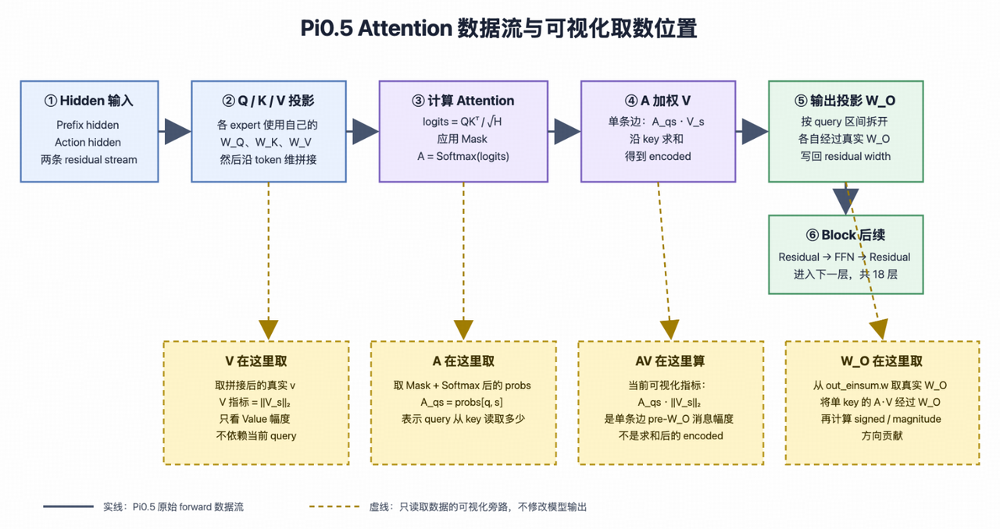
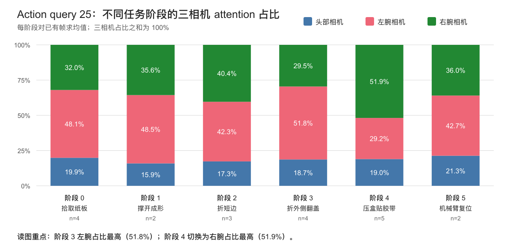
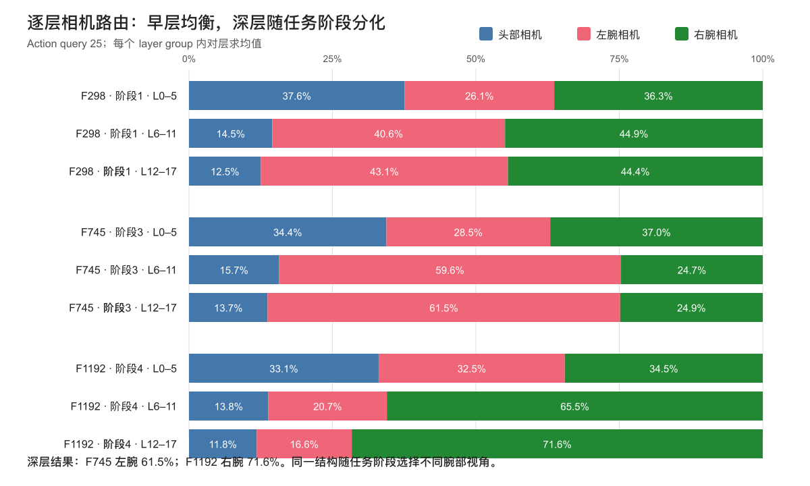
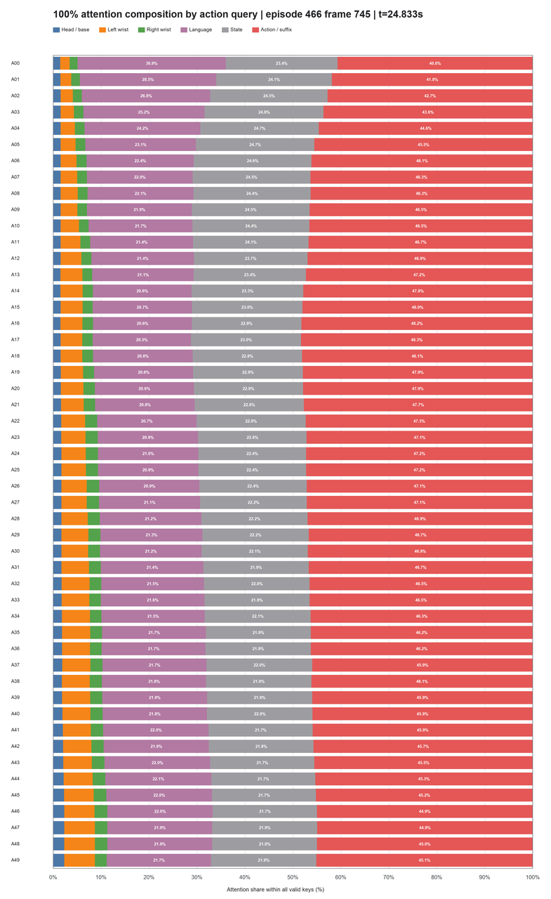
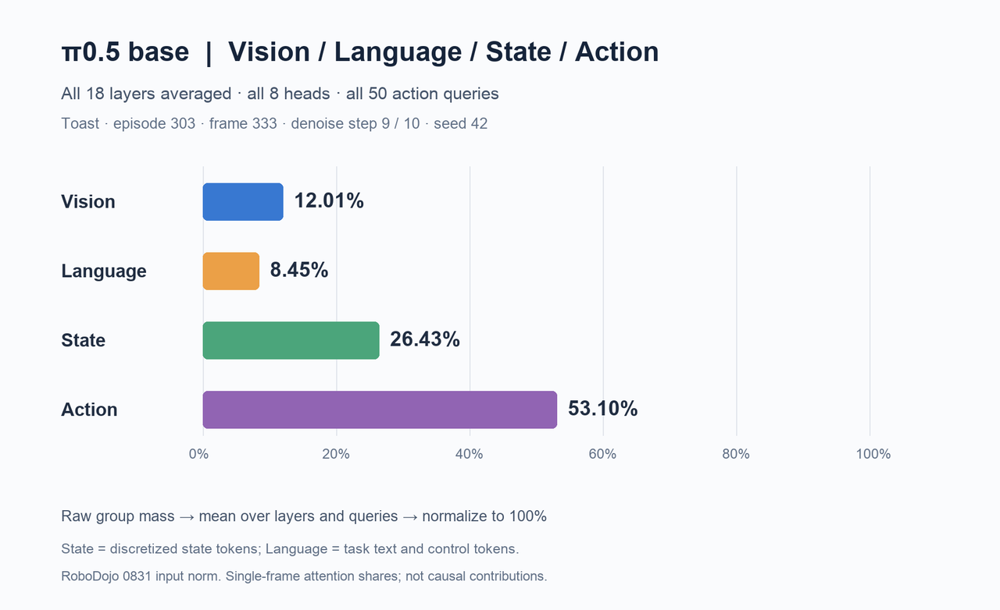
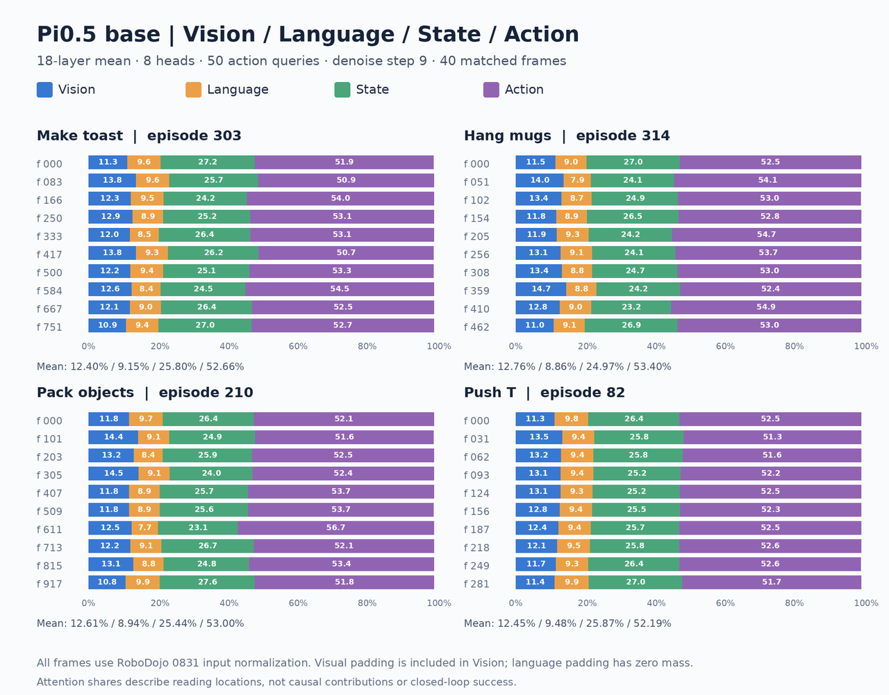
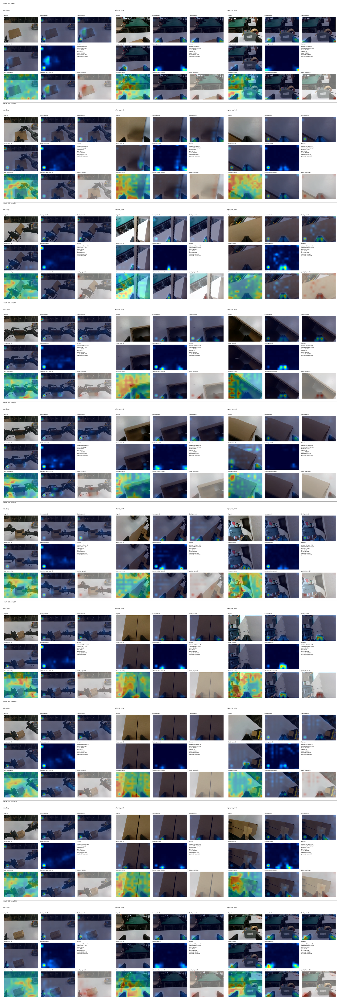
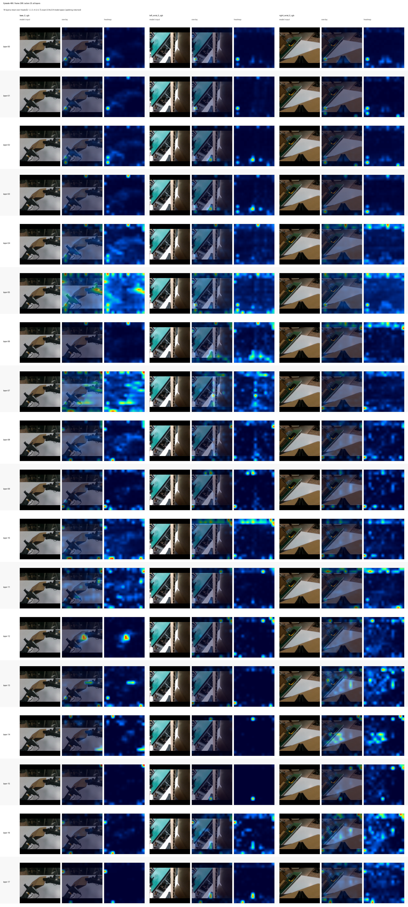
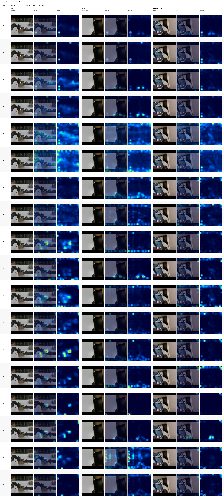

# Pi0.5 Action-to-Vision Attention 分析

## 1. 目的与主要结论

本实验检查 action query 如何读取三视角视觉信息，重点区分：**读了多少图像信息、选择哪个相机、聚焦哪些空间位置**。分析用于定位视觉引导的不足，并为接触区域与物体几何监督提供依据。

主要结论（fold-box 模型、episode 466）：

1. **相机选择随任务阶段切换。** Query 25 在折外侧翻盖阶段偏左腕（51.8%），压盒贴胶带阶段偏右腕（51.9%）；百分比均为图像 attention 内的条件占比。
2. **深层更偏腕部局部区域，不能据此认定几何信息不足。** Layer 15 的图像读取并不低，但头部相机仅占其图像 attention 的 1.87%；部分热点落在 padding，不能全部解释为夹爪或接触点。
3. **较远 action 位置的视觉直接读取比例更高。** 20 帧平均 image mass 从 query 0 的 5.58% 升至 query 25 的 8.40%、query 49 的 9.72%。
4. **去噪后期更偏向 noisy-action suffix。** Step 9 的 raw attention 按视觉 / language-control / state / action 分别为 8.33 / 21.55 / 23.01 / 47.12%；post-$W_O$ 汇总比例为 5.41 / 17.40 / 15.42 / 61.77%。两种指标不能混用。
5. **视觉与动态动作、预测误差呈正相关，但尚不能推出鲁棒性收益。** 干预视觉读取会改变动作；是否影响任务成功率，仍需闭环验证。

以上是单 episode 的内部诊断结果。按 key 位置分组的 attention 不等于信息来源归因：language、state 和 suffix 的隐藏表示可能已包含视觉信息。

## 2. 实验设置与统计口径

### 2.1 模型与推理配置

| 项目 | 设置 |
| --- | --- |
| 模型配置 | `pi05_fold_box_normal_0731_e1_base_mix_disturbance` |
| Checkpoint | `/pfs/user/checkpoints/BASE/fold_box/79999/params/` |
| 数据集 | `/pfs/public/Data/fold_box_datasets/fold_box_v2.1_reviewed_ep940_0706_0710_export0721_v2.1_subtask` |
| Episode | 466 |
| 时序采样 | 全 episode 均匀采样 20 帧，覆盖 6 个任务阶段 |
| 逐层样本 | frame 298、745、1192（当前图片仅有 298、745） |
| 默认汇总层 | layer 0、1、2、15、16、17，均值 |
| 逐层分析 | 保留 layer 0–17，各层对 8 个 heads 求均值 |
| 推理 | Pi0.5 flow-matching；10 步去噪；随机种子 42 |
| 默认诊断步 | 最后一步，index 9，flow $t=0.1$ |
| Action | horizon 50，query index 0–49；输出维度 32 |
| 后端 | JAX 0.5.3；Orbax/OCDBT 参数；BF16 前向 |
| 图像 | `base_0_rgb`、`left_wrist_0_rgb`、`right_wrist_0_rgb` |
| 输入 / patch | 每相机 224 × 224；patch 14 × 14；网格 16 × 16 |
| Attention heads | 8 个 query heads；1 个 KV head（MQA） |
| Overlay 透明度 | 0.45 |

“头部/主相机”均指 `base_0_rgb`。除另行说明外，时序统计采用默认汇总层、全部 8 个 heads 和 step 9；阶段路由与逐层空间图固定 query 25。Base 模型对照采用其图中标明的独立口径。

### 2.2 Token 布局

| Key 区间（左闭右开） | 内容 | 数量 |
| --- | --- | ---: |
| `[0, 256)` | 主相机视觉 patches | 256 |
| `[256, 512)` | 左腕视觉 patches | 256 |
| `[512, 768)` | 右腕视觉 patches | 256 |
| `[768, 968)` | 任务文本、离散 state、模板字符及被 mask 的 padding slots | 200 |
| `[968, 1018)` | Noisy-action suffix | 50 |

Prefix 共 968 个位置，key 总数为 1018。Language 和 state 共享文本 token 段，但可按 tokenizer 的位置映射进一步分组；不能把整个 200 slots 都解释为自然语言。

### 2.3 阶段与采样帧

| 阶段 | 采样帧 | 帧数 |
| --- | --- | ---: |
| 0 拾取纸板 | 0、74、149、223 | 4 |
| 1 撑开成形 | 298、372 | 2 |
| 2 折短边 | 447、521、596 | 3 |
| 3 折外侧翻盖 | 670、745、819、894 | 4 |
| 4 压盒贴胶带 | 968、1043、1117、1192、1266 | 5 |
| 5 机械臂复位 | 1341、1416 | 2 |

阶段统计按上述采样帧分组，不是对每个阶段的全部视频帧统计。

## 3. 提取方法与指标

### 3.1 从真实前向读取 Attention

诊断分支直接读取正常前向实际使用的 `probs`，并提取 action query 到视觉 key 的权重；无需第二次 forward 重算。紧凑统计在设备端完成，避免保存完整 attention tensor。

*图 1：Raw Attention、Value、Attention × Value 和 post-$W_O$ 的取数位置。完整实现片段见[代码附录](04_Attention_诊断代码_完整记录.md)。*

记去噪步为 $d$、层为 $\ell$、head 为 $h$、action query 为 $a$、任意 key 为 $s$、视觉 key 为 $j$，head 维度为 $d_h$。对应用 RoPE 后的 Q/K，在 key 轴上计算：

$$
A^{(d,\ell,h)}_{a,s}
=\operatorname{softmax}_{s}\left(
\frac{\langle\operatorname{RoPE}(Q_a),\operatorname{RoPE}(K_s)\rangle}{\sqrt{d_h}}
+B_{a,s}\right),
\qquad
B_{a,s}=\begin{cases}0,&\text{有效连接},\\-\infty,&\text{被 mask 的连接}.\end{cases}
$$

Mask 使无效位置在 softmax 后接近零；softmax 将有效 key 的权重归一化为 1。对选中的去噪步、层和 head 求均值：

$$
\bar A_{a,s}
=\frac{1}{|\mathcal D||\mathcal L||\mathcal H|}
\sum_{d\in\mathcal D}\sum_{\ell\in\mathcal L}\sum_{h\in\mathcal H}
A^{(d,\ell,h)}_{a,s}.
$$

默认 $\mathcal D=\{9\}$、$\mathcal L=\{0,1,2,15,16,17\}$、$\mathcal H=\{0,\ldots,7\}$。逐层图不在 layer 轴上求均值。

### 3.2 读取总量、相机占比与空间集中度

令 $\mathcal I_c$ 为相机 $c$ 的视觉 token 集合，$\mathcal I$ 为三相机的并集，$\varepsilon$ 为防止除零的小正数。

$$
M_{\mathrm{img}}(a)=\sum_{j\in\mathcal I}\bar A_{a,j},
\qquad M_c(a)=\sum_{j\in\mathcal I_c}\bar A_{a,j},
\qquad R_c(a)=\frac{M_c(a)}{\max(M_{\mathrm{img}}(a),\varepsilon)}.
$$

$M_{\mathrm{img}}$ 是进入图像的绝对 attention mass；$R_c$ 是相机在图像 attention 内的条件占比。Image-only 分布为：

$$
P^{\mathrm{img}}_{a,j}=\frac{\bar A_{a,j}}{\max(M_{\mathrm{img}}(a),\varepsilon)}.
$$

| 指标 | 含义 |
| --- | --- |
| Raw Attention | 分配给某 key 的真实 attention probability |
| Image / camera mass | 对全部图像 / 单相机 key 的 raw attention 求和 |
| Image-only Attention | 在全部 768 个视觉 tokens 内重新归一化的空间分布 |
| Entropy | $-\sum_j P_j^{\mathrm{img}}\log P_j^{\mathrm{img}}$；越大越分散 |
| Top-N 条件占比 | 权重最高的 N 个视觉 patches 承担的 image-only mass |
| Padding mass | 落在 padding patches 上的权重；需明确是绝对值还是图像内条件占比 |

Top-N 的绝对 attention mass 为：

$$
T_N^{\mathrm{abs}}(a)=M_{\mathrm{img}}(a)R_N(a),
\qquad R_N(a)=\sum_{j\in\operatorname{TopN}(P_a^{\mathrm{img}})}P^{\mathrm{img}}_{a,j}.
$$

先在每个样本内求乘积，再跨样本平均；均值的乘积一般不等于乘积的均值。

### 3.3 Value 与输出方向诊断

以下公式在固定去噪步和层内计算。$\kappa(h)$ 表示 query head 对应的 KV head，本实验 8 个 query heads 共享 1 个 KV head。

$$
N^V_{h,j}=\|V_j^{\kappa(h)}\|_2,
\qquad
N^{AV}_{a,h,j}=A^h_{a,j}\|V_j^{\kappa(h)}\|_2.
$$

Value norm 与 action query 无关，表示 token 的 Value 幅值；$A\|V\|$ 同时考虑读取权重和内容幅值，但没有包含输出投影、残差与后续层。

完整 attention update 及其单位方向为：

$$
z_{a,h}=\sum_s A^h_{a,s}V_s^{\kappa(h)},
\qquad y_a=\sum_h z_{a,h}W_{O,h},
\qquad u_a=\frac{y_a}{\max(\|y_a\|_2,\varepsilon)}.
$$

单个 patch 对该方向的投影为：

$$
C^{\mathrm{signed}}_{a,j}
=\sum_h A^h_{a,j}\langle V_j^{\kappa(h)}W_{O,h},u_a\rangle,
\qquad C^{\mathrm{mag}}_{a,j}=|C^{\mathrm{signed}}_{a,j}|.
$$

Signed 的正负表示与当前完整 attention update 同向或反向；Magnitude 是该投影的绝对值，不是投影后向量的范数。该指标已合并 heads，不能视为移除 patch 对最终动作的因果影响。原记录中的无 LoRA 路径仅对紧凑诊断投影使用 FP32，正常动作分支仍使用模型配置的 dtype。

### 3.4 图像回投影与显示规则

每相机 256 个 token 按 row-major 顺序还原成 16 × 16 网格，再双线性插值到 224 × 224。模型空间图保留 padding；原图空间图先裁去 padding，再插值回原始尺寸并以透明度 0.45 叠加。

例如 640 × 480 图像 resize-with-pad 后，有效区域为 224 × 168，上下各补 28 像素。非负 heatmap 按单图最大值归一化，signed heatmap 按最大绝对值归一化：

$$
\widehat H=\frac{H}{\max(\max_{x,y}H,\varepsilon)},
\qquad
\widehat C=\frac{C}{\max(\max_{x,y}|C|,\varepsilon)}.
$$

**颜色仅表示单张图内的相对强弱，不能跨相机、帧、层或 query 比较绝对强度。** 跨样本比较应读取 `camera_attention_mass`、`metadata.json` 或 `attention.npz`。非负图使用蓝—青—黄—红色图；signed 图使用蓝（负）—白（零）—红（正）色图。

## 4. 结果分析

### 4.1 相机路由随任务阶段切换

*图 2：每个阶段内，三相机的 image-conditioned attention 占比之和为 100%。*

- 主相机占比为 15.9%–21.3%，双腕合计 78.7%–84.1%。
- 折短边阶段趋向双腕均衡；折外侧翻盖阶段偏左腕（51.8%，右腕 29.5%）。
- 压盒贴胶带阶段转向右腕（51.9%，左腕 29.2%）。
- 复位阶段左 / 右腕为 42.7% / 36.0%，重新趋于均衡。

这些结果表明相机选择与操作阶段相关，但尚不能证明模型选择了最有效的视角。

### 4.2 层间分化与局部热点

*图 3：三个代表帧中，早层 0–5、中层 6–11、深层 12–17 的相机条件占比。*

早层三相机相对均衡，中深层按任务阶段偏向特定腕部。Layer 12 和 15 的部分热图可见交互物边缘与局部接触区域，但不能直接据此判断哪一层更适合动作生成。

| 指标（三个代表帧） | Layer 12 | Layer 15 |
| --- | ---: | ---: |
| 平均 image attention mass | 5.31% | 21.59% |
| 各帧在 18 层中的 image mass 排名 | 15–16 | 2–7 |
| 主相机平均条件占比 | 17.09% | 1.87% |
| 双腕合计条件占比 | 82.91% | 98.13% |
| Top-16 承担的图像 attention | 37.54% | 71.03% |
| Top-16 中 padding patch 的数量占比 | 64.60% | 52.10% |
| Top-16 权重中来自 padding 的占比 | 68.70% | 42.90% |

Layer 15 的整体图像读取并不低，低的是主相机占比：frame 298、745、1192 分别为 0.97%、3.66%、0.99%。此外，padding 对热点有明显影响，不能把所有高响应区域都解释成夹爪或物体几何。

逐层图见[第 5 节](#5-空间可视化图集)。

### 4.3 少数 patch 集中读取，padding 被过度选择

在全部 768 个视觉 tokens 内排序：Top-16 仅占 token 数的 2.08%，却平均承担约 34.1% 的 image-conditioned attention。Padding 占视觉 tokens 的 25%，在 Top-16 中的数量占比为 35.83%，高于其空间占比。

| Query | Image mass | Top-16 条件占比 | Top-16 绝对 mass |
| --- | ---: | ---: | ---: |
| 0 | 5.58% | 31.40% | 1.75% |
| 25 | 8.40% | 35.60% | 3.06% |
| 49 | 9.72% | 35.20% | 3.46% |

表内为跨样本汇总值，绝对 mass 按样本内乘积统计，不能直接用前两列均值相乘复算。

| Top-N（占全部 patches 的比例） | Query 0 条件占比 | Query 25 条件占比 | Query 49 条件占比 | Padding 在 Top-N 中的数量占比 |
| --- | ---: | ---: | ---: | ---: |
| 8（1.04%） | 21.03% | 24.89% | 24.85% | 30.21% |
| 16（2.08%） | 31.44% | 35.63% | 35.21% | 35.83% |
| 20（2.60%） | 35.07% | 39.65% | 39.17% | 39.17% |
| 32（4.17%） | 43.43% | 48.42% | 47.98% | 45.73% |
| 38（约 5%） | 46.63% | 51.65% | 51.36% | 47.85% |
| 169（22.0%） | 75.16% | 80.21% | 81.40% | 57.77% |
| 317（41.3%） | 86.21% | 89.99% | 91.00% | 46.55% |

最后一列沿用原始汇总值，原记录未明确其跨 query 聚合方式。整体呈现少数高响应 patch 与大量长尾 patch 并存的分布。

### 4.4 Action horizon：远期 query 的视觉占比上升

| Action query | 视觉 | Language + State | Action suffix |
| --- | ---: | ---: | ---: |
| 0 | 5.60% | 54.30% | 40.10% |
| 10 | 7.90% | 44.70% | 47.40% |
| 25 | 8.40% | 43.50% | 48.10% |
| 40 | 8.70% | 43.60% | 47.70% |
| 49 | 9.70% | 44.10% | 46.20% |

较远 query 的视觉读取比例更高，同时原记录中的动作误差从 query 0 的 0.0026 增至 query 49 的 0.0169（该项误差定义未单独注明）。一种待验证的解释是：当前 state 对远期动作的约束减弱，模型增加视觉读取；这并不意味着视觉增加已解决远期预测不确定性。

*图 4：单帧 query 0–49 的直接 attention 组成；不同于上表的 20 帧均值。*

旧版合并口径图保留作对照：[Language + State 合并图](../../Picture/attention_ep466_frame745_queries_language_state_combined.png)。旧图中的“State (no token)”表示未单独分组，不能解读为模型没有 state token。

### 4.5 去噪过程中的模态分配

按 key 位置划分视觉、language/control、state 和 noisy-action，并在组内求和，再对 20 帧、50 个 queries、8 个 heads 和默认 6 层求均值。以下均为 raw attention mass，未按 token 数量重新归一化。

| Denoise step | Flow $t$ | Vision | Language / control | State | Noisy-action |
| --- | ---: | ---: | ---: | ---: | ---: |
| 0 | 1.0 | 10.21% | 25.84% | 31.97% | 31.98% |
| 2 | 0.8 | 10.84% | 24.02% | 29.47% | 35.68% |
| 4 | 0.6 | 10.44% | 23.28% | 27.45% | 38.83% |
| 6 | 0.4 | 10.01% | 22.65% | 25.41% | 41.94% |
| 8 | 0.2 | 9.23% | 22.13% | 24.03% | 44.61% |
| 9 | 0.1 | 8.33% | 21.55% | 23.01% | 47.12% |

视觉在 step 2 短暂达到峰值后下降；suffix 从 31.98% 增至 47.12%，state 下降 8.96 个百分点。该趋势与“后期更多依赖已形成的动作轨迹”一致，但机制仍需干预验证。

原文另列的 8.3% / 44.6% / 47.1%（视觉 / language+state / suffix）与此表末行近似一致；其“最后一层”标注与后续 6 层汇总口径冲突，因此不再作为独立的 layer 17 结果使用。

**Language/control 高占比不等于自然语言指令主导。** 原记录统计的 15 个固定 language/control tokens 中：

| Token 类别 | Step 0 占总 attention | Step 9 占总 attention |
| --- | ---: | ---: |
| BOS | 15.85% | 13.92% |
| State 后的 `;\nAction:` 等结构 tokens | 8.84% | 6.99% |
| `Fold the paper box` 四个词 | 0.32% | 0.21% |

Step 9 的 language/control mass 中，约 64.6% 来自 BOS、32.4% 来自上述结构 tokens。这些位置可能起汇聚或边界锚点作用，也可能通过 prefix 上下文化携带视觉和 state 信息；以上是解释假设。

### 4.6 加入 Value 和输出方向后的比较

每格依次为 **Vision / Language-control / State / Noisy-action**，单位为 %。纯 A 是 attention mass；其余两列是对应诊断量的组间比例，不能当作 attention probability。

| Step / Flow $t$ | 纯 A | $A\lVert V\rVert$ | post-$W_O$ 方向指标 |
| --- | --- | --- | --- |
| 0 / 1.0 | 10.21 / 25.85 / 31.97 / 31.98 | 12.61 / 16.73 / 20.02 / 50.64 | 5.99 / 14.49 / 15.58 / 63.94 |
| 2 / 0.8 | 10.84 / 24.02 / 29.47 / 35.68 | 12.56 / 16.46 / 19.40 / 51.57 | 5.91 / 14.64 / 15.45 / 64.00 |
| 4 / 0.6 | 10.44 / 23.28 / 27.45 / 38.83 | 12.28 / 16.46 / 19.01 / 52.25 | 5.74 / 14.77 / 15.02 / 64.46 |
| 6 / 0.4 | 10.01 / 22.65 / 25.41 / 41.94 | 12.24 / 16.61 / 18.77 / 52.38 | 5.71 / 15.08 / 14.70 / 64.51 |
| 8 / 0.2 | 9.23 / 22.13 / 24.03 / 44.61 | 11.98 / 17.03 / 18.82 / 52.17 | 5.59 / 16.06 / 14.95 / 63.41 |
| 9 / 0.1 | 8.33 / 21.55 / 23.01 / 47.12 | 11.39 / 17.39 / 18.72 / 52.51 | 5.41 / 17.40 / 15.42 / 61.77 |

原记录未明确 post-$W_O$ 汇总表采用 signed 求和还是 magnitude 求和、以及归一化与跨样本平均的先后顺序；需回查导出元数据后才能严格复算。Step 0 的 language/control 在两张原表中相差 0.01 个百分点，暂保留各表原值。

视觉在 post-$W_O$ 表中约占 5.4%–6.0%，仅描述图像 key 位置对当前 attention 输出方向的直接路由。不能据此认定视觉输入不重要，因为存在间接路径：

$$
\text{image}\longrightarrow\text{language/state hidden positions}\longrightarrow\text{action},
$$

且深层 suffix 也可能已吸收前层视觉信息。

### 4.7 Pi0.5 base 对照

*图 5：Make toast，episode 303、frame 333；18 层、8 heads、50 queries 平均，step 9。Vision / Language / State / Action 为 12.01 / 8.45 / 26.43 / 53.10%。*

*图 6：Make toast、Hang mugs、Pack objects、Push T，每个任务采样 10 帧，共 40 帧；使用 18 层均值。图中逐帧展示，不是仅展示四任务总均值。*

Base 对照与 fold-box 的任务、采样及汇总层不同，可用于观察分布差异，不能直接将差异归因为微调。

### 4.8 全局 Attention 干预

每帧比较完整 action chunk，张量形状为 `[1, 50, 32]`：

$$
\operatorname{relative\text{-}L2}
=\frac{\|a_{\mathrm{intervention}}-a_{\mathrm{baseline}}\|_2}
{\max(\|a_{\mathrm{baseline}}\|_2,\varepsilon)}.
$$

- `persistent`：全部 10 个去噪步持续干预。
- `pulse`：只干预一个去噪步，随后恢复正常；下表未提供该设置的结果。
- `zero_av`：删除目标连接的 $A\times V$ 消息，不重分配 attention。
- `mask_renorm`：屏蔽目标 key，并重新归一化剩余 attention。

| Token 组 | Persistent zero_av relative-L2 | Persistent mask_renorm relative-L2 | Mask_renorm RMSE |
| --- | ---: | ---: | ---: |
| Vision | 9.14% ± 4.46% | 8.56% ± 5.37% | 0.06968 ± 0.04451 |
| Language/control | 15.37% ± 0.72% | 2.32% ± 0.97% | 0.01887 ± 0.00798 |
| State | 39.63% ± 4.65% | 24.71% ± 8.38% | 0.20149 ± 0.07034 |
| Noisy-action suffix | 54.24% ± 1.98% | 49.40% ± 1.84% | 0.40258 ± 0.02470 |
| No-op control | 0 | 0 | 0 |

原记录未说明本表的样本数、层范围及 ± 的定义，解读时需保留这一限制。干预表明目标读取路径会影响最终动作，尤其 state 和 suffix；它衡量的是相对 baseline 的输出变化，不是任务成功率下降或全部视觉信息的因果贡献。

### 4.9 视觉读取与动作变化的关系

数据为同一 episode 的 20 帧 × 50 action queries，共 1000 个观测格点。动作指标使用前 14 个真实机器人动作维度：

$$
\Delta^{\mathrm{pred}}_{f,q}=\|a^{\mathrm{pred}}_{f,q,1:14}-a^{\mathrm{pred}}_{f,q-1,1:14}\|_2,
\qquad
\Delta^{\mathrm{GT}}_{f,q}=\|a^{\mathrm{GT}}_{f,q,1:14}-a^{\mathrm{GT}}_{f,q-1,1:14}\|_2,
$$

$$
E_{f,q}=\frac{1}{14}\sum_{i=1}^{14}|a^{\mathrm{pred}}_{f,q,i}-a^{\mathrm{GT}}_{f,q,i}|.
$$

对模态 mass 和动作指标分别进行二维去均值，去除 frame 与固定 action-index 的主效应，再展平计算 Pearson 相关系数：

$$
\widetilde x_{f,q}=x_{f,q}-\bar x_{f,\cdot}-\bar x_{\cdot,q}+\bar x_{\cdot,\cdot},
\qquad r=\operatorname{corr}(\operatorname{vec}\widetilde M,\operatorname{vec}\widetilde Y).
$$

| 目标量 | Visual | Language + State | Action suffix |
| --- | ---: | ---: | ---: |
| Prediction delta | 0.357 | -0.445 | 0.180 |
| GT delta | 0.343 | -0.398 | 0.130 |
| Action MAE | 0.335 | -0.352 | 0.077 |

视觉读取与更动态、更难预测的动作呈正相关。需要注意：原记录未说明 query 0 的差分边界处理，复算时应先确认；相关性也不能证明增加视觉权重会改善动作质量。

原记录另报图像 attention 中约 43.7% 落在 padding；若与 8.33% image mass 使用相同统计口径，有效内容的直接 raw mass 约为 $8.33\%\times(1-43.7\%)\approx4.7\%$。这是基于汇总比例的近似，严格值应逐样本计算后再平均。

## 5. 空间可视化图集

### 5.1 全流程 10 帧预览

*图 7：原图及多个 action query 的 overlay / heatmap。此图是 10 帧预览，不是第 2 节统计所用的完整 20 帧图集。*

### 5.2 Frame 298：撑开成形

*图 8：每层一行，三相机横排；每相机依次为 model input / overlay / heatmap。固定 query 25，各层对 8 heads 求均值，保留 224 × 224 模型空间 padding。*

### 5.3 Frame 745：折外侧翻盖

*图 9：配置与图 8 相同。当前文件中没有可确认的 frame 1192 逐层图，因此不将 frame 745 的重复图用于该位置。*

### 5.4 图片归档说明

图片统一存放于根目录 `Picture/`，正文使用相对路径；文件名按“分析主题 + episode/frame/query”等可确认信息命名。两组完全相同的图片经 SHA-256 校验，仅在正文引用一份，副本保留为：

- [十帧总览副本](../../Picture/attention_ep466_10frames_overview_duplicate.png)（原 `contact_sheet_frames_10rows_preview (1).png`）。
- [Frame 745 逐层图副本](../../Picture/attention_ep466_frame745_query25_all_layers_duplicate.png)（原 `image (2).png`）。

原记录提到的完整 20 帧图、其他样本总览、18 层与 layer 17 时序对比、Frames 075–099 等图在当前目录中未找到可确认的对应文件，已移除空占位符。目录中的其他既有图片与本实验无直接对应关系，未插入正文。

## 6. 后续实验

1. **核实统计与 padding。** 补全 post-$W_O$ 归一化、干预误差条与差分边界口径；分别统计有效内容和 padding 的读取权重，并对 padding 热点进行受控干预。
2. **验证视觉增益。** 对视觉特征或读取权重做可控缩放，比较动作误差、扰动恢复能力与闭环成功率，避免只以 attention 增大作为改善证据。
3. **引入几何辅助监督。** 对末端位置、接触点、物体边缘等区域施加监督，检验是否改善精确交互；同时比较相机与层级选择。
4. **扩大验证范围。** 在多 episode、多任务和不同去噪步重复分析，并控制汇总层、采样方式与动作维度，使 base / 微调模型之间的比较可解释。
