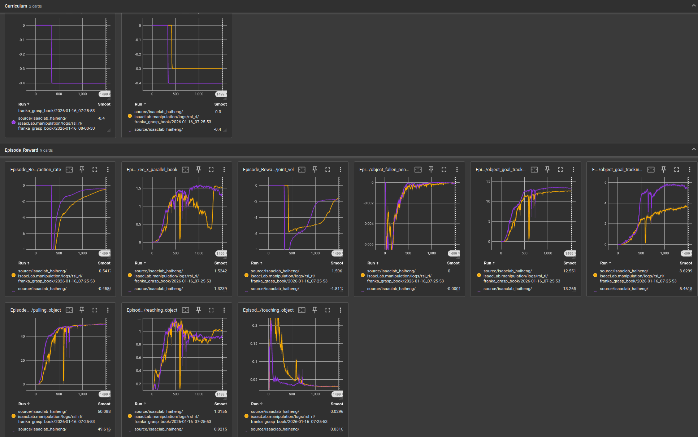

# 机器人运动学
## 基本动力学模型
τ = D(q)q̈ + C(q, q̇) + G(q)
| 符号             | 维度           | 含义            |
| -------------- | ------------ | ------------- |
| $\tau$         | $n \times 1$ | 关节驱动力矩向量      |
| $D(q)$         | $n \times n$ | 质量/惯性矩阵（正定对称） |
| $\ddot{q}$     | $n \times 1$ | 关节加速度向量       |
| $C(q,\dot{q})$ | $n \times 1$ | 科氏力 + 离心力向量   |
| $G(q)$         | $n \times 1$ | 重力向量          |

## 动力学分析方法 牛顿欧拉法
目标是给定机器人的关节位置 q、速度 q̇ 和加速度 q̈，计算出为了产生这个运动状态，每个关节需要施加多大的驱动力矩 τ

# 坐标变换
## 欧拉角
### 1. 定义
**Z-Y-X 欧拉角**（又称 **航向-俯仰-横滚**，Yaw-Pitch-Roll）：

- 先绕 **Z** 轴旋转 α（Yaw）  
- 再绕 **新 Y** 轴旋转 β（Pitch）  
- 最后绕 **新 X** 轴旋转 γ（Roll）

角度向量：  
\[
[\alpha,\ \beta,\ \gamma]
\]

---

### 2. 单轴基础旋转矩阵
绕当前坐标系 `i` 的各轴旋转角度 `θ` 时，对应的 **3×3 旋转矩阵** 如下：
| 轴 | 旋转矩阵 |
|---|---|
| **Z(α)** | \[R_z(\alpha)=\begin{bmatrix}\cos\alpha & -\sin\alpha & 0 \\ \sin\alpha & \cos\alpha & 0 \\ 0 & 0 & 1\end{bmatrix}\] |
| **Y(β)** | \[R_y(\beta)=\begin{bmatrix}\cos\beta & 0 & \sin\beta \\ 0 & 1 & 0 \\ -\sin\beta & 0 & \cos\beta\end{bmatrix}\] |
| **X(γ)** | \[R_x(\gamma)=\begin{bmatrix}1 & 0 & 0 \\ 0 & \cos\gamma & -\sin\gamma \\ 0 & \sin\gamma & \cos\gamma\end{bmatrix}\] |

---

### 3. 合成旋转矩阵（Z-Y-X 欧拉角 → 旋转矩阵）
按**当前轴顺序**右乘：

\[
R = R_z(\alpha)\cdot R_y(\beta)\cdot R_x(\gamma)
\]

展开结果：

\[
R =
\begin{bmatrix}
\cos\alpha\cos\beta &
\cos\alpha\sin\beta\sin\gamma - \sin\alpha\cos\gamma &
\cos\alpha\sin\beta\cos\gamma + \sin\alpha\sin\gamma \\[6pt]
\sin\alpha\cos\beta &
\sin\alpha\sin\beta\sin\gamma + \cos\alpha\cos\gamma &
\sin\alpha\sin\beta\cos\gamma - \cos\alpha\sin\gamma \\[6pt]
-\sin\beta &
\cos\beta\sin\gamma &
\cos\beta\cos\gamma
\end{bmatrix}
\]

---

## 坐标变换的两种解释：固定系左乘 vs 运动系右乘

&gt; 一句话区别：  
&gt; **固定轴（外部视角）→ 左乘（Premultiply）**  
&gt; **运动轴（本体视角）→ 右乘（Postmultiply）**

---

### 1 固定坐标系解释（Fixed-Frame / 左乘）

| 说明 | 操作顺序 | 矩阵乘法顺序 |
|---|---|---|
| 所有变换都**绕最开始的固定系**进行 | 先旋转 → 再平移 | `T = Trans(d) · Rot(R)` |
| 几何意义：把物体在“世界”里依次摆位 | 步骤 1：绕 `[0]` 旋转 → 得到 `[0']` &lt;br&gt; 步骤 2：沿 `[0]` 平移 → 得到 `[1]` | 左乘 |


---

### 2 运动坐标系解释（Moving-Frame / 右乘）

| 说明 | 操作顺序 | 矩阵乘法顺序 |
|---|---|---|
| 每一步变换都**绕最新建立的动系**进行 | 先平移 → 再旋转 | `T = Trans(d) · Rot(R)` |
| 几何意义：把物体“装”在动系上，再让动系自己动 | 步骤 1：沿 `[0]` 平移 → 得到 `[0']` <br> 步骤 2：绕**新轴 `[0']`** 旋转 → 得到 `[1]` | 右乘 |


# IK 逆运动学
正：已知 θ→T，用 DH/MDH 递推
逆：已知 T→θ，解析法（Pieper 准则，三轴交于一点）或数值法（Newton-Raphson、Jacobian 伪逆、LM）。

## 解析法
解析法适用于结构较为简单的机械臂，可以通过几何或者代数方法进行求解。
满足pieper准则才有解析解：三个相邻关节轴相交于一点或者三个相邻关节轴相互平行。

## 数值法
### 雅可比矩阵求逆法
#### 一、背景知识

在机器人运动学中，**逆运动学（IK）**的目标是：

> 给定末端执行器的目标位姿 \( \mathbf{x}_d \in \mathbb{R}^m \)，求解关节角度 \( \mathbf{q} \in \mathbb{R}^n \)，使得：
\[
\mathbf{x}_d = f(\mathbf{q})
\]

由于 \( f \) 通常是非线性的，**雅可比矩阵求逆法**通过**线性化**和**迭代**来逼近解。

---

#### 二、核心思想
利用**雅可比矩阵**建立**关节速度**与**末端速度**之间的线性关系：

\[
\dot{\mathbf{x}} = \mathbf{J}(\mathbf{q}) \dot{\mathbf{q}}
\]

其中：

- \( \dot{\mathbf{x}} \in \mathbb{R}^m \)：末端执行器在任务空间的速度（如线速度 + 角速度）, 是个 6×1 向量：前 3 行是末端线速度 v，后 3 行是角速度 ω
- \( \dot{\mathbf{q}} \in \mathbb{R}^n \)：关节速度,是 n×1 关节速度向量（每个关节转多快）。
- \( \mathbf{J}(\mathbf{q}) \in \mathbb{R}^{m \times n} \)：雅可比矩阵，依赖于当前关节角度
- 把“关节空间的小速度”映射成“任务空间的小速度”。
一句话：如果我把每个关节拧快一点点，末端会往哪边跑、跑多快？

---

#### 三、求解步骤（一阶雅可比迭代法）
##### 步骤1：初始化
- 给定初始关节角度 \( \mathbf{q}_0 \)
- 设定目标位姿 \( \mathbf{x}_d \)
- 设定误差容限 \( \epsilon \) 和最大迭代次数 \( N \)

##### 步骤2：迭代更新
对于第 \( k \) 次迭代：

1. 计算当前末端位姿：
   \[
   \mathbf{x}_k = f(\mathbf{q}_k)
   \]

2. 计算误差：
   \[
   \Delta \mathbf{x}_k = \mathbf{x}_d - \mathbf{x}_k
   \]

3. 计算雅可比矩阵 \( \mathbf{J}(\mathbf{q}_k) \)

4. 求解关节速度：
   - 若 \( m = n \)（非冗余）：
     \[
     \dot{\mathbf{q}}_k = \mathbf{J}^{-1}(\mathbf{q}_k) \Delta \mathbf{x}_k
     \]
   - 若 \( m < n \)（冗余）：
     \[
     \dot{\mathbf{q}}_k = \mathbf{J}^+(\mathbf{q}_k) \Delta \mathbf{x}_k
     \]
     其中 \( \mathbf{J}^+ \) 是**伪逆矩阵（Moore-Penrose inverse）**：
     \[
     \mathbf{J}^+ = \mathbf{J}^T (\mathbf{J} \mathbf{J}^T)^{-1}
     \]
     把“末端还差的速度”转换成“关节要补的速度”。就像齿轮比：末端差 1 mm/s，关节需要转多少 rad/s 才能补上。

5. 更新关节角度（使用小步长 \( \alpha \)）：
   \[
   \mathbf{q}_{k+1} = \mathbf{q}_k + \alpha \dot{\mathbf{q}}_k
   \]

6. 检查收敛：
   - 若 \( \|\Delta \mathbf{x}_k\| < \epsilon \)，停止
   - 否则继续迭代

---

#### 四、伪逆法（冗余机械臂）
当自由度 \( n > \) 任务空间维度 \( m \)，系统**欠定**，有无穷多解。
此时使用**伪逆法**求解**最小范数解**（即能量最小）：

\[
\dot{\mathbf{q}} = \mathbf{J}^+ \dot{\mathbf{x}}
\]

##### 优点：
- 保证解的**最小速度范数**
- 可用于**避障、避奇异**等优化目标（结合零空间控制）
- 在所有能满足末端速度 Δx 的关节速度里，挑一个“总转速最小”的解

---

#### 五、奇异问题与阻尼伪逆
当 \( \mathbf{J} \) 接近**奇异**（行列式接近0），伪逆法会**数值不稳定**。

### 解决方案：**阻尼伪逆（Damped Pseudoinverse）**
\[
\mathbf{J}^* = \mathbf{J}^T (\mathbf{J} \mathbf{J}^T + \lambda^2 \mathbf{I})^{-1}
\]

- \( \lambda \)：阻尼因子（通常 0.01 ~ 0.1）
- 牺牲少量精度，换取**数值稳定性**

---

#### 六、总结对比
| 方法 | 适用场景 | 优点 | 缺点 |
|------|----------|------|------|
| 雅可比逆法 | 非冗余机械臂（n = m） | 简单、直接 | 奇异时失效 |
| 伪逆法 | 冗余机械臂（n > m） | 最小范数解 | 奇异时不稳定 |
| 阻尼伪逆法 | 所有构型 | 鲁棒性强 | 精度略降 |

---

# 规划算法
## RRT*算法
---
### 1 算法定位
| 维度        | 内容                                      |
|-------------|-------------------------------------------|
| 类型        | 基于采样的运动规划 |
| 解决什么问题 | 高维连续 C-space 中找**可行**→**最优**路径 |
| 对比 RRT    | RRT 只保证概率完备，RRT\* 额外持续优化，成本→c\* |
---

### 2 核心思想一句话
RRT的算法流程：
1.初始化环境参数
2.随机采样
3.寻找最近点
4.确定生长方向得到xnew
5.碰撞检测
6.无碰撞则添加新节点

&gt; “在 RRT 的随机扩张基础上，**新增两步**：  
&gt; (1) 重选父节点：
1.找到xnew2后，在一定半径内找到所有父节点
2.计算成本（路径长度）重新选择父节点。
既在选父节点时**选最小代价**（不只是最近）；  
&gt; (2) 
对于新节点找到附近节点，判断从新节点到附近节点是否可以降低路径成本
既局部**重写父节点**（rewire），让新采样点反过来优化邻居。”
  
<!-- ---

## 3 数学前提
1. **度量空间** (X, ρ)  —— 通常用欧氏距离 ρ(x,y)=‖x−y‖₂  
2. **成本函数**  c: [0,1]→ℝ≥0，常用弧长 c(γ)=∫₀¹‖γ′(s)‖ds  
3. **渐进最优** 定义  
   limₖ→∞ c(γₖ)=c(γ\*)  概率 1 成立，γ\* 为全局最优路径。

---

## 4 数据结构
- **G=(V,E)**  —— 无向图，顶点位形 q∈C-space，边代价 c(e)  
- **rₙ**        —— 连接半径，rₙ=γ\_ball\*(log n/n)^(1/d)，d 维空间  
- **B(q,r)**    —— 以 q 为中心、r 为半径的球，用 k-d tree 加速近邻查询 -->

---

## A*算法
### 1 算法定位
| 维度 | 内容 |
|------|------|
| 类别 | 图搜索 + 启发式（Informed Search） |
| 完备性 | 是（只要解存在就能找到） |
| 最优性 | 是（启发 h 可纳） |
| 时间复杂度 | O(b^d)（最坏，b 分支因子，d 解深度） |
| 空间复杂度 | O(b^d)（OPEN 与 CLOSED 表） |
| 典型场景 | 2D 栅格导航、3D UAV 体素、任务级图、多关节离散网格 |
---

### 2 核心思想一句话
&gt; “每次从边界选 **‘当前代价 + 未来估计’最小** 的节点展开；只要估计不‘吹牛’(可纳)，第一次弹出目标即最优。”

### 3 启发式函数
欧几里得距离：直线距离，开根号
曼哈顿距离：网格地图，只允许四向移动，不用开根号 |x1-x2| + |y1-y2|

<!-- ---

## 3 数学符号


- G=(V,E) 图，边权 w(e)≥ε&gt;0  
- g(n) = 从起点到 n 的最小已知代价  
- h(n) = 从 n 到目标的 **启发估计代价**（heuristic）  
- f(n) = g(n) + h(n)  （评估函数）  
- h\*(n) = n→目标的 **真实最优代价**  
- 可纳性 ⇔ ∀n, h(n)≤h\*(n)  
- 一致性 ⇔ ∀(n,m)∈E, h(n)≤w(n,m)+h(m)  （更强，保证 reopen 最优）

---

## 4 数据结构
| 名称 | 用途 | 实现 |
|------|------|------|
| OPEN | 待扩展节点，按 f 小顶堆 | std::priority_queue / heapq |
| CLOSED | 已扩展节点，防重复 | unordered_set / set |
| Parent | 回溯路径 | dict / vector | -->

---


# ROS2基本概念
## ROS2节点和通信
### 1 什么是ROS2节点？
ROS2节点是ROS2系统中的基本计算单元，每个节点负责特定功能，通过发布/订阅话题、提供/使用服务或参数来与其他节点通信。节点遵循单一责任原则，使系统更加模块化和健壮。

### 2 ROS2中的话题通信机制是什么？
ROS2话题通信是一种发布/订阅(Pub/Sub)模式，允许节点间进行异步、多对多通信。发布者发布消息到特定话题，订阅者从感兴趣的话题接收消息，两者之间不需要直接连接。
发布者将消息发送到特定的话题 ，而所有订阅了该话题的订阅者都会接收到这些消息。

## Lanuch
1 robot_gazebo.launch.py ：负责仿真环境和机器人模型
- 启动robot_state_publisher节点发布机器人模型
- 包含Gazebo仿真环境
- 在Gazebo中生成机器人实例
- 加载并激活必要的控制器


2 navi_launch.py ：负责导航功能
- 包含Nav2导航框架
- 启动自定义A*规划器
- 配置并启动RViz2可视化工具

## Gazebo仿真
ROS2与Gazebo的集成主要通过以下方式实现：
1. gazebo_ros包 ：提供ROS2和Gazebo之间的桥接功能
2. URDF模型 ：定义机器人和环境模型
3. Gazebo插件 ：连接Gazebo物理引擎与ROS2接口
4. ros2_control ：提供硬件抽象层，连接控制器与仿真


# 电机控制FOC算法
六步换相 6个mos管外加不通电可以控制三个线圈产生7个不同方向的磁场力
再用类似于PWM占空比理论，让两个相邻方向磁场对应的状态来回切换，改变占比，就可以控制电机转向任意方向了
再加入PID控制，分别对位置、速度、电流进行控制，形成三个负反馈系统


# 个人项目
## 1.ROS2机械臂夹取项目
### 用到的库
- 1.rclpy - ROS2的Python客户端库，用于创建节点、发布者、订阅者等
- 2.gazebo_ros2_control - 连接Gazebo仿真器和ROS2控制系统
- 3.MoveIt2 - 用于机器人运动规划和操作
- 4.hardware_interface - 提供硬件抽象层，连接控制器和机器人硬件
- 5.robot_state_publisher - 发布机器人的TF变换
- 6.joint_state_publisher - 发布关节状态信息
- 7.rviz2 - 用于可视化机器人状态和轨迹

### pick-and-place
#### 状态机枚举 
把 整个 pick-place 流程 拆成 5 个离散状态 状态机
class StateMachineAction(enum.Enum):
GRAB # 激活夹爪，抓取物体
DELIVER # 激活夹爪，抓取物体
RELEASE # 释放物体
HOVER # 悬停在物体上方
HOME # 返回初始位置

#### 话题与通信
- create_publisher(Float64MultiArray, joint_control_topic, 10)：
把目标关节角发给ros2_control 的 JointGroupPositionController
- create_subscription(JointState, '/joint_states', ...)	
拿到实测关节角+角速度+力矩	用于FK反馈与速度判稳
- create_subscription(Odometry, '/odom', ...)	
拿到 机器人基座在世界系的位姿（可选）	若基座移动（AGV），需 T_world_base 做全局定位
- create_subscription(PoseStamped, '/goal_pose', ...)
接收外部点击的目标	RViz 2D Nav Goal 可直接发 /goal_pose

#### 运动学核心调用链
- self._panda.solve_fk(joint_states)
FK：关节角 → 末端 4×4 齐次矩阵 → 填到 Odometry
- self._panda.solve_ik(end_effector_target)
IK：末端Pose → 关节角向量，MoveIt2框架内部使用KDL（Kinematics and Dynamics Library）作为默认求解器
- move_fingers(..., FingersAction.OPEN/CLOSE)
返回 平行夹爪最后两个关节 的角度	0 = 全开，1 = 全闭

### 遇到的问题
#### 奇异点问题
机械臂在某些位置会出现奇异点。
原因：6DOF逆解时无解，有向量线性相关出现奇异值
现象：某关节速度暴涨
解决方式：多加一个自由度or在ymal文件里面直接lock掉容易出现奇异值的角度

### 关于动力学的内容
在这个项目中，我主要关注的是机械臂的运动学规划和基于位置的控制。我们通过逆运动学（IK）求解器计算目标关节角度，然后将这些角度作为指令发送给ROS2 Control框架下的关节位置控制器。Gazebo仿真器在底层负责处理机械臂的动力学计算，它会根据URDF模型中定义的质量、惯量等物理参数，以及控制器输出的力矩指令，来模拟机械臂的实际运动。因此，虽然我没有直接在代码中实现像RNE这样的动力学推导，但动力学在整个仿真和控制链条中是至关重要的，它由Gazebo和ROS 2 Control的底层机制来处理。


## 2.海恒智能国科大机械臂项目
### task1 通信桥代码
#### 背景
机器人中AGX的上位机通过http传输数据给docker内部，需要写一个通信桥script将接受的数据转换到ros内，去调用moveit的规划功能，从而去控制电机去执行。

#### 主要实现接口：
- leg_move: 腿部电机控制服务（服务端与客户端之间的调用）
- get_current_pose_http：获取当前末端执行器的位置。采取position.x/y/z加orientation.x/y/z/w可以直接给move_group调用
- calculate_pre_position：计算从目标位置远离书架某段距离后的位置，用于计算夹取前的一个中间位置
- calculate_target_position_from_pixel：接受相机的像素坐标，将像素坐标转换成base下的位置。
- plan_to_position：调用move_group接口，实现接受目标点的位置数据，将机械臂移动到该位置

#### 遇到的难点和细节
- plan_to_position运动规划：
1）首先尝试直接用位置进行规划，但总是解算超时，会有过多路径。
2）通过观察 RViz 中拖动末端进行规划的行为，发现 move_group 内部倾向于使用关节空间（Joint Space）进行规划。因此，策略调整为：
   在代码中手动调用逆运动学（IK）求解器，将末端目标位姿（Pose）逆解为一组目标关节角度（Joint Values）。将这组关节角度作为目标，进行关节空间规划与执行。
3）新的问题：这种“先解IK，再规划”的方式虽然能快速得到规划结果，但由于路径中间缺少约束，可能导致机械臂出现大幅度的、非直观的“甩动”现象，路径品质不佳。
4）最终方案：实践发现，直接使用 move_group 提供的高级接口（如 go() 函数）并设置位姿目标是最高效简洁的方式。move_group 会在内部自动完成IK解算和关节空间规划，并倾向于选择一条关节移动量最小的最优路径，从而避免了手动操作的复杂性和路径品质问题。

- 将像素点和抓取角度转换成机器人基座标系下的目标位姿：
这是一个多步骤的坐标变换过程，目标是根据2D图像中的信息（像素位置、深度）和期望的抓取方向（一个平面角度），计算出机械臂末端在三维空间中应到达的目标位置（position）和姿态（orientation）。
1）第1步：像素坐标 → 相机坐标系下的三维点，通过相机内参进行转换
2）第2步：相机坐标系 → 机器人基座标系（BASE_S）
   通过 tf2_ros.Buffer.lookup_transform 查找相机坐标系（camera_frame）到机器人基座标系（base_frame）的TF变换矩阵，然后使用 ros_numpy.numpify 将其转换为NumPy矩阵 T_base_cam，最后通过矩阵乘法完成坐标转换，将相机系下的点和向量变换到基座标系下。
3）第3步：根据输入角度构建目标姿态
   由相机检测到书本的位置，会提供一个向量。将此向量通过TF变换的旋转部分，转换到机器人基坐标系之下，得到夹爪的z轴方向。为了完全定义一个三维姿态，还需要确定X轴和Y轴。代码中通过将目标Z轴与基座标系的X轴（[1, 0, 0]保证夹爪是垂直于书架进行夹取的）进行叉乘来构建一个正交的坐标系，从而生成最终的姿态旋转矩阵。
   再进行解算之前，先对夹爪的坐标轴方向进行了调整，使其与基座标系方向一致，这样只用把夹爪的z轴对准向量，x轴向前与书架垂直，就能确定y轴。再最后再对结果进行旋转补偿，转换为实际的夹爪urdf中的坐标系方向。

- 手眼标定：
1）realsense2 相机驱动
2）aruco_ros marker标定
3）easy_handeye 坐标解算
原则是：深度尽量保持不变，角度尽量多变。

### task2 multi_action_server.py
#### 背景
它是一个ROS（机器人操作系统）节点，其核心功能是作为一个桥梁，连接上层运动规划（如MoveIt）和底层硬件（通过CAN总线控制的多个电机），并确保多组关节（如手臂和腿部）在运动时不会发生冲突。

#### 遇到的难点和细节
- 问题复盘：状态读取指令无序插入动作指令序列（如GOTO指令执行中多次插入STATE读取），导致部分电机动作延迟，机械臂出现非预期运动轨迹，违背预设逻辑。
- 原因：原来的控制机制中，动作服务器一直在读取电机状态，与电机动作指令无约束并发执行，导致：1.动作指令未发送完成即被状态读取打断，引发指令不同步；2.存在非必要状态读取，造成资源冗余。
- 解决措施：取消无约束高频定频读取，增设约束：动作指令发送完成前禁止状态获取；优化控制锁范围，删除无效长时间锁占用，避免锁竞争加剧混乱。


# 面试复盘
## 25.10.10 海恒智能 机械臂算法工程师
### 1 ros加moveit2 怎么做一些完整的运动规划和控制？
1）机器人模型与配置
- URDF:机器人描述文件，定义了机器人的几何结构、关节、连杆、传感器等。
- SRDF：MoveIt2会自动生成的配置文件，在URDF的基础上增加了语义信息
2）感知与环境建模
- 传感器数据:接收来自深度相机（如Kinect）、激光雷达等传感器的点云数据。
- 环境表示:Costmap，通常会订阅ROS2的话题实现
3）运动规划 (Motion Planning)
- 规划请求 (Planning Request) : 用户或上层任务发送的规划请求，包括：
起始状态 (Start State) : 机器人的当前关节角度。
目标状态 (Goal State) : 目标末端执行器位姿或目标关节角度。
路径约束 (Path Constraints) : 运动过程中需要满足的约束，例如保持末端执行器姿态不变。
障碍物信息 (Obstacle Information) : 来自环境建模的障碍物数据。
规划器 (Planners) : MoveIt2集成了多种运动规划算法，包括采样式规划器和优化式规划器
项目中的体现 : panda_pick_n_place.py 中通过Panda类中的 _panda.solve_ik 直接计算关节目标。
如果使用MoveIt 2，会通过 move_group 接口发送规划请求，由MoveIt 2的规划器选择合适的算法生成轨迹。
- 逆运动学求解器 (Inverse Kinematics Solvers) : 在规划过程中，规划器需要频繁调用逆运动学求解器来计算末端执行器目标对应的关节角度。
项目中的体现 : self._panda.solve_ik(self._end_effector_target) 直接调用了Panda类逆运动学求解器。
MoveIt 2通常会配置一个默认的IK求解器（如KDL或TRAC-IK）
### 2 opencv中使用了哪一些算法？
1）边缘检测（比如Canny）找出墙面上的“线条”
2）轮廓检测（findContours）找出抹头的边缘位置
3）霍夫直线变换（Hough Lines）拟合出这两条线的角度
### 3 CAN通信两个节点在主线上无法通信，怎么排查问题？
1）从软件角度：工作中遇到的实际bug案例，调度代码里面屏蔽了
2）硬件角度：示波器看差分波形，看看显性隐性电平对不对；监听抓ACK故障位
### 4 之前项目使用的CAN通信波特率是多少？
500 kbit/s 注意单位
### 5 多个模块在ROS中，是怎么管理的？
1）引入组件（Component）机制，通过rclcpp_components实现运行时动态加载节点为共享库
2）Docker容器化
### 6 节点启动是怎么做的？
launch文件
### 7 ROS的通讯机制是什么？（分布式）
分布式、异步、多对多
### 8 PID的三个字母分别代表什么意思？有什么作用？
P：比例，消除当前误差；
I：积分，消除稳态残差；
D：微分，预测未来误差变化，抑制超调。

### 9 PID控制算法和模糊控制算法相比有什么优势和劣势？
PID：
是一种线性反馈控制算法，通过计算设定值与实际输出值之间的误差，对误差进行比例（P）、积分（I）和微分（D）三种运算，加权求和后作为控制量输出，驱动系统向目标靠拢。
特点：
结构简单、响应快、稳定性好，但对系统模型和参数变化敏感。

---
模糊控制
是一种基于模糊逻辑的控制方法，模仿人类的经验决策过程。它将输入变量（如误差和误差变化率）进行模糊化（如“正大”、“负小”等语言变量），通过预设的模糊规则库进行推理，最后解模糊化得到精确的控制输出。
特点：
不依赖精确数学模型，适合非线性、时变或难以建模的系统，鲁棒性强，但规则设计依赖经验，调试复杂

---
总结：
如果系统模型明确、线性、控制精度要求高，建议用PID控制。
如果系统难以建模、非线性、存在不确定性，建议用模糊控制。

### 10 机械臂出现轨迹抖动，或者说关节不连续，有可能是因为什么原因造成的？
1）轨迹规划层（Trajectory Planning）
- 轨迹平滑性不足（路径不连续或加速度跳变），贝塞尔曲线 B样条插值
- 逆运动学（IK）求解不稳定，对于冗余自由度机械臂 IK 解不唯一，导致奇异点附近IK解算器输出跳变
2）运动控制层（Motion Control）
-  控制器增益设置不当（PID / 力矩环震荡）
现象：关节在目标位置附近高频抖动（小幅度振荡），尤其在低速或静止时明显。
原因：位置环或速度环 PID 增益过高，导致系统震荡；力矩环带宽过高，激发结构柔性模态；未做摩擦补偿或前馈控制，导致稳态误差 + 积分饱和。
- 采样频率不一致或通信延迟
### 11 如果是关节的解不是唯一的，这个时候应该怎么做？
关节限位 + 避障代价
### 12 Docker的主要步骤
- 1.创建Dockerfile ：定义基础镜像、安装依赖、配置环境变量等
- 2.编写启动脚本 ：在项目中有 docker/entrypoint.bash ，用于容器启动时执行的命令 
设置ROS2环境变量、构建工作空间、启动相关节点
- 3.运行脚本 ： docker/run.bash 用于简化Docker容器的启动
这种方式的优点是：
- 环境一致性：所有开发者使用相同的环境
- 依赖隔离：避免系统依赖冲突
- 便于部署：可以轻松在不同机器上运行
### 13 git基本操作

# RL项目实践复盘&Isaaclab使用
## 25.12.27 ｜ 环境定义架构

### 1. 配置类（@configclass）
* **本质**：纯数据容器（Python Decorator），不含运行逻辑。
* **作用**：实现参数与逻辑解耦。通过修改配置类即可切换物理属性，无需改动环境核心代码。

### 2. Spawn 属性
* **机制**：支持配置对象的继承与复用。
* **随机化**：通过 `spawn` 实现资产的参数化定义，是实现大规模并行环境随机化的核心入口。

### 3. 架构解耦
* **物理资产**（Asset）与**控制逻辑**（Manager）彻底分离。
* 资产层只定义“物体是什么”，逻辑层（Reward/Obs/Action Managers）定义“怎么做”。

---

## 26.1.4 ｜ Docker 部署与项目跑通

### 1. Docker Build 网络故障
* **问题**：`build` 过程中 `git clone` 失败。主机全局代理无效，因 Docker 编译环境与宿主机网络默认不互通。
* **解决方法**：
    1.  `docker-compose.yaml`：在 `build` 标签下添加 `network: host` 强制共享宿主机网络。
    2.  `Dockerfile.base`：显式设置环境变量 `ENV http_proxy` 和 `ENV https_proxy`。

### 2. 容器操作流程
* **标准步骤**：`container.py start` -> `container.py enter`。
* **注意**：必须通过 `enter` 脚本进入容器，系统会自动挂载路径并配置 `PYTHONPATH` 等环境变量，手动 `docker exec` 会导致路径报错。

### 3. 项目运行与迁移
* **基础链路**：`train.py` 训练模型 -> `play.py` 加载模型演示。
* **API 兼容性**：老旧项目需对比官方最新 Demo 检查 `ManagerTermBase` 等 API 的函数签名，重点关注参数名的更新。

### 4. 数据可视化（Tensorboard）
* **避坑**：Docker 内端口转发不稳定，且占用容器资源。
* **最佳实践**：在宿主机终端直接运行，通过挂载的 `logs` 目录实时读取：
    ```bash
    tensorboard --logdir .
    ```
---

## 26.1.5 ｜ Lift 项目跑通与核心逻辑

### 1. 环境注册机制（Registration）
* **流程**：Isaac Lab 通过 `gym.register` 将环境加入注册表。`train.py` 或 `play.py` 通过 `--task` 参数从注册表中检索配置。
* **入口**：注册信息通常集中在模块的 `__init__.py` 中。
* **链式导入**：通过 `from . import config` 等语句实现层层递进式加载，确保在运行脚本前，所有自定义环境配置已注入 Gym 注册表。

### 2. 观测空间设计（Observations）
* **泛化性原则**：优先使用**相对坐标**。相比绝对坐标，相对坐标（如物体相对于机器人基座）能让策略更易学习空间几何关系，提高在不同初始位姿下的泛化能力。
* **坐标转换**：利用 `subtract_frame_transforms` 将物体从世界坐标系（World Frame）转换至机器人局部坐标系（Local/Root Frame）。
    ```python
    # 实现世界系到局部系的转换：(物体世界位姿 - 机器人世界位姿)
    object_pos_b, _ = subtract_frame_transforms(
        robot.data.root_state_w[:, :3], robot.data.root_state_w[:, 3:7], object_pos_w
    )
    ```

### 3. 奖励函数结构（Rewards）
Lift 示例通常包含三个关键引导项：
* `object_is_lifted`：物体是否离开台面的离散/连续奖励。
* `object_ee_distance`：末端执行器（EE）与物体的接近诱导奖励。
* `object_goal_distance`：物体与目标位置的距离惩罚。

---

## 26.1.6 ｜ 源码追踪与任务迁移

### 1. 开发技巧：函数跳转
* **痛点**：由于 Isaac Lab 路径复杂，IDE 默认无法直接跳转到外部库定义。
* **解决方法**：`Ctrl+Shift+P` -> `Tasks: Run Task` -> 运行一次 Isaac Lab 提供的 Python 环境配置脚本，使 IDE 索引生效。

### 2. 源码阅读注意点
* **版本差异**：Isaac Lab 迭代快，不同分支的代码实现（如库的调用路径）可能存在偏差。务必以当前本地库的源码定义为准进行修改。

### 3. 任务拓展：从 Cube 迁移到长方体（模拟书本）抓取
若要训练机械臂从薄面抓取长方体，需从以下维度调整：
* **观测（Obs）**：必须引入**物体旋转角（Orientation）**，否则策略无法感知长方体的长短边，无法精准定位抓取面。
* **奖励（Rewards）**：
    * 增加姿态对齐奖励（如 EE X轴与物体法线的夹角）。
    * 增加抓取稳定性奖励。
* **算法配置（RSL_RL）**：算法逻辑通常无需改动，但针对更精细的任务，可能需要微调学习率（Learning Rate）或增加训练迭代次数（Max Iterations）。
* **配置注册**：需新建对应的配置文件并在 `__init__.py` 中更新注册信息。

## 26.1.7 ｜ 长方体抓取：奖励破解与物理约束

### 1. 奖励破解（Reward Hacking）现象
* **问题**：改成长方体后，机械臂学会了通过“侧蹭”使物体竖立来骗取 `lift_object` 分数，而非真正夹取。
* **成因**：`lift_object` 权重过高且目标高度阈值设定过低，导致“竖立”动作产生的位移足以触发奖励。

### 2. 引导奖励与物理极限
* **优化**：引入 `EE_to_object_distance` 奖励，强制末端靠近重心中点，抑制“蹭”的行为。
* **失败分析（紫色曲线）**：增加抬升高度后任务失败。对比 Tensorboard 曲线发现，抬升奖励归零是因为设置的高度**超出了机械臂的物理可达范围（Workspace Limit）**。
* **反思**：奖励目标必须设定在机器人运动学范围内，否则会引导策略进入死胡同。


---

## 26.1.8 ｜ 姿态对齐与 Sim2Real 预演

### 1. 随机化与观测增强
* **Domain Randomization**：在 `EventCfg` 中增加初始偏航角（Yaw）随机化，模拟物体在书架上的不同摆放姿态。
* **Sim2Real 衔接**：模拟相机检测逻辑，将“物体中心指向倾斜方向的向量”注入观测空间（Observations），为后续实机部署对齐数据流。

### 2. 引导对齐奖励（Orientation Guidance）
为引导夹爪从薄面夹取，新增两项奖励：
* **平行奖励**：EE 的 X 轴与物体向量平行。
* **垂直奖励**：EE 的 Z 轴与物体向量垂直。

### 3. 负面现象：任务后过度调整（Over-optimization）
* **现象**：物体举起后，夹爪为追求姿态分持续扭动，导致机械臂高频抖动或姿态扭曲。
* **根源**：
    1.  `joint_vel` 和 `action_rate` 惩罚项过小，不足以抑制高频震荡。
    2.  奖励函数在任务完成后未失效，导致 AI 在高处“刷分”。

### 4. 改进思路：奖励消隐与参考系切换
* **线性消隐（Linear Decay）**：引入线性插值，随着物体高度增加（任务接近完成），逐渐降低姿态奖励的权重，使机器人后期专注于稳定维持。
* **坐标系重构**：考虑将夹爪对齐目标由“物体局部向量”改为“世界坐标系轴向”。
    * **优点**：物体的局部向量在被抓起旋转时会剧烈变动，导致奖励不稳定；对齐世界坐标系（如垂直于地面）通常能提供更稳定的梯度。

## 26.1.13 ｜ PPO 算法原理（基于 rsl_rl 源码）

### 1. 核心损失函数
PPO 通过限制策略更新幅度来确保训练稳定性。其核心公式为：

* **策略裁剪（Clip Surrogate Object）**: 
    $$L^{CLIP}(\theta) = \hat{\mathbb{E}}_t \left[ \min \left( r_t(\theta) \hat{A}_t, \text{clip}(r_t(\theta), 1-\epsilon, 1+\epsilon) \hat{A}_t \right) \right]$$
* **总损失函数（Total Loss）**: 
    $$L_t^{PPO}(\theta) = \hat{\mathbb{E}}_t \left[ L_t^{CLIP}(\theta) - c_1 L_t^{VF}(\theta) + c_2 S[\pi_{\theta}](s_t) \right]$$

### 2. Actor-Critic 模型结构
* **Actor（策略网络）**：输出动作的均值 $\mu$。通过 `std`（标准差）参数构建正态分布进行采样，维持探索性。
* **Critic（价值网络）**：输出状态价值 $V(s)$，用于评估当前局面的好坏。

### 3. 计算比例和Clip损失
```python
# Actor-Critic简化逻辑示意
class ActorCritic(nn.Module):
    def __init__(self, ...):
        # 定义策略网络 (Actor)
        self.actor = nn.Sequential(...) # 输出动作均值 mu
        # 定义价值网络 (Critic)
        self.critic = nn.Sequential(...) # 输出状态价值 V(s)
        # 动作标准差 (Action Standard Deviation)，代表探索的随机性
        self.std = nn.Parameter(torch.ones(num_actions))

    def act(self, observations):
        # 采样动作：根据正态分布 N(mu, std)
        mu = self.actor(observations)
        dist = Normal(mu, self.std)
        action = dist.sample()
        return action, dist.log_prob(action), self.critic(observations)
```
```python
# 获取新旧策略的动作概率比
actions_log_prob_batch = self.actor_critic.get_actions_log_prob(obs_batch, actions_batch)
ratio = torch.exp(actions_log_prob_batch - old_actions_log_prob_batch)

# PPO Clipped Objective
surrogate = -advantages_batch * ratio
surrogate_clipped = -advantages_batch * torch.clamp(ratio, 1.0 - self.clip_param, 1.0 + self.clip_param)
# 取两者中的最大值（因为这里带了负号，等同于论文里的 min）
action_loss = torch.max(surrogate, surrogate_clipped).mean()
```
```python
# Critic 的损失：预测值与目标值 (Returns) 的均方误差
value_loss = (return_batch - value_batch).pow(2).mean()
```
```python
# 鼓励探索
entropy_loss = dist.entropy().mean()
```
```python
# 总损失 = 策略损失 + 价值损失权重 * 价值损失 - 熵权重 * 熵损失
loss = action_loss + self.value_loss_coef * value_loss - self.entropy_coef * entropy_loss

# 反向传播
self.optimizer.zero_grad()
loss.backward()
self.optimizer.step()
```
### 4. 优势函数计算：GAE (Generalized Advantage Estimation)
GAE 通过权衡偏差（Bias）和方差（Variance）来计算优势函数 $\hat{A}_t$。
* **TD 误差（$\delta$）**: $r_t + \gamma V(s_{t+1}) - V(s_t)$。
* **递归计算**: 结合 $\gamma$（折扣因子）和 $\lambda$（平滑参数）进行逆序计算，平滑优势估计。
```python
def compute_returns(self, last_values, gamma, lam):
    advantage = 0
    for step in reversed(range(self.num_transitions_per_env)):
        next_values = last_values if step == self.num_transitions_per_env - 1 else self.values[step + 1]
        # TD 误差 delta
        delta = self.rewards[step] + gamma * next_values * self.not_done[step] - self.values[step]
        # GAE 递归计算
        advantage = delta + gamma * lam * self.not_done[step] * advantage
        self.advantages[step] = advantage
        self.returns[step] = self.advantages[step] + self.values[step]
```

---

## 26.1.14 ｜ 任务进阶：从 Lift 到 Grasp & Pull

### 1. 任务迁移
目标由单纯的垂直抬升（Lift）转变为从书架中夹取并向外拉出（Pull）。

### 2. 坐标系陷阱：全局 vs 局部
**痛点**：在 Isaac Lab 大规模并行仿真中，环境按 `env_spacing` 平铺分布。
* **全局坐标（root_pos_w）**：每个环境的坐标系原点在世界空间中是不同的。
* **风险**：若直接用全局 $X$ 坐标设定奖励阈值，除 0 号环境外，其他环境可能在起始点就已触发奖励（刷分），导致梯度爆炸或模型无法收敛。

**解决方案**：永远使用**相对坐标**计算奖励逻辑。
```python
# 将物体的世界 X 坐标减去该环境在世界系中的原点 X 坐标
relative_x = object.data.root_pos_w[:, 0] - env.scene.env_origins[:, 0]

# 基于相对位移判断拉出状态
is_pulled = relative_x < (target_x_offset - minimal_distance)
```

---

## 26.1.15 ｜ 权重分配与训练稳定性

### 1. 任务阶段权重失衡：Reach vs. Pull
* **现象**：末端执行器（EE）夹住书本后停止动作。
* **根源**：任务被分为“接近（Reach）”与“拉出（Pull）”两个阶段。若 Reach 阶段的引导奖励（距离、对齐等）权重过大，而 Pull 阶段（目标追踪、位移）权重过小，Agent 会倾向于停留在接近状态以稳拿高分，失去后续冒险拉出的动力。
* **对策**：显著提升 Pull 相关项（如 `pulling_object`）的权重，确保后期奖励远高于前期引导奖励。

### 2. 终止条件导致的 Value Loss 爆炸
* **现象**：增加“书本倒下”的终止条件（Termination）后，Value Loss 飙升至 `inf`。
* **原理**：在 PPO 中，Critic 网络负责预测长期回报。如果环境突然终止（书本倒下）却没有任何对应的负反馈（惩罚），Critic 会无法理解为什么高分奖励流会瞬间中断，导致预测偏差剧烈震荡。
* **对策**：**保持奖励连续性**。在设置终止条件的同时，必须配套施加显著的负奖励（Penalty），让算法明确感知到“触发该条件是错误的”。

### 3. 任务后期摆动问题
* **现象**：成功抓取并取出后，EE 大幅度偏转或乱动。
* **原因**：Curriculum 中的 `joint_vel` 和 `action_rate` 惩罚介入过晚或权重过小，导致 Agent 在完成核心任务后完全无视运动的平滑性。
```python
# Curriculum本身是为了初期训练的流畅，在一定步数之后在增大惩罚项的权重
@configclass
class CurriculumCfg:
    """Curriculum terms for the MDP."""
    action_rate = CurrTerm(
        func=general_mdp.modify_reward_weight, params={"term_name": "action_rate", "weight": -1e-1, "num_steps": 10000}
    )

    joint_vel = CurrTerm(
        func=general_mdp.modify_reward_weight, params={"term_name": "joint_vel", "weight": -1e-1, "num_steps": 10000}
    )

```

---

## 26.1.16 ｜ curriculum优化

### 1. 惩罚项介入时机的量化参考
* **策略**：参考核心任务奖励（如 `pulling_object`）的曲线。
* **逻辑**：当前期奖励达到稳定阈值（说明 Agent 已掌握抓取基本功）时，即为施加运动限制的最佳时机。
* **计算示例**：若 `pulling_object` 在第 400 次迭代左右达标，则设置 `num_steps = 400 * num_steps_per_env`（如 $400 \times 24$）。


### 2. 从跳变到线性插值（Smoothing）
* **现状**：原生的 `modify_reward_weight` 函数执行权重突变（Step Change），容易造成策略抖动。
* **改进**：自研 `modify_reward_weight_linear` 函数。
* **优势**：
    * **平滑过渡**：在设定的步数区间内（如从 6000 到 20000 步）线性增加惩罚。
    * **学习稳定性**：给 Agent 留出适应“运动限制”的时间缓冲区，避免因突然增加的惩罚导致已学到的抓取策略崩溃。


