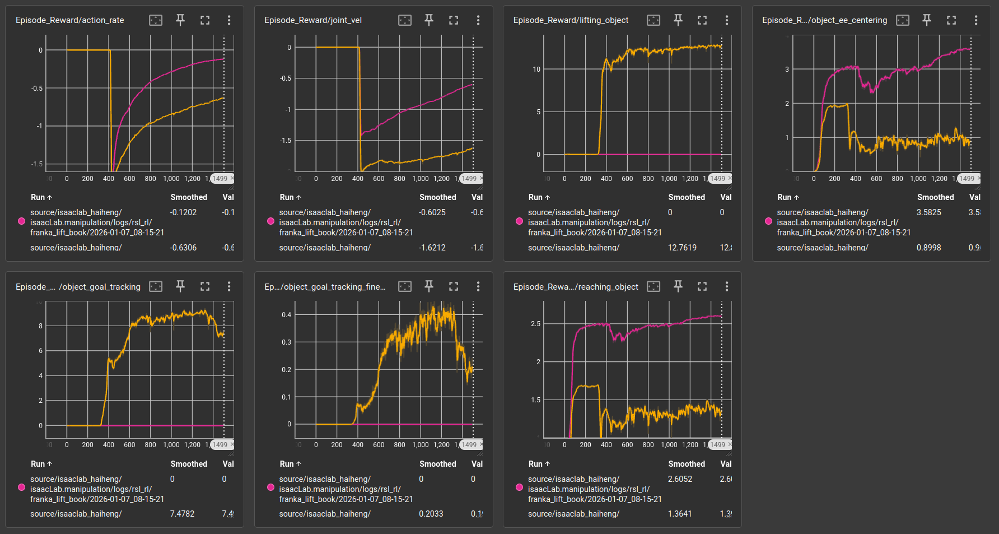
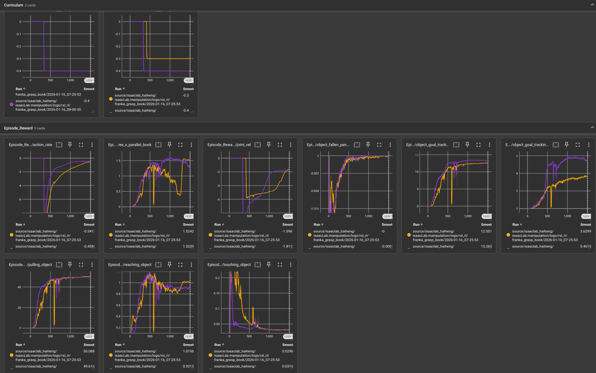

# 一、基础知识
## 机器人运动学
### 基本动力学模型
τ = D(q)q̈ + C(q, q̇) + G(q)
| 符号             | 维度           | 含义            |
| -------------- | ------------ | ------------- |
| $\tau$         | $n \times 1$ | 关节驱动力矩向量      |
| $D(q)$         | $n \times n$ | 质量/惯性矩阵（正定对称） |
| $\ddot{q}$     | $n \times 1$ | 关节加速度向量       |
| $C(q,\dot{q})$ | $n \times 1$ | 科氏力 + 离心力向量   |
| $G(q)$         | $n \times 1$ | 重力向量          |

### 动力学分析方法 牛顿欧拉法
目标是给定机器人的关节位置 q、速度 q̇ 和加速度 q̈，计算出为了产生这个运动状态，每个关节需要施加多大的驱动力矩 τ

## 坐标变换
### 欧拉角
#### 1. 定义
**Z-Y-X 欧拉角**（又称 **航向-俯仰-横滚**，Yaw-Pitch-Roll）：

- 先绕 **Z** 轴旋转 α（Yaw）  
- 再绕 **新 Y** 轴旋转 β（Pitch）  
- 最后绕 **新 X** 轴旋转 γ（Roll）

角度向量：

$$
[\alpha,\ \beta,\ \gamma]
$$

---

#### 2. 单轴基础旋转矩阵

绕当前坐标系 `i` 的各轴旋转角度 `θ` 时，对应的 **3×3 旋转矩阵** 如下：

**绕 Z 轴旋转 α（Yaw）：**

$$
R_z(\alpha)=
\begin{bmatrix}
\cos\alpha & -\sin\alpha & 0 \\
\sin\alpha &  \cos\alpha & 0 \\
0          &  0          & 1
\end{bmatrix}
$$

**绕 Y 轴旋转 β（Pitch）：**

$$
R_y(\beta)=
\begin{bmatrix}
\cos\beta  & 0 & \sin\beta \\
0          & 1 & 0         \\
-\sin\beta & 0 & \cos\beta
\end{bmatrix}
$$

**绕 X 轴旋转 γ（Roll）：**

$$
R_x(\gamma)=
\begin{bmatrix}
1 & 0          & 0           \\
0 & \cos\gamma & -\sin\gamma \\
0 & \sin\gamma &  \cos\gamma
\end{bmatrix}
$$

---

#### 3. 合成旋转矩阵（Z-Y-X 欧拉角 → 旋转矩阵）

按**当前轴顺序**右乘：

$$
R = R_z(\alpha)\cdot R_y(\beta)\cdot R_x(\gamma)
$$

展开结果：

$$
R =
\begin{bmatrix}
\cos\alpha\cos\beta &
\cos\alpha\sin\beta\sin\gamma - \sin\alpha\cos\gamma &
\cos\alpha\sin\beta\cos\gamma + \sin\alpha\sin\gamma \\[6pt]
\sin\alpha\cos\beta &
\sin\alpha\sin\beta\sin\gamma + \cos\alpha\cos\gamma &
\sin\alpha\sin\beta\cos\gamma - \cos\alpha\sin\gamma \\[6pt]
-\sin\beta &
\cos\beta\sin\gamma &
\cos\beta\cos\gamma
\end{bmatrix}
$$

---

### 坐标变换的两种解释：固定系左乘 vs 运动系右乘

> 一句话区别：
> **固定轴（外部视角）→ 左乘（Premultiply）**
> **运动轴（本体视角）→ 右乘（Postmultiply）**

---

#### 1 固定坐标系解释（Fixed-Frame / 左乘）

| 说明 | 操作顺序 | 矩阵乘法顺序 |
|---|---|---|
| 所有变换都**绕最开始的固定系**进行 | 先旋转 → 再平移 | `T = Trans(d) · Rot(R)` |
| 几何意义：把物体在“世界”里依次摆位 | 步骤 1：绕 `[0]` 旋转 → 得到 `[0']` <br> 步骤 2：沿 `[0]` 平移 → 得到 `[1]` | 左乘 |


---

#### 2 运动坐标系解释（Moving-Frame / 右乘）

| 说明 | 操作顺序 | 矩阵乘法顺序 |
|---|---|---|
| 每一步变换都**绕最新建立的动系**进行 | 先平移 → 再旋转 | `T = Trans(d) · Rot(R)` |
| 几何意义：把物体“装”在动系上，再让动系自己动 | 步骤 1：沿 `[0]` 平移 → 得到 `[0']` <br> 步骤 2：绕**新轴 `[0']`** 旋转 → 得到 `[1]` | 右乘 |


## IK 逆运动学
正：已知 θ→T，用 DH/MDH 递推
逆：已知 T→θ，解析法（Pieper 准则，三轴交于一点）或数值法（Newton-Raphson、Jacobian 伪逆、LM）。

### 解析法
解析法适用于结构较为简单的机械臂，可以通过几何或者代数方法进行求解。
满足pieper准则才有解析解：三个相邻关节轴相交于一点或者三个相邻关节轴相互平行。

### 数值法

所有非解析 IK 都建立在「**雅可比线性化 + 迭代逼近**」之上。常用三种：标准雅可比逆、伪逆、阻尼伪逆。

#### 1. 背景与目标

> 给定末端目标位姿 $\mathbf{x}_d \in \mathbb{R}^m$，求关节角度 $\mathbf{q} \in \mathbb{R}^n$，使 $\mathbf{x}_d = f(\mathbf{q})$。

$f$ 通常非线性，所以用「**线性化 + 迭代**」逼近解。

#### 2. 核心关系：雅可比把关节速度映射到末端速度

$$
\dot{\mathbf{x}} = \mathbf{J}(\mathbf{q}) \dot{\mathbf{q}}
$$

- $\dot{\mathbf{x}} \in \mathbb{R}^m$：末端任务空间速度，常用 6×1 = 线速度 v(3) + 角速度 ω(3)。
- $\dot{\mathbf{q}} \in \mathbb{R}^n$：n 个关节各自的转动速度。
- $\mathbf{J}(\mathbf{q}) \in \mathbb{R}^{m \times n}$：雅可比矩阵，依赖当前关节角。
- 直觉：**关节空间的小速度 → 任务空间的小速度**。"如果我把每个关节拧快一点点，末端会往哪边跑、跑多快？"

#### 3. 一阶雅可比迭代法

**初始化**：给定 $\mathbf{q}_0$、目标 $\mathbf{x}_d$、误差容限 $\epsilon$、最大迭代次数 $N$。

**第 k 次迭代**：

1. 当前位姿：$\mathbf{x}_k = f(\mathbf{q}_k)$
2. 误差：$\Delta \mathbf{x}_k = \mathbf{x}_d - \mathbf{x}_k$
3. 计算雅可比 $\mathbf{J}(\mathbf{q}_k)$
4. 求关节速度：
   - 非冗余（$m = n$）：$\dot{\mathbf{q}}_k = \mathbf{J}^{-1}(\mathbf{q}_k) \Delta \mathbf{x}_k$
   - 冗余（$m < n$）：$\dot{\mathbf{q}}_k = \mathbf{J}^+(\mathbf{q}_k) \Delta \mathbf{x}_k$，其中 $\mathbf{J}^+ = \mathbf{J}^T (\mathbf{J} \mathbf{J}^T)^{-1}$ 是 **Moore–Penrose 伪逆**
5. 更新关节：$\mathbf{q}_{k+1} = \mathbf{q}_k + \alpha \dot{\mathbf{q}}_k$（$\alpha$ 是小步长）
6. 收敛判断：$\|\Delta \mathbf{x}_k\| < \epsilon$ 则停止；否则继续

> 步骤 4 直觉：把"末端还差的速度"转换成"关节要补的速度"，就像齿轮比——末端差 1 mm/s，关节需要转多少 rad/s 才能补上。

#### 4. 伪逆法（冗余机械臂）

当 $n > m$ 系统**欠定**，有无穷多解。伪逆法求其中的**最小范数解**（能量最小）：

$$
\dot{\mathbf{q}} = \mathbf{J}^+ \dot{\mathbf{x}}
$$

- 在所有能满足末端速度 $\Delta \mathbf{x}$ 的关节速度里，挑一个"总转速最小"的；
- 配合零空间投影还可以加避障 / 避奇异 / 关节限位等次级目标。

#### 5. 阻尼伪逆（奇异问题）

当 $\mathbf{J}$ 接近奇异（$\det \mathbf{J} \to 0$）时伪逆法数值不稳定。

$$
\mathbf{J}^* = \mathbf{J}^T (\mathbf{J} \mathbf{J}^T + \lambda^2 \mathbf{I})^{-1}
$$

- $\lambda$：阻尼因子，通常 $0.01 \sim 0.1$
- 牺牲少量精度，换取数值稳定性

#### 6. 三种方法对比

| 方法 | 适用场景 | 优点 | 缺点 |
|------|----------|------|------|
| 雅可比逆法 | 非冗余机械臂（n = m） | 简单、直接 | 奇异时失效 |
| 伪逆法 | 冗余机械臂（n > m） | 最小范数解 | 奇异时不稳定 |
| 阻尼伪逆法 | 所有构型 | 鲁棒性强 | 精度略降 |

---

## 规划算法
### RRT*算法
#### 1 算法定位
| 维度        | 内容                                      |
|-------------|-------------------------------------------|
| 类型        | 基于采样的运动规划 |
| 解决什么问题 | 高维连续 C-space 中找**可行**→**最优**路径 |
| 对比 RRT    | RRT 只保证概率完备，RRT\* 额外持续优化，成本→c\* |

#### 2 核心思想一句话
> 在 RRT 随机扩张的基础上，**新增两步**：选父节点时选最小代价（不只是最近）；并对邻居做 **rewire**，让新采样点反过来优化已有路径。

#### 3 算法流程

RRT 基础流程：
1. 初始化环境参数
2. 随机采样 x_rand
3. 寻找树中最近点 x_nearest
4. 沿 x_nearest → x_rand 方向生长得到 x_new
5. 碰撞检测
6. 无碰撞则将 x_new 加入树

RRT\* 在第 6 步前后多两步：

- **(a) 重选父节点（Choose Parent）**：在 x_new 半径 r 内找到所有候选父节点，计算"经过候选父节点到达 x_new 的总代价"，选代价最小的作为真正父节点。
- **(b) 重写邻居（Rewire）**：再次遍历半径 r 内的邻居，判断"经过 x_new 到达邻居"是否比邻居当前路径更短，是则把邻居的父节点改成 x_new。

### A*算法
#### 1 算法定位
| 维度 | 内容 |
|------|------|
| 类别 | 图搜索 + 启发式（Informed Search） |
| 完备性 | 是（只要解存在就能找到） |
| 最优性 | 是（启发 h 可纳） |
| 时间复杂度 | O(b^d)（最坏，b 分支因子，d 解深度） |
| 空间复杂度 | O(b^d)（OPEN 与 CLOSED 表） |
| 典型场景 | 2D 栅格导航、3D UAV 体素、任务级图、多关节离散网格 |

#### 2 核心思想一句话
> “每次从边界选 **‘当前代价 + 未来估计’最小** 的节点展开；只要估计不‘吹牛’(可纳)，第一次弹出目标即最优。”

#### 3 启发式函数
欧几里得距离：直线距离，开根号
曼哈顿距离：网格地图，只允许四向移动，不用开根号 |x1-x2| + |y1-y2|

<!-- ---

### 3 数学符号


- G=(V,E) 图，边权 w(e)≥ε>0  
- g(n) = 从起点到 n 的最小已知代价  
- h(n) = 从 n 到目标的 **启发估计代价**（heuristic）  
- f(n) = g(n) + h(n)  （评估函数）  
- h\*(n) = n→目标的 **真实最优代价**  
- 可纳性 ⇔ ∀n, h(n)≤h\*(n)  
- 一致性 ⇔ ∀(n,m)∈E, h(n)≤w(n,m)+h(m)  （更强，保证 reopen 最优）

---

### 4 数据结构
| 名称 | 用途 | 实现 |
|------|------|------|
| OPEN | 待扩展节点，按 f 小顶堆 | std::priority_queue / heapq |
| CLOSED | 已扩展节点，防重复 | unordered_set / set |
| Parent | 回溯路径 | dict / vector | -->


## ROS2基本概念

### 节点与通信
- **节点（Node）**：ROS2 的基本计算单元，单一职责，通过话题 / 服务 / 参数与其他节点通信。
- **话题通信**：发布/订阅（Pub/Sub）模式，异步、多对多，发布者把消息发到话题，所有订阅者都收到，两端不直接连接。

### Launch
用 Python launch 文件批量启动多个节点 + 参数 + remap。项目里有两个：

| Launch 文件 | 职责 | 包含 |
|---|---|---|
| `robot_gazebo.launch.py` | 仿真环境 + 机器人模型 | `robot_state_publisher`（发模型） + Gazebo 仿真环境 + 在 Gazebo 中生成机器人实例 + 加载并激活控制器 |
| `navi_launch.py` | 导航功能 | Nav2 导航框架 + 自定义 A* 规划器 + RViz2 可视化 |

### Gazebo 仿真集成

| 组件 | 作用 |
|---|---|
| `gazebo_ros` 包 | ROS2 与 Gazebo 之间的桥接 |
| URDF 模型 | 定义机器人和环境模型 |
| Gazebo 插件 | 连接 Gazebo 物理引擎与 ROS2 接口 |
| `ros2_control` | 硬件抽象层，连接控制器与仿真 |


# 二、项目实战
## 个人项目

### 1. ROS2 机械臂夹取项目

#### 用到的库

| 库 | 用途 |
|---|---|
| `rclpy` | ROS2 Python 客户端库，创建节点 / 发布者 / 订阅者 |
| `gazebo_ros2_control` | 连接 Gazebo 仿真器与 ROS2 控制系统 |
| `MoveIt2` | 运动规划与操作 |
| `hardware_interface` | 硬件抽象层，连接控制器与机器人硬件 |
| `robot_state_publisher` | 发布机器人 TF 变换 |
| `joint_state_publisher` | 发布关节状态信息 |
| `rviz2` | 可视化机器人状态与轨迹 |

#### Pick-and-Place 实现

##### 状态机枚举

把整个 pick-place 流程拆成 5 个离散状态：

```
class StateMachineAction(enum.Enum):
    GRAB     # 激活夹爪，抓取物体
    DELIVER  # 运送物体
    RELEASE  # 释放物体
    HOVER    # 悬停在物体上方
    HOME     # 返回初始位置
```

##### 话题与通信

| 方向 | 接口 / 话题 | 用途 |
|---|---|---|
| Pub | `Float64MultiArray` → `joint_control_topic` | 把目标关节角发给 ros2_control 的 `JointGroupPositionController` |
| Sub | `JointState` ← `/joint_states` | 拿到实测关节角 / 角速度 / 力矩，用于 FK 反馈与速度判稳 |
| Sub | `Odometry` ← `/odom` | 拿到机器人基座在世界系的位姿；AGV 场景下需 `T_world_base` 做全局定位 |
| Sub | `PoseStamped` ← `/goal_pose` | 接收外部点击的目标，RViz 2D Nav Goal 可直接发到此话题 |

##### 运动学核心调用链

| 调用 | 功能 |
|---|---|
| `self._panda.solve_fk(joint_states)` | FK：关节角 → 末端 4×4 齐次矩阵 → 填到 Odometry |
| `self._panda.solve_ik(end_effector_target)` | IK：末端 Pose → 关节角，MoveIt2 内部默认用 KDL 求解 |
| `move_fingers(..., FingersAction.OPEN/CLOSE)` | 返回平行夹爪最后两个关节角度，0 = 全开，1 = 全闭 |

#### 遇到的问题

##### 奇异点问题
- **现象**：某关节速度暴涨。
- **原因**：6DOF 逆解时无解（雅可比向量线性相关出现奇异值）。
- **解决**：增加一个自由度，或在 yaml 配置里直接 lock 掉易出现奇异值的角度。

#### 关于动力学的说明

项目主要关注**运动学规划 + 基于位置的控制**：通过 IK 求解器算出目标关节角，再交给 ROS2 Control 的关节位置控制器执行。底层动力学由 Gazebo 根据 URDF 中的质量 / 惯量参数和控制器输出力矩自动仿真，本项目没有直接实现 RNE 等动力学推导。

### 2. 海恒智能国科大机械臂项目

#### task1 通信桥代码

##### 背景
AGX 上位机通过 HTTP 把数据传给 Docker 内部，需要一个通信桥脚本把数据转到 ROS 内，再调用 MoveIt 规划功能控制电机执行。

##### 主要接口

| 接口 | 功能 |
|---|---|
| `leg_move` | 腿部电机控制服务（服务端 + 客户端） |
| `get_current_pose_http` | 获取当前末端执行器位姿（`position.x/y/z` + `orientation.x/y/z/w`，可直接给 move_group） |
| `calculate_pre_position` | 计算从目标位置远离书架一定距离的中间位置，作为夹取前的预位 |
| `calculate_target_position_from_pixel` | 像素坐标 → base 坐标 |
| `plan_to_position` | 调用 move_group，把机械臂移动到目标位置 |

##### 难点与细节

**A. `plan_to_position` 运动规划演进**

1. **方案 1（失败）**：直接用末端位置规划，频繁解算超时、候选路径过多。
2. **方案 2（次优）**：观察 RViz 拖动末端的行为发现 move_group 内部倾向于关节空间规划；改成手动调 IK 解出关节角，再做关节空间规划。
3. **新问题**：路径中间缺少约束，机械臂出现大幅"甩动"，路径品质差。
4. **方案 3（最终）**：直接用 move_group 高级接口 `go()` 并设置位姿目标，让 move_group 内部自动完成 IK + 关节空间规划，并优选关节移动量最小的路径。

**B. 像素 + 抓取角度 → 基座坐标系下的目标位姿**

输入是 2D 像素 + 深度 + 期望抓取角度，输出是末端 6D 位姿（position + orientation）。

1. **像素 → 相机坐标**：用相机内参做反投影得到三维点。
2. **相机坐标 → 基座坐标**：用 `tf2_ros.Buffer.lookup_transform` 查 `camera_frame → base_frame` 的 TF，`ros_numpy.numpify` 转成 `T_base_cam`，矩阵乘法完成变换。
3. **构建目标姿态**：
   - 相机检测书本得到一个向量，通过 TF 旋转部分映射到基座系，作为夹爪 Z 轴。
   - 与基座系 X 轴 `[1, 0, 0]`（保证夹爪垂直于书架）叉乘构建正交坐标系，得到旋转矩阵。
   - 解算前先把夹爪坐标系对齐到基座系方向，简化"Z 对准向量、X 朝前"的逻辑；最后再做一次旋转补偿，回到夹爪 URDF 的实际坐标系。

**C. 手眼标定流程**

1. `realsense2`：相机驱动
2. `aruco_ros`：marker 标定
3. `easy_handeye`：坐标解算

> 标定原则：**深度尽量保持不变，角度尽量多变**。

#### task2 multi_action_server.py

##### 背景
ROS 节点，作为上层 MoveIt 与底层 CAN 总线电机之间的桥梁，确保多组关节（手臂、腿部）在运动时不会冲突。

##### 难点与细节

- **问题复盘**：状态读取指令无序插入动作指令序列（如 GOTO 执行中多次插入 STATE 读取），导致部分电机动作延迟、轨迹与预设不符。
- **原因**：原控制机制中动作服务器高频读取电机状态，与动作指令无约束并发——动作指令未发完就被状态读取打断；同时存在非必要的状态读取浪费资源。
- **解决**：
  - 取消无约束高频定频读取；
  - 增设约束：动作指令发送完成前禁止状态获取；
  - 优化控制锁范围，删除无效长时间锁占用，避免锁竞争。

## RL项目实践复盘&Isaaclab使用
### 25.12.27 | 环境定义架构

#### 1. 配置类（@configclass）
* **本质**：纯数据容器（Python Decorator），不含运行逻辑。
* **作用**：实现参数与逻辑解耦。通过修改配置类即可切换物理属性，无需改动环境核心代码。

#### 2. Spawn 属性
* **机制**：支持配置对象的继承与复用。
* **随机化**：通过 `spawn` 实现资产的参数化定义，是实现大规模并行环境随机化的核心入口。

#### 3. 架构解耦
* **物理资产**（Asset）与**控制逻辑**（Manager）彻底分离。
* 资产层只定义“物体是什么”，逻辑层（Reward/Obs/Action Managers）定义“怎么做”。

---

### 26.1.4 | Docker 部署与项目跑通

#### 1. Docker Build 网络故障
* **问题**：`build` 过程中 `git clone` 失败。主机全局代理无效，因 Docker 编译环境与宿主机网络默认不互通。
* **解决方法**：
    1.  `docker-compose.yaml`：在 `build` 标签下添加 `network: host` 强制共享宿主机网络。
    2.  `Dockerfile.base`：显式设置环境变量 `ENV http_proxy` 和 `ENV https_proxy`。

#### 2. 容器操作流程
* **标准步骤**：`container.py start` -> `container.py enter`。
* **注意**：必须通过 `enter` 脚本进入容器，系统会自动挂载路径并配置 `PYTHONPATH` 等环境变量，手动 `docker exec` 会导致路径报错。

#### 3. 项目运行与迁移
* **基础链路**：`train.py` 训练模型 -> `play.py` 加载模型演示。
* **API 兼容性**：老旧项目需对比官方最新 Demo 检查 `ManagerTermBase` 等 API 的函数签名，重点关注参数名的更新。

#### 4. 数据可视化（Tensorboard）
* **避坑**：Docker 内端口转发不稳定，且占用容器资源。
* **最佳实践**：在宿主机终端直接运行，通过挂载的 `logs` 目录实时读取：
    ```bash
    tensorboard --logdir .
    ```
---

### 26.1.5 | Lift 项目跑通与核心逻辑

#### 1. 环境注册机制（Registration）
* **流程**：Isaac Lab 通过 `gym.register` 将环境加入注册表。`train.py` 或 `play.py` 通过 `--task` 参数从注册表中检索配置。
* **入口**：注册信息通常集中在模块的 `__init__.py` 中。
* **链式导入**：通过 `from . import config` 等语句实现层层递进式加载，确保在运行脚本前，所有自定义环境配置已注入 Gym 注册表。

#### 2. 观测空间设计（Observations）
* **泛化性原则**：优先使用**相对坐标**。相比绝对坐标，相对坐标（如物体相对于机器人基座）能让策略更易学习空间几何关系，提高在不同初始位姿下的泛化能力。
* **坐标转换**：利用 `subtract_frame_transforms` 将物体从世界坐标系（World Frame）转换至机器人局部坐标系（Local/Root Frame）。
    ```python
    # 实现世界系到局部系的转换：(物体世界位姿 - 机器人世界位姿)
    object_pos_b, _ = subtract_frame_transforms(
        robot.data.root_state_w[:, :3], robot.data.root_state_w[:, 3:7], object_pos_w
    )
    ```

#### 3. 奖励函数结构（Rewards）
Lift 示例通常包含三个关键引导项：
* `object_is_lifted`：物体是否离开台面的离散/连续奖励。
* `object_ee_distance`：末端执行器（EE）与物体的接近诱导奖励。
* `object_goal_distance`：物体与目标位置的距离惩罚。

---

### 26.1.6 | 源码追踪与任务迁移

#### 1. 开发技巧：函数跳转
* **痛点**：由于 Isaac Lab 路径复杂，IDE 默认无法直接跳转到外部库定义。
* **解决方法**：`Ctrl+Shift+P` -> `Tasks: Run Task` -> 运行一次 Isaac Lab 提供的 Python 环境配置脚本，使 IDE 索引生效。

#### 2. 源码阅读注意点
* **版本差异**：Isaac Lab 迭代快，不同分支的代码实现（如库的调用路径）可能存在偏差。务必以当前本地库的源码定义为准进行修改。

#### 3. 任务拓展：从 Cube 迁移到长方体（模拟书本）抓取
若要训练机械臂从薄面抓取长方体，需从以下维度调整：
* **观测（Obs）**：必须引入**物体旋转角（Orientation）**，否则策略无法感知长方体的长短边，无法精准定位抓取面。
* **奖励（Rewards）**：
    * 增加姿态对齐奖励（如 EE X轴与物体法线的夹角）。
    * 增加抓取稳定性奖励。
* **算法配置（RSL_RL）**：算法逻辑通常无需改动，但针对更精细的任务，可能需要微调学习率（Learning Rate）或增加训练迭代次数（Max Iterations）。
* **配置注册**：需新建对应的配置文件并在 `__init__.py` 中更新注册信息。

### 26.1.7 | 长方体抓取：奖励破解与物理约束

#### 1. 奖励破解（Reward Hacking）现象
* **问题**：改成长方体后，机械臂学会了通过“侧蹭”使物体竖立来骗取 `lift_object` 分数，而非真正夹取。
* **成因**：`lift_object` 权重过高且目标高度阈值设定过低，导致“竖立”动作产生的位移足以触发奖励。

#### 2. 引导奖励与物理极限
* **优化**：引入 `EE_to_object_distance` 奖励，强制末端靠近重心中点，抑制“蹭”的行为。
* **失败分析（紫色曲线）**：增加抬升高度后任务失败。对比 Tensorboard 曲线发现，抬升奖励归零是因为设置的高度**超出了机械臂的物理可达范围（Workspace Limit）**。
* **反思**：奖励目标必须设定在机器人运动学范围内，否则会引导策略进入死胡同。



---

### 26.1.8 | 姿态对齐与 Sim2Real 预演

#### 1. 随机化与观测增强
* **Domain Randomization**：在 `EventCfg` 中增加初始偏航角（Yaw）随机化，模拟物体在书架上的不同摆放姿态。
* **Sim2Real 衔接**：模拟相机检测逻辑，将“物体中心指向倾斜方向的向量”注入观测空间（Observations），为后续实机部署对齐数据流。

#### 2. 引导对齐奖励（Orientation Guidance）
为引导夹爪从薄面夹取，新增两项奖励：
* **平行奖励**：EE 的 X 轴与物体向量平行。
* **垂直奖励**：EE 的 Z 轴与物体向量垂直。

#### 3. 负面现象：任务后过度调整（Over-optimization）
* **现象**：物体举起后，夹爪为追求姿态分持续扭动，导致机械臂高频抖动或姿态扭曲。
* **根源**：
    1.  `joint_vel` 和 `action_rate` 惩罚项过小，不足以抑制高频震荡。
    2.  奖励函数在任务完成后未失效，导致 AI 在高处“刷分”。

#### 4. 改进思路：奖励消隐与参考系切换
* **线性消隐（Linear Decay）**：引入线性插值，随着物体高度增加（任务接近完成），逐渐降低姿态奖励的权重，使机器人后期专注于稳定维持。
* **坐标系重构**：考虑将夹爪对齐目标由“物体局部向量”改为“世界坐标系轴向”。
    * **优点**：物体的局部向量在被抓起旋转时会剧烈变动，导致奖励不稳定；对齐世界坐标系（如垂直于地面）通常能提供更稳定的梯度。

### 26.1.13 | PPO 算法原理（基于 rsl_rl 源码）

#### 1. 核心损失函数
PPO 通过限制策略更新幅度来确保训练稳定性。其核心公式为：

* **策略裁剪（Clip Surrogate Object）**: 
    $$L^{CLIP}(\theta) = \hat{\mathbb{E}}_t \left[ \min \left( r_t(\theta) \hat{A}_t, \text{clip}(r_t(\theta), 1-\epsilon, 1+\epsilon) \hat{A}_t \right) \right]$$
* **总损失函数（Total Loss）**: 
    $$L_t^{PPO}(\theta) = \hat{\mathbb{E}}_t \left[ L_t^{CLIP}(\theta) - c_1 L_t^{VF}(\theta) + c_2 S[\pi_{\theta}](s_t) \right]$$

#### 2. Actor-Critic 模型结构
* **Actor（策略网络）**：输出动作的均值 $\mu$。通过 `std`（标准差）参数构建正态分布进行采样，维持探索性。
* **Critic（价值网络）**：输出状态价值 $V(s)$，用于评估当前局面的好坏。

#### 3. 计算比例和Clip损失
```python
# Actor-Critic简化逻辑示意
class ActorCritic(nn.Module):
    def __init__(self, ...):
        # 定义策略网络 (Actor)
        self.actor = nn.Sequential(...) # 输出动作均值 mu
        # 定义价值网络 (Critic)
        self.critic = nn.Sequential(...) # 输出状态价值 V(s)
        # 动作标准差 (Action Standard Deviation)，代表探索的随机性
        self.std = nn.Parameter(torch.ones(num_actions))

    def act(self, observations):
        # 采样动作：根据正态分布 N(mu, std)
        mu = self.actor(observations)
        dist = Normal(mu, self.std)
        action = dist.sample()
        return action, dist.log_prob(action), self.critic(observations)
```
```python
# 获取新旧策略的动作概率比
actions_log_prob_batch = self.actor_critic.get_actions_log_prob(obs_batch, actions_batch)
ratio = torch.exp(actions_log_prob_batch - old_actions_log_prob_batch)

# PPO Clipped Objective
surrogate = -advantages_batch * ratio
surrogate_clipped = -advantages_batch * torch.clamp(ratio, 1.0 - self.clip_param, 1.0 + self.clip_param)
# 取两者中的最大值（因为这里带了负号，等同于论文里的 min）
action_loss = torch.max(surrogate, surrogate_clipped).mean()
```
```python
# Critic 的损失：预测值与目标值 (Returns) 的均方误差
value_loss = (return_batch - value_batch).pow(2).mean()
```
```python
# 鼓励探索
entropy_loss = dist.entropy().mean()
```
```python
# 总损失 = 策略损失 + 价值损失权重 * 价值损失 - 熵权重 * 熵损失
loss = action_loss + self.value_loss_coef * value_loss - self.entropy_coef * entropy_loss

# 反向传播
self.optimizer.zero_grad()
loss.backward()
self.optimizer.step()
```
#### 4. 优势函数计算：GAE (Generalized Advantage Estimation)
GAE 通过权衡偏差（Bias）和方差（Variance）来计算优势函数 $\hat{A}_t$。
* **TD 误差（$\delta$）**: $r_t + \gamma V(s_{t+1}) - V(s_t)$。
* **递归计算**: 结合 $\gamma$（折扣因子）和 $\lambda$（平滑参数）进行逆序计算，平滑优势估计。
```python
def compute_returns(self, last_values, gamma, lam):
    advantage = 0
    for step in reversed(range(self.num_transitions_per_env)):
        next_values = last_values if step == self.num_transitions_per_env - 1 else self.values[step + 1]
        # TD 误差 delta
        delta = self.rewards[step] + gamma * next_values * self.not_done[step] - self.values[step]
        # GAE 递归计算
        advantage = delta + gamma * lam * self.not_done[step] * advantage
        self.advantages[step] = advantage
        self.returns[step] = self.advantages[step] + self.values[step]
```

---

### 26.1.14 | 任务进阶：从 Lift 到 Grasp & Pull

#### 1. 任务迁移
目标由单纯的垂直抬升（Lift）转变为从书架中夹取并向外拉出（Pull）。

#### 2. 坐标系陷阱：全局 vs 局部
**痛点**：在 Isaac Lab 大规模并行仿真中，环境按 `env_spacing` 平铺分布。
* **全局坐标（root_pos_w）**：每个环境的坐标系原点在世界空间中是不同的。
* **风险**：若直接用全局 $X$ 坐标设定奖励阈值，除 0 号环境外，其他环境可能在起始点就已触发奖励（刷分），导致梯度爆炸或模型无法收敛。

**解决方案**：永远使用**相对坐标**计算奖励逻辑。
```python
# 将物体的世界 X 坐标减去该环境在世界系中的原点 X 坐标
relative_x = object.data.root_pos_w[:, 0] - env.scene.env_origins[:, 0]

# 基于相对位移判断拉出状态
is_pulled = relative_x < (target_x_offset - minimal_distance)
```

---

### 26.1.15 | 权重分配与训练稳定性

#### 1. 任务阶段权重失衡：Reach vs. Pull
* **现象**：末端执行器（EE）夹住书本后停止动作。
* **根源**：任务被分为“接近（Reach）”与“拉出（Pull）”两个阶段。若 Reach 阶段的引导奖励（距离、对齐等）权重过大，而 Pull 阶段（目标追踪、位移）权重过小，Agent 会倾向于停留在接近状态以稳拿高分，失去后续冒险拉出的动力。
* **对策**：显著提升 Pull 相关项（如 `pulling_object`）的权重，确保后期奖励远高于前期引导奖励。

#### 2. 终止条件导致的 Value Loss 爆炸
* **现象**：增加“书本倒下”的终止条件（Termination）后，Value Loss 飙升至 `inf`。
* **原理**：在 PPO 中，Critic 网络负责预测长期回报。如果环境突然终止（书本倒下）却没有任何对应的负反馈（惩罚），Critic 会无法理解为什么高分奖励流会瞬间中断，导致预测偏差剧烈震荡。
* **对策**：**保持奖励连续性**。在设置终止条件的同时，必须配套施加显著的负奖励（Penalty），让算法明确感知到“触发该条件是错误的”。

#### 3. 任务后期摆动问题
* **现象**：成功抓取并取出后，EE 大幅度偏转或乱动。
* **原因**：Curriculum 中的 `joint_vel` 和 `action_rate` 惩罚介入过晚或权重过小，导致 Agent 在完成核心任务后完全无视运动的平滑性。
```python
# Curriculum本身是为了初期训练的流畅，在一定步数之后在增大惩罚项的权重
@configclass
class CurriculumCfg:
    """Curriculum terms for the MDP."""
    action_rate = CurrTerm(
        func=general_mdp.modify_reward_weight, params={"term_name": "action_rate", "weight": -1e-1, "num_steps": 10000}
    )

    joint_vel = CurrTerm(
        func=general_mdp.modify_reward_weight, params={"term_name": "joint_vel", "weight": -1e-1, "num_steps": 10000}
    )

```

---

### 26.1.16 | curriculum优化

#### 1. 惩罚项介入时机的量化参考
* **策略**：参考核心任务奖励（如 `pulling_object`）的曲线。
* **逻辑**：当前期奖励达到稳定阈值（说明 Agent 已掌握抓取基本功）时，即为施加运动限制的最佳时机。
* **计算示例**：若 `pulling_object` 在第 400 次迭代左右达标，则设置 `num_steps = 400 * num_steps_per_env`（如 $400 \times 24$）。


#### 2. 从跳变到线性插值（Smoothing）
* **现状**：原生的 `modify_reward_weight` 函数执行权重突变（Step Change），容易造成策略抖动。
* **改进**：自研 `modify_reward_weight_linear` 函数。
* **优势**：
    * **平滑过渡**：在设定的步数区间内（如从 6000 到 20000 步）线性增加惩罚。
    * **学习稳定性**：给 Agent 留出适应“运动限制”的时间缓冲区，避免因突然增加的惩罚导致已学到的抓取策略崩溃。




## 超维动力工作总结
### PI05 归一化统计
#### 1. norm_stats 是什么
`compute_norm_stats.py` 会输出 `norm_stats.json`，包含 `state`（机器人当前状态）和 `actions`（动作指令）两组统计量，每组 4 个值：

| 字段 | 含义 | 计算方式 |
|---|---|---|
| `mean` | 均值 | 全数据加权滑动平均 |
| `std` | 标准差 | √(E[x²] - E[x]²) |
| `q01` | 第 1 百分位数 | 直方图近似 |
| `q99` | 第 99 百分位数 | 直方图近似 |

为什么需要：每个关节的角度范围相差几百倍，直接喂给模型会让 loss 和梯度被波动大的维度主导，波动小的维度信号被淹没。归一化把每个维度除以自己的标准差拉到同一尺度，让模型对每个关节同等关注。

#### 2. `compute_norm_stats.py` 计算速度优化
**核心优化：跳过视频解码**

`compute_norm_stats` 只需要 `state` 和 `actions` 的统计量，根本用不到图像；但 v1 直接复用 `LeRobotDataset`，每次取样都会走 `_query_videos` 把对应帧的 mp4 解码出来，纯属浪费 CPU。

v2 的思路是用一个子类覆盖 `_query_videos`，让它直接返回与真解码同 shape 的全零张量。下游 `RepackTransform` / `AlohaInputs` / `DeltaActions` 等 transform 看到的 dict 结构和维度跟原来完全一致，不需要任何改动；而图像本来就是 transform pipeline 的旁路，不参与 `state`/`actions` 的统计，因此 `norm_stats` 数值结果与 v1 同分布，是纯加速优化。

实测提速：`pico_ego_V7` 是 av1 编码、1536×2048 视频，mp4 解码极吃 CPU，v1 在 8-worker 下几乎是 CPU-bound；v2 只读 parquet，全量遍历 1500w 帧从 6–10 小时压到 1 小时以内（5–10×）。


### PI0 训练流程笔记

PI0 / PI0.5 / PI0.7 都是 Physical Intelligence 出的视觉-语言-动作（VLA）模型，把机器人控制建模成"条件生成"问题：给定多视角图像、语言指令和本体状态，输出未来 H 步的连续动作序列。

#### 0. 家族总览

| 模型 | 时间 | 核心改动 |
|---|---|---|
| PI0 | 2024.10 | PaliGemma VLM + Action Expert + Flow Matching，10K 小时同质数据 |
| PI0-FAST | 2025 | 用 FAST tokenizer 把动作离散化成 token，走纯自回归路径 |
| PI0.5 | 2025.04 | FAST 离散预训练 + flow matching 后训练；异构多源数据联合训练；层次化高低层推理 |
| PI0.7 | 2026 | Steerable：多模态 prompt（subgoal 图、episode metadata）+ 知识隔离 KI |

#### 1. 模型架构：双专家如何与 VLM 交互

##### 1.1 整体结构

- **Prefix 侧（VLM 专家）**：SigLIP 编码图像 → image embedding；Gemma-2B 词嵌入 → language embedding。约 2.7B 参数，从 PaliGemma 初始化。
- **Suffix 侧（Action Expert）**：`state_proj` → 状态 embedding；`action_in_proj` + time MLP → 动作 + 时间 embedding。Gemma-300m 架构，随机初始化。
- **输出头**：`action_out_proj` → 预测向量场 `v_t`，shape `[B, 50, action_dim]`。

##### 1.2 双专家在 Transformer 内的交互方式

PI0 在**同一个 Transformer 内**用两组独立权重（类似 MoE），每一层做的事：

- **Q / K / V 投影 + FFN 各自独立**（VLM 用 PaliGemma 权重，action expert 用随机初始化的小权重）。
- 两边的 token **拼成一条序列做联合 self-attention**——action expert 的 Q 可以查到 VLM prefix 的 K/V，把视觉语义"拉过来"。
- attention 出来之后 FFN 各走各的。

**信息流向用 attention mask 控制**：

| 区块 | 可看见 |
|---|---|
| Prefix（image + language） | 仅 Prefix（双向） |
| State token | Prefix + 自己 |
| Action tokens | Prefix + state + 全部 action token（action 内部双向） |

prefix 看不到 suffix——信息**单向流向** action expert，不污染 VLM 预训练分布。这也是 prefix KV 可以缓存的原因（10 步 Euler 推理时 prefix 只算一次）。

PI0.5 / PI0.7 沿用这个双专家骨架，但监督路径有变化：
- **PI0.5**：VLM 同时通过 FAST 离散动作 token 的交叉熵被监督；action expert token 不去看 FAST token，避免两种动作表示泄漏。
- **PI0.7（知识隔离 KI）**：action expert 可以 attention 访问 VLM 全部激活，但**梯度不回传到 VLM**。VLM 只由 FAST 离散交叉熵监督，避免连续 flow 损失干扰视觉语言表征。

#### 2. Flow Matching vs Diffusion

两者都是"从噪声生成数据"的连续生成模型，本质都在学一条把高斯分布变换到数据分布的路径，区别在路径设计：

| 维度 | Diffusion (DDPM) | Flow Matching |
|---|---|---|
| 前向过程 | 反复加噪：`x_t = √α_t · x_0 + √(1-α_t) · ε` | 直线插值：`x_τ = τ·noise + (1-τ)·action` |
| 学习目标 | 预测噪声 `ε` 或 score `∇log p_t` | 预测向量场 `v_τ = noise - action`（直线方向上的速度） |
| 数学框架 | SDE / 马尔可夫链 | ODE / 连续归一化流 |
| 时间步采样 | 一般均匀 | PI0 用 `Beta(1.5, 1.0)` 偏向小 τ |
| 推理 | DDIM/DPM-Solver，20-50 步 | Euler ODE，PI0 只 10 步 |
| 训练稳定性 | β/α 调度敏感 | 直线路径更稳，loss 更平 |

##### PI0 的具体实现

构造样本（fp32 算）：

- `noise ~ N(0, I)`，`τ ~ Beta(1.5, 1.0)` 缩放到 `[0.001, 1.0]`。
- `x_τ = τ · noise + (1 - τ) · actions`。
- 目标向量场：`u_τ = noise - actions`。

Loss：`L = E[||v_θ(x_τ, τ, condition) - u_τ||²]`。

直觉：`τ → 0` 时 `x_τ ≈ actions`（接近目标），`τ → 1` 时 `x_τ ≈ noise`（接近纯噪声）。`Beta(1.5, 1.0)` 偏向小 τ 是因为接近目标那段决定最终精度，需要重点训。

##### PI0 选 Flow Matching 的理由

- 训练目标更简单（不用复杂噪声调度）。
- 推理快——10 步 Euler 就收敛，diffusion 一般要 20-50 步。
- 与机器人 50Hz 控频匹配（4090 上推理 ~73ms）。

#### 3. 数据流：从观测到 loss

##### 3.1 输入

> 以下以 PI0 论文默认的**双臂场景**（如 Franka 双臂 / Aloha-AgileX）为例，state/action 都是 **16 维**；不同 embodiment 维度不同，但 openpi 实现里都会被 pad 到 `max_state_dim = max_action_dim = 32` 统一进 Transformer（这也是 3.5 节输出为 `[B, 50, 32]` 的原因）。

- `observation`：
  - **图像** `[B, V, 3, 224, 224]`：V 个视角的 RGB（典型双臂配置 V=3：head + 左 wrist + 右 wrist），每张 224×224 给 SigLIP；
  - **state** `[B, 16]`：当前本体感觉（proprioception），双臂 = 左臂 7 joint pos（关节角度，单位 rad）+ 1 gripper（开合 0/1 或归一化连续值）+ 右臂 7 joint pos + 1 gripper；
  - **language tokens** `[B, L]`：任务指令（如 "pick up the red cup"），经 Gemma tokenizer 编码。

- `actions` `[B, 50, 16]`：未来 H=50 步的 **action chunk**，每一步同样 16 维（双臂 joint + gripper）。action 一般用**绝对 joint 目标**或 **delta joint**（取决于具体配置）；gripper 维度一般是 0/1 开合或归一化连续开度。

> 关于 16 维到 32 维的 padding：进入 `action_in_proj` 前，会把 16 维零填充到 32 维（`max_action_dim`），这样同一个 PI0 模型可以无缝吃不同 embodiment 的数据（单臂 7 维、Franka 双臂 16 维、Aloha-AgileX 14 维等），只在最后做 action 时按真实维度截断。state 也是同样的 pad 处理。

##### 3.2 Prefix Embedding（图像 + 语言）

- SigLIP：Conv2d patch embedding（fp32）→ 位置编码（fp32）→ cast bf16 → 12 层 Transformer → 输出 `[B, 256, dim]` bf16。
- 语言：Gemma-2B `embed_tokens`（bf16）→ 乘 `sqrt(dim)` 缩放。
- 拼接后 attention mask 全 0 = 双向，图像和语言互相可见。

`patch_embedding` 和 `position_embedding` 故意保留 fp32：图像信息进入模型的第一个瓶颈，精度损失会传播到所有后续层。

##### 3.3 Suffix Embedding（状态 + 动作 + 时间）

- 状态：`state_proj = Linear(16 → width)`，fp32。
- 时间：正弦位置编码把标量 `τ ∈ [0, 1]` 编码为高维向量。
- 动作：`action_in_proj(x_τ pad 到 32 维)` → 与 `time_emb` 拼接 → MLP（`Linear → SiLU → Linear`）融合。
- Suffix 内部 attention mask 为 causal：state 和 action 各 token 只能看到自身及之前的。

##### 3.4 联合 Transformer 前向

- Attention mask 结构见 1.2。
- 双专家：每层 prefix/suffix 各算自己的 Q/K/V 后拼起来做联合 attention，FFN 各自独立。
- 数值稳定关键算子强制 fp32：**Softmax、RoPE 三角函数、RMSNorm 方差**。bf16 下这几个算子会累积明显数值漂移。

##### 3.5 输出与 Loss

```
suffix_out → cast fp32 → action_out_proj → v_t [B, 50, 32]
loss = MSE(u_τ, v_t)        # fp32 下算，避免 bf16 平方溢出
loss.backward()
```

`v_t` 应逼近 `u_τ = noise - actions`。

#### 4. 为什么能输出 Action Chunk

##### 4.1 chunk 是什么

PI0 一次预测的不是单步动作，而是未来 H=50 步序列 `A_t = [a_t, ..., a_{t+49}]`，叫 **action chunk**。控制时取前 25 步执行，然后下一次推理。

##### 4.2 架构为什么能支持

- Suffix 里直接放 H 个 action token，每个 `action_in_proj` 投影一个时间步的 noisy action。
- Action 内部双向 attention，可以建模 50 步之间的时序依赖。
- Flow matching 的向量场输出 shape 天然是 `[B, H, action_dim]`，**一次性预测整个 chunk 的速度场**，没有自回归的串行依赖。

对比 OpenVLA：走自回归离散 token，每个时间步都要解一个 token，输出 50 步动作需要 50 次串行 decode，无法满足 50Hz 控频。PI0 论文里 OpenVLA 在灵巧任务上"几乎完全失败"就是这个原因。

##### 4.3 推理：10 步 Euler ODE

从纯噪声 `x ~ N(0, I)`（`τ=1`）出发，分 10 步沿向量场走回 `τ=0`：

```
for step in range(10):
    x = x - dt * v_θ(x, τ, condition)   # dt = 0.1
    τ -= dt
```

之所以 10 步够：
- Flow matching 直线路径收敛快。
- Prefix KV 可缓存，只算一次；10 步只重复算 suffix 的 attention/FFN。
- 4090 上总耗时 ~73ms（图像编码 14ms + 观测 forward 32ms + 10 步去噪 27ms）。

#### 5. State 表示的两种正交选择

PI 系列里 state 字段有两个完全独立的维度可以调，**不要把它们搞混**：

##### 5.1 编码方式：`discrete_state_input`

控制 **state 怎么进模型**：

- `discrete_state_input=True`（PI0.5 默认）：state 走**文本 token 路径**。tokenizer 把 state 离散化成整数序列拼到 prompt 文本，例如 `Task: xxx, State: 12 87 200 ...; Action:`，跟 task 一起走 VLM bidirectional attention。
- `discrete_state_input=False`（PI0 默认）：state 走**连续向量路径**。经过 `state_proj` 线性投影变成连续 token 拼到 action expert 的 suffix 里。

实际工程里 `pi05_pico` 当前是 `pi05=True` + `discrete_state_input=False`，这是非默认组合——骨架是 PI0.5，但 state 走 PI0 风格连续投影。

##### 5.2 内容语义：state 字段里装什么

控制 **state 字段里放什么数**，与编码方式无关：

- 当前 proprioception（标准）：state[t] = 当前关节角度。
- `action[t-1]`（变体）：state[t] = 上一帧的动作指令。

##### 5.3 两个维度可任意组合

| state 内容 | state 编码 | 说明 |
|---|---|---|
| 当前 proprioception | 离散文本 token | PI0.5 标准组合 |
| 当前 proprioception | 连续投影 | PI0 / 当前 pi05_pico |
| `action[t-1]` | 离散文本 token | 变体 A |
| `action[t-1]` | 连续投影 | 变体 B |

要把 state 改成 `action[t-1]`，**正确做法是改数据侧**，不是动 `discrete_state_input`：

- 在数据 transform 链路加一步 `RepackTransform` 或自定义 transform，在 LeRobot dataset 层面或 `LeRobotPicoEgoDataConfig` 的 `repack_transforms` 里替换 `state` 字段。
- 首帧没有 `t-1`，用零向量或第 0 帧 action 自身填充。
- **`norm_stats` 必须同步替换**：原来 state 和 action 各有 mean/std；改成 action 分布后必须用 action 的 norm stats 给替换后的 state 归一化，否则模型看到的输入分布偏移。

一句话：`discrete_state_input` 改的是"state 张量怎么进模型"，"上一帧 action 当 state"改的是"state 张量里放什么数"，两者正交不互相替代。

#### 6. PI0-FAST：动作离散化 Tokenizer

PI0 用 flow matching 输出连续动作；PI0-FAST 走另一条路——把动作变成离散 token，让自回归 VLM 直接预测。

##### 6.1 为什么不能直接对动作做 BPE

机器人动作在时域上**高度相关**（手臂位置变化平滑），直接 BPE 会得到极长的低熵 token 序列，浪费上下文。

##### 6.2 FAST 的两步压缩

1. **DCT 频域转换**：对一段动作做**离散余弦变换（Discrete Cosine Transform）**，把时序信号从时域转到频域。机器人动作的高频分量很小，可以直接丢掉只保留低频系数。
2. **BPE 字节对编码**：对剩下的低频系数做 BPE，得到有限的"动作词表"——类似 LLM 词表，每个 token 代表一段动作的某种"模式"。

##### 6.3 在 PI0.5 / PI0.7 中的作用

PI0.5 同时训练两种动作预测路径，联合 loss：

`L = H(FAST_tokens) + α · ||v_θ - u_τ||²`

- 预训练阶段 `α=0`，只用 FAST 离散监督，训练效率高、适合大规模异构数据。
- 后训练阶段 `α=10`，启用 action expert + flow matching，精度高、推理快。

PI0.7 把这种"FAST 监督 VLM + flow matching 监督 action expert"做成永久的双轨结构（即 KI），并且 VLM 梯度不被 action expert 污染。

#### 7. 训练工程细节

##### 7.1 梯度裁剪 + AdamW

- `clip_grad_norm_`：全局 L2 范数超过 `max_norm=1.0` 时等比例缩小。
- AdamW：`β1=0.9, β2=0.95, ε=1e-8, wd=1e-10`。

精度影响：bf16 参数下 m/v 只有 2-3 位有效数字，`lr=2.5e-5` 时微小更新会被吞掉（`1.0 + 2.5e-7 = 1.0`）；fp32 下更新正确保留（`1.0 + 2.5e-7 = 1.00000025`）。所以**优化器状态必须 fp32**，参数可以 bf16 + master copy fp32。

##### 7.2 学习率调度

前 1000 步线性 warmup 到 `peak_lr=2.5e-5`，之后 cosine decay 到 `end_lr=2.5e-6`。

##### 7.3 JAX 显存：XLA 环境变量

```bash
# export XLA_PYTHON_CLIENT_ALLOCATOR=platform   # 不要再设这个
export XLA_PYTHON_CLIENT_MEM_FRACTION=0.9
```

`platform` 模式是"用多少分配多少"会有波动，跟 `MEM_FRACTION=0.9` 的预分配冲突，导致 0.9 不生效。统一只设 `MEM_FRACTION=0.9` 预先分配，行为更稳定。

#### 8. 完整数据流图

```
数据加载 (fp32)
  → 采样 noise + time (fp32)
  → 构造 x_τ 和目标 u_τ (fp32)
  → SigLIP 编码图像 (fp32→bf16)
  → Gemma 词嵌入 (bf16)
  → state/action/time 编码 (fp32)
  → 统一 cast bf16 进 Transformer
  → 双专家 Transformer (bf16, Softmax/RoPE/RMSNorm 用 fp32)
  → 输出 cast fp32 → action_out_proj → v_t [B, 50, 32]
  → MSE loss (fp32) → backward → clip_grad → AdamW.step
  → 定期保存 checkpoint
```

#### 9. PI0.5 相对 PI0 的改进

| 维度 | PI0 | PI0.5 |
|---|---|---|
| 训练数据 | 10K 小时同质遥操作 + OXE | 异构联合训练：MM + ME + CE + HL（高层标注）+ WD（网络数据）+ VI（口头指令），97.6% 数据不来自目标平台 |
| 训练阶段 | 单阶段：预训练 → 后训练 | 两阶段：FAST 离散 token 自回归预训练 → 加入 action expert + flow matching 后训练 |
| 推理范式 | 一次给出 action chunk | 层次化：同一模型先输出子任务文本（"拿起盘子"），再基于子任务输出动作 |
| State 默认编码 | 连续投影（`discrete_state_input=False`） | 离散文本 token（`discrete_state_input=True`） |
| 泛化能力 | 任务级泛化（同环境） | 开放世界泛化：在**全新真实家庭**完成 10-15 分钟清洁任务 |

核心 take-away：PI0.5 把 VLA 重新定义成一个**同时能输出文本（子任务、FAST 动作 token）和连续动作（flow matching）的统一模型**，靠异构数据联合训练 + 层次化推理实现开放世界泛化。

#### 10. PI0.7 相对前作的不同

关键词是 **Steerable**——同一个通用模型可以通过 prompt 精确控制"怎么做"。

##### 10.1 架构变化

- VLM 骨干升级到 Gemma-3 4B + 400M 视觉编码器。
- 新增 **MEM 视频历史编码器**：最多 4 个摄像头 × 6 帧历史时空压缩成固定数量 token。
- Action expert 扩到 860M（PI0/PI0.5 是 300M）。
- 总参数约 5B。

##### 10.2 核心创新：多模态 Prompt

除语言指令外，prompt 还可包含：

- **子任务指令** `ℓ̂_t`：当前要做的语义子任务文本。
- **子目标图像** `g_t`：BAGEL 14B 世界模型生成的近未来期望状态图像，专门解决"语言描述不清楚视觉细节"的问题。
- **Episode metadata**：速度（离散化步数）、质量（1-5 分）、错误标签、控制模式。**这是 steerable 的核心抓手**——训练时给真实标签，推理时设为"最高质量/最快速度/无错误"来引导模型输出最优行为。

训练时各组件随机 dropout（subgoal 75%、metadata 15%、子任务 30%），让模型推理时可以灵活使用任意子集。

##### 10.3 知识隔离（KI）

VLM 只由 FAST token 的离散交叉熵监督，action expert 可以 attention 访问 VLM 的全部激活，但**梯度不回传到 VLM**。VLM 训练更稳定，避免连续 flow loss 干扰视觉语言表征。

##### 10.4 涌现能力

- **跨构型零样本迁移**：BiPi → UR5e 折 T 恤，80% 成功率，匹配顶级人类遥操作员。
- **组合泛化**：通过语言 coaching 完成训练中从未见过的任务（空气炸锅、压面壶等）。
- **混合质量数据的 scaling**：去掉 metadata 时加更多数据反而性能下降；有 metadata 时持续提升——证明 metadata 条件化解锁了数据规模的 scaling 效应。

##### 10.5 PI0 → PI0.5 → PI0.7 内在逻辑

| 维度 | PI0 | PI0.5 | PI0.7 |
|---|---|---|---|
| 解决的核心问题 | 灵巧操作的高频动作生成 | 开放世界场景泛化 | 多策略 steerable 控制 |
| 数据策略 | 高质量同质遥操作 | 异构多源（含网络数据） | 混合质量 + metadata 条件化 |
| Prompt | 语言指令 | 语言 + 自动生成子任务 | 语言 + 子任务 + subgoal 图 + metadata |
| 关键设计 | Flow matching + 双专家 | FAST 预训练 + 层次化推理 | Episode metadata + 知识隔离 |

### pico ego pipeline

把 PICO 头显采集的第一人称视角原始数据（视频 + tracking + 片段标注）转换成 **LeRobot v2.1** 数据集，用于 VLA 模型（pi0.5）预训练。

#### 输入与输出

**输入**：每个采集会话目录包含
- `CameraRecord_*.mp4`：原始头显视频
- `trackingData_*.txt`：JSON Lines 格式的手部追踪
- `camera_params*.json`：相机内参 + 畸变参数
- `*_segments_description.json`：人工标注的片段（skill、interacting_hand、target_object 等）
- `quality_inspection.json`：质检报告（可选）

**输出**：标准 LeRobot 数据集（`data/` / `videos/` / `meta/`），`observation.state` 与 `action` 均为 **20D**（每只手 `xyz(3) + 6D rotation(6) + gripper(1) = 10D`，6D 旋转用 Zhou et al. 2019 的"旋转矩阵前两列展平"）。

#### 流水线步骤

入口 `run_pipeline.py` 递归扫描顶层目录下所有会话，按以下步骤逐个处理：

| 步 | 内容 | 脚本 |
|---|---|---|
| **Q** | 质量过滤（硬过滤 + 软评分 0~5）；硬过滤未通过直接跳过 | `quality_filter.py` |
| **0** | 修正 tracking 时间戳（补偿管线延迟 140ms） | `00_correct_tracking_time.py` |
| **1** | 并行：① tracking TXT → HDF5（只保留左右手）；② 视频去畸变 | `01_trackingdata_to_hdf5.py` / `01_video_undistort.py` |
| **2** | 按标注切分 episodes：视频段 + 动作 H5，可选帧率转换（如 25→30fps，`setpts=N/fps/TB -bf 0`） | `02_video_hdf5_segment.py` |
| **3** | H5 → Parquet：构造 20D state/action（xyz+6D rot+gripper），同时生成 `tasks.jsonl` | `03_hdf5_to_parquet.py` |
| **4** | 并行：① 整理 LeRobot `data/`；② 整理 LeRobot `videos/`（仅复制重组，不重编码） | `04_lerobot_data_generate.py` / `04_lerobot_video_generate.py` |
| **5** | 生成 LeRobot `meta/`（info.json、stats、episodes.jsonl、tasks.jsonl 等） | `04_lerobot_meta_generate.py` |
| **6**（可选） | `--auto-merge` 合并所有单会话数据集到 `_merged/`，**视频用 symlink** 节省空间 | `05_merge_lerobot_datasets.py` |

#### 质量过滤的两层设计

1. **硬过滤**：任一命中直接淘汰
   - 相机标定无效（去畸变会崩）
   - 视频 < 5s（切分后没意义）
   - 视频-tracking 时长比偏离 `[0.9, 1.1]`（同步出问题）
   - 双手 missing ratio 都 > 90%
   - 语义噪声里有 invalid 段
   - 关节 ROM 违规 > 100 帧

2. **软评分**：从视觉 / 动作 / 时序 / 内容四个维度打 0~100 分 → 映射到 0~5 的 quality 数值，写入 `task_prompt` 前缀：

   `quality: 5; skill: Hover; hand: both; target_object: shelf; type: human; <原始描述>`

   下游训练时可按 quality 筛选/加权（pi0.7 那种 multimodal prompting 的思路）。

#### 关键设计点

- **20D action 维度** 是为了对齐 VLA 输入；6D rotation 而非欧拉/四元数，避免不连续性。
- **视频帧率统一在 Step 2 完成**，Step 4 不再重编码，避免重复 transcoding 损失质量。
- **中间产物（`_middle/` 与 `_segments/`）默认结束清理**，`--debug` 保留方便排查。
- **OSS FUSE 写视频问题**：所有 ffmpeg / cv2.VideoWriter 输出必须先写本地 FS 再 `cp`，已封装在 `staged_writer`（见上节）。
- **并行**：单会话内 Step 1 / Step 4 并行；多会话之间用 `--workers` 控制 ThreadPoolExecutor。


### 基于 OpenPI 0.5 开发两套 Policy：Egocentric 与 UMI/遥操

为了让 Pico 第一视角数据和松灵双臂的 UMI/遥操数据共用同一个 π0.5 模型，开发了 `pi05_pico` 和 `pi05_kaiumi` 两套 policy。**核心原则**：π0.5 backbone 与 base checkpoint 完全共享，差异只放在 policy 的 input/output transform 层——让两种数据用同一份权重起步，方便阶段式迁移（pico pretrain → kaiumi midtrain → 遥操 posttrain）。

#### 1. 两套 Policy 对照

| 维度 | `pi05_pico` | `pi05_kaiumi` |
|---|---|---|
| 数据来源 | Pico VR 头显第一视角 | 松灵双臂 UMI 采集 / 遥操 |
| state/action 维度 | **20D**：(3 xyz + 6 6D-rot + 1 gripper) × 2 手 | **14D**：(6 joint + 1 gripper) × 2 手 |
| 动作空间 | 末端位姿（手部 tracking 解出） | 关节角度 |
| 相机 | 仅 `cam_high`（单目第一视角） | `cam_high` + 双 wrist（三相机全启用） |
| delta mask | `(3, -7, 3, -7)`：xyz delta，rot/gripper absolute | `(6, -1, 6, -1)`：joint delta，gripper absolute |
| Inputs/Outputs | `PicoEgoInputs/Outputs`（新写） | `AlohaInputs/Outputs`（直接复用 aloha_policy） |
| `adapt_to_pi` | — | `True` |

#### 2. 共同的模型骨架

```python
Pi0Config(
    pi05=True,                          # PI0.5 骨架（FAST 离散监督 + adaRMSNorm）
    action_horizon=ACTION_HORIZON,
    paligemma_variant="gemma_2b",       # USE_LORA=True 时切 gemma_2b_lora
    action_expert_variant="gemma_300m",
    discrete_state_input=False,         # state 走 PI0 风格连续投影
)
# 都用 PI05_BASE_CHECKPOINT_PATH 起步 + CosineDecaySchedule + ema_decay=None
```

`discrete_state_input=False` 是**非 PI0.5 默认**的组合——骨架是 PI0.5，但 state 走 PI0 的连续 `state_proj`。原因是 Pico 的末端位姿和 UMI 的关节角度都是连续物理量，离散 tokenize 反而失真。

#### 3. Pico Ego 的两个关键设计点

**(1) 单目兼容三相机 base ckpt**（最有意思的工程取舍）：base 是按 3 相机训的，但 Pico 只有第一视角。直接改模型结构会破坏 base 权重，所以走 mask 路线——把两路 wrist 用零图填充，对应 `image_mask` 设为 `False`，attention 自动忽略这两路。base ckpt 完全不动就能吃单目数据。

**(2) 旋转选 6D + absolute，xyz 选 delta**：xyz 是欧氏空间的平移量，delta 物理上就是位移，最好学；旋转用 6D（连续可微无双覆盖）+ absolute（绕开 SO(3) 上 delta 怎么定义的坑）。这套维度选择是踩了"四元数 + 全 delta"的坑之后定下来的，详见下方"遇到的问题 #2"。

#### 4. KaiUmi 的设计：直接复用 Aloha 接口

松灵双臂的形态（6-DoF + gripper × 2 = 14D）和 Aloha 完全一致，所以 `kaiumi_policy.py` 直接派生自 `aloha_policy.py`，保留 `adapt_to_pi=True`：

- `_joint_flip_mask`：把 Aloha joint 约定翻成 π0 内部约定（部分 joint 符号反转）；
- `_gripper_to/from_angular`：Aloha gripper 是线性归一化（米），π0 是角度归一化（弧度），双向换算来自 Interbotix datasheet。

inputs 做正向（数据集 → 模型），outputs 做逆向（模型 → 真机）。三相机和 base ckpt 完全对齐，无需任何 trick。

#### 5. 关键设计要点速查

| 设计点 | 选择 | 一句话原因 |
|---|---|---|
| 模型架构 | 完全共享 π0.5 backbone | base ckpt 复用 + 阶段式迁移 |
| state 编码 | 连续投影（非默认） | 连续物理量，离散化反而失真 |
| Pico 单目 | 零图 + image_mask=False | 不改模型结构兼容三相机 ckpt |
| 旋转表示 | 6D rotation + absolute | 连续可微 + 绕开 SO(3) delta（详见踩坑 #2） |
| LoRA / 全参 | `USE_LORA` 环境变量切换 | LoRA 节省显存适合小数据 |
| EMA | `ema_decay=None` | 微调阶段 EMA 收益有限 |


### 遇到的问题以及一些细节

#### 1. OSS FUSE 写 MP4 时 moov atom 丢失

- 问题现象：用 ffmpeg 或 cv2.VideoWriter 把 mp4 直接写到 OSS FUSE 挂载路径（`/mnt/pico_data`）时，文件能写出但 ffprobe 报 moov 缺失、播放器打不开，典型报错 `Error writing trailer: Invalid argument`。

- 原因：MP4 文件由两个核心 atom 组成——`mdat` 存编码数据（编码过程中顺序追加），`moov` 存每帧偏移和编解码参数等索引（必须等所有帧编完才能算出）。主流 muxer 的标准流程是先占位写 `mdat`，结束时构造 `moov` 写到文件尾，再 seek 回头把 `moov` 搬到文件首部做 faststart 重排，方便边下边播。而 OSS 对象存储本身不可变（PutObject 是原子全量写），ossfs2 用 multipart upload 模拟追加，只支持顺序 append 和顺序 read，不支持回头改写已写过的偏移。所以一旦 muxer 在 close 时做 faststart 重排，那一刻就必然失败。

- 解决方案：用 staged writer 模式，让 seek 发生在本地 FS 上，写完整后再一次性顺序传到 OSS。即 encoder 先把完整 mp4 写到本地高速 FS（tmpfs 或 CPFS），再用 `cp` 顺序复制到 OSS FUSE。`cp` 对 OSS FUSE 来说就是把整个文件作为一次 multipart upload 写出，全程顺序无 seek，因此能成功。项目里统一封装在 `python/staged_writer.staged_oss_output`（context manager），face_blur、VideoSplitRefiner 等所有写 mp4 的 refiner 都套这个 wrapper。

#### 2. Pico action 表示踩坑：从「四元数 + 全 delta」到「6D rotation + xyz delta + 旋转 absolute」

- 问题现象：Pico ego policy 最初版本用 `xyz (3) + 四元数 (4) + gripper (1) = 8D` 作为单手动作表示，并且 **xyz、四元数都做 delta**。训练时旋转维度 loss 长期不下降、推理时手部姿态明显抖动甚至跳变，xyz 维度反而正常。

- 原因（两个独立但叠加的问题）：

  - **四元数双覆盖（±q 表示同一旋转）**：单位四元数 `q` 和 `-q` 几何上代表同一个旋转，但欧氏数值上差了一倍模长。Pico 头显的手部 tracking 在相邻帧偶尔会输出符号翻转的 q（解算时挑了相反的半球），如果直接 `Δq = q_t - q_{t-1}`，正常情况下是接近 0 的小向量，符号翻转那帧就会突然变成一个 |Δq| ≈ 2 的"伪大旋转"。训练数据里混了这种**完全虚假的大目标**，模型既学不到真规律，也压不住梯度。
  - **四元数 delta 在欧氏空间没几何意义**：真正的"旋转之差"在 SO(3) 上应该用 `R_delta = R_t · R_{t-1}^T` 然后取 log map（转成轴角向量）才有意义；直接对四元数做欧氏减法既不是旋转增量，加回去之后单位长度也不再为 1，必须额外归一化，又会引入二次误差。所以**"四元数 + delta"这条路从原理上就走不通**。
  - 附加问题：相比 xyz 这种本来就在欧氏空间的物理量，旋转 delta 对模型来说还要额外学一个非线性流形上的减法操作，难度更高。

- 解决方案：把单手动作从 8D 改成 **10D = `xyz (3) + 6D rotation (6) + gripper (1)`**，双手合 20D，并调整 delta mask 为 `make_bool_mask(3, -7, 3, -7)`，即**只 xyz 做 delta，6D rot 和 gripper 全部 absolute**：

  - **旋转表示换成 6D rotation**（Zhou et al. 2019，旋转矩阵前两列展平）：连续可微、没有双覆盖、用 Gram-Schmidt 就能反解出合法的旋转矩阵，对回归非常友好。
  - **旋转改成 absolute（不做 delta）**：直接预测下一时刻的目标旋转矩阵，彻底绕开 SO(3) 上 delta 怎么定义这个坑。代价是模型每帧都要从头预测姿态，但实测 6D 表示足够稳定，没有性能下降。
  - **xyz 仍然 delta**：xyz 是平移量，本来就在欧氏空间，delta 物理上就是位移（≈ 速度 × dt），对模型最友好。
  - **gripper 仍 absolute**：开/合是绝对状态，delta 没有物理意义。

- 教训：VLA/IL的旋转表示：
  - 模型回归用的旋转表示永远用 **6D rotation** 或**直接 absolute 旋转矩阵 / 9D**，不用欧拉角（万向锁 + 不连续）、不用四元数（双覆盖）；
  - 旋转**绝对不做欧氏空间的 delta**，要做就得在 SO(3) 上用 log map 做（项目里没必要这么复杂，直接 absolute 最稳）；
  - delta vs absolute 是 **per-维度独立选择**的事——位移 delta、旋转 absolute、夹爪 absolute 是一套实测最稳的组合。

### 优化方向

两条根据近期论文产生、可在 Pico ego + Kaiumi 双 policy 上落地的思路。

#### 1. 时间监督不平衡：让 ego 数据重监督关键帧

- **问题**：当前 pico ego pipeline 把所有帧均匀送进 `pi05_pico` 训练。但 ego 视频大段是「悬停 / 接近 / 稳定搬运」等低信息帧，真正决定任务的「对齐 / 接触 / 抓取 / 释放」瞬间占比很小——等于把算力大头喂给了低价值帧。

- **参考论文**：FrameSkip（arXiv:2605.13757，2026）。dataloader 层用 AVI（动作变化）+ VAC（视觉-动作错位）+ TPI（任务进度先验）+ gripper 过渡 4 个轻量信号给每帧打分，按 retention ratio 剪枝；**不动模型架构、不动 loss、不动推理**。r=20% 时三 benchmark 平均 66.5% → 76.15%。

- **落地路径**：
  - 在 pipeline Step 3（H5 → Parquet）后做一次离线打分，先只用最便宜的 AVI + gripper-aware（VAC 和 GMM-TPI 第一版可省），把分数写成 parquet 的 `importance` 列。
  - 在 LeRobot dataloader 加一层 index remapping：按当前 retention ratio 用二分查找把请求 timestep 映射到最近的保留 timestep；openpi 训练侧（`pi05_pico` / `pi05_kaiumi`）一行不改。
  - 配合现有 `quality: 0~5` 软分形成「trajectory 级 × frame 级」双层数据分配——`quality` 决定整条轨迹的采样权重，`importance` 决定轨迹内的帧采样。

#### 2. 三阶段微调的先验丢失：用先验保留式适配替代 full fine-tune

- **问题**：当前 `base ckpt → Pretrain(Ego) → Midtrain(UMI) → Posttrain(遥操)` 是串行 full fine-tune，每一阶段都会把上一阶段（含 π0.5 base）学到的广泛 motor / scene 先验**覆写成当前阶段的窄分布**。Posttrain 后 policy 在新光照 / 桌高 / 物体位置等 OOD 下鲁棒性不足，few-shot 真机数据时尤其明显。注意 KI（PI0.7）思路只冻 VLM，**action expert 的 motor prior 仍会被改写**，不能直接解决这个问题。

- **参考论文**：PriorVLA（arXiv:2605.10925，2026）。把预训练 VLA 看成两类只读先验源（VLM = scene prior，action expert = motor prior）。
  - **Dual Action Experts**：预训练 AE 复制成 frozen Prior Expert + trainable Adaptation Expert，只有 AE 输出进 loss 和轨迹更新，PE 仅作为 motor 只读源。
  - **Expert Queries**：Scene / Motor / Action 3 组可学习 token + attention mask，让 AE 单向读取两类先验（MQ 不许看 VLM prefix，避免被 scene 特征淹没）。
  - 25% 可训参数全面赢过 full fine-tune；真机 few-shot OOD 10% → 32%（3.2×）。

- **落地路径**：
  - 优先在最敏感的 Posttrain(遥操) 阶段替换：冻住 Midtrain 出来的 AE 当 Prior Expert，复制一份作 Adaptation Expert 训练；VLM 同时冻。
  - 3 组 Expert Queries 接入 openpi 双专家 attention mask（兼容现有 prefix/suffix mask 结构，新增 3 段可学习 token + 对应的单向 mask 即可）。
  - 先在「Midtrain ckpt + 10–50 demo 遥操数据」的 few-shot 设定下对比 full fine-tune vs PriorVLA-style 适配的 OOD 成功率，作为最便宜的可行性验证。
  - 推理多一次 PE forward 是已知成本，先用 chunked control 摊薄，后续再考虑 PE 蒸馏。

## 魔法原子工作总结-VLA算法工程师-magicvla预训练方向

### 项目总框架

```text
数据处理
  ├─ Ego 数据
  ├─ 混元开源 UMI 数据（当前主要负责）
  ├─ 仿真数据
  └─ 真机数据
        ↓ 统一数据格式 / action 与 state 表示 / 质量控制

MagicVLA-base pretrain
  ├─ VLM backbone
  ├─ action expert
  ├─ 多模态输入与 action chunk 输出
  ├─ flow matching / 其他监督
  └─ 多源数据路由与训练框架
        ↓ base checkpoint

后训练：模型能力提升
  ├─ memory 方向
  ├─ RoboMME 方法整理与接入
  ├─ DM05 方法整理与接入
  └─ 长时任务、遮挡、历史信息和 OOD 能力评估
```

这三块的关系是：数据处理统一异构数据，base pretrain 学习通用 VLA 先验，后训练补强历史建模与复杂任务能力。

### 1. 数据处理与预训练数据

**一句话回答：** 我们把第一视角人手、Hy-UMI、真机和仿真数据统一为 LeRobot v2.1 的三相机、32D state/action、逐维 mask 契约；我主要负责 Hy-UMI 的 `cam_high` 无标定相机参数估计，以及将 UMI 双手 EEF 轨迹投影为 ARX5 双臂 joint 标签。

#### 1.1 预训练数据构成

当前 base 训练把 8 个机器人数据源按样本量混合为一个 robotics source，再以 robotics:EO VLM-SFT = 9:1 按 batch 交错。机器人数据使用行为克隆/flow matching，EO 提供视觉语言监督。

| 类别 | 数据源 | 机器人/相机特点 | 作用 |
|---|---|---|---|
| Ego | EgoDex | 人手第一视角，仅 `cam_high` | 学习第一视角操作和手部运动先验 |
| UMI | Hy-Embodied UMI table_000/001 | 双手第一视角，`cam_high` + 双 wrist | 大规模人类示教，retarget 为 ARX5 |
| 真机 | RoboDojo real：ARX X5、PiPER、PiPER-X | 三相机、双臂 | 对齐真实机器人动力学和关节控制 |
| 仿真 | RoboTwin2.0、RoboDojo sim | 三相机、跨机器人/任务 | 扩展任务、场景和轨迹覆盖 |
| 真机 | Galaxea R1 Lite | head + 双 wrist，读取时映射为统一相机 key | 增加 embodiment 多样性 |
| VLM | EO Robo2VLM SFT | 图文/视频问答 | 保留和增强视觉语言能力 |

机器人数据在 source 内按物理样本量 `concat_shuffle`，不人为把小数据集重复到和大数据集一样多；每个 source 独立做 normalization，不能将人手、ARX5 和 PiPER 的统计量混用。

#### 1.2 统一 32D 数据契约

```text
state[t]：当前机器人状态
action[t:t+50]：未来 50 步动作 chunk
dim_mask：该维度是否真实存在并参与输入/loss
camera_valid：当前样本实际具备哪些相机
```


| 索引 | 维度 | 语义 |
|---|---:|---|
| `0:6` | 6 | 左臂 joint |
| `6` | 1 | 左 gripper |
| `7:13` | 6 | 右臂 joint |
| `13` | 1 | 右 gripper |
| `14:17` | 3 | 左 EEF 在 `cam_high` 坐标系的 xyz |
| `17:23` | 6 | 左 EEF rotation-6D |
| `23:26` | 3 | 右 EEF 在 `cam_high` 坐标系的 xyz |
| `26:32` | 6 | 右 EEF rotation-6D |

设计为 32D 的原因：

- **统一模型接口**：不同机器人、joint 控制和 EEF 控制可共用同一个 action expert、checkpoint 和 action tokenizer。
- **joint 与 EEF 互补**：前 14D 是可直接执行的双臂控制量；后 18D 把动作放到图像观察坐标系，提供更强的视觉几何对应。
- **mask 而非假零值**：Hy-UMI 的兼容版本只有前 14D、部分源没有 EEF 或缺少 wrist 图像，均右侧补零并关闭相应 mask。mask 同时进入 state embedding 和 flow loss，避免把“未测量的 0”误当成“中位姿态/真实动作”。
- **统一旋转语义**：EEF 使用连续 rotation-6D；训练中的 `chunk_delta` 对平移/joint 构造相对量，gripper 保持绝对状态，rotation group 用合法旋转组合处理，避免直接相减四元数。

#### 1.3 总体 pipeline

`/home/user/workspace/pretrain_data_pipeline` 是数据处理仓库。每种 source 只实现 reader，公共 transforms 负责质量检查、坐标处理、retarget 和写盘：

```text
Lance / HDF5 / 原始 LeRobot
  → source reader：episode、图像、原始 state/action
  → quality check / 异常修复
  → 坐标系变换、retarget、next-step action
  → 32D pack + state_mask/action_mask
  → LeRobot v2.1：Parquet + 三路 MP4 + meta + norm statistics
```

训练 reader 再统一相机 key 为 `cam_high / cam_left_wrist / cam_right_wrist`；缺失相机使用 `camera_valid` 屏蔽，而不把零图像作为真实观测。

#### 1.4 Hy-UMI 原始数据与清洗

Hy-UMI 原始数据是 Lance-backed LeRobot v3，`table_000` 和 `table_001` 各约 1.16 万 episode、约 1,079 万帧，原始 30 FPS。每帧包含三路 `424x240` RGB、16D 双手跟踪状态和 2D gripper command：

```text
raw state = [L_xyz(3), L_quat_xyzw(4), L_gripper(1),
             R_xyz(3), R_quat_xyzw(4), R_gripper(1)]
raw action = [L_gripper_command, R_gripper_command]
```

处理时将四元数从 `xyzw` 统一为 `wxyz`；夹爪把原始 `0 mm=open, 90 mm=closed` 转为 `1=open, 0=closed`。测得 gripper state 与下一步 gripper command 分开保存，不能相互替代。

质量控制先检查三路图像描述符、夹爪范围、EEF 可见性、位置异常、速度/角速度突变和静止段；只对异常 EEF 轨迹插值修复，再进入 IK。视频、EEF 与 action 共用同一帧索引，正式生产配置保持 30 FPS、原始 `424x240` 分辨率。

#### 1.5 本人工作一：`cam_high` 无标定相机参数估计

Hy-UMI 没有官方 `cam_high` 内外参，且每帧可稳定利用的几何对应只有左右两个 UMI 设备。目标不是逐 episode 盲拟合，而是估计 table 级共享参数，并按 session/batch 做小范围 refinement。

1. 从多帧灰度图取时间中值作为背景；以亮桌面区域为搜索范围。
2. 用 `max(|I-background|, background-I)` 同时保留运动和暗色证据，形态学去噪后取两个连通域；左右手尝试两种匹配，选总重投影误差更小的一种。
3. 以针孔模型优化 15 个变量：相机旋转/平移 6D、共享焦距 1D、主点 2D、左右 device offset 各 3D。offset 解决 3D 跟踪原点和图像暗块质心并非同一点的问题。
4. 优化目标是所有有效对应的 pixel residual 的最小 60% trimmed mean，降低遮挡、设备重叠和 blob 误检的影响；从经过验证的 seed 多次 Nelder-Mead 优化，而不是随机初始化。
5. 标定输出 `T_W_C`（`cam_high -> UMI world`）和 K。训练 EEF 通过 `$T_C^E=(T_W^C)^{-1}T_W^E$` 转到相机系；**device offset 只用于标定，不写入 EEF 标签**。

table_000 的全局标定为 `fx=fy=235.7 px`，重投影中位误差约 41 px、held-out 约 37 px。由于 2D blob 是“手+设备”的质心而非动捕原点，存在约 15-20 px 的误差地板；验收以跨任务 overlay 为主，数值 residual 只作汇总。头戴相机跨 session 会变化，因此后续以 table 全局 K/offset 为先验，session 主要 refine rotation。

#### 1.6 本人工作二：UMI EEF 到 ARX5 joint 投影

目标是把人手 EEF 示教变成可由 ARX5 执行的 14D 双臂标签，而不是把人手坐标直接当成 robot joint。

```text
UMI EEF pose
  → 统一到 UMI world/task frame
  → 手部局部轴对齐 ARX5 TCP
  → 固定虚拟 ARX5 base
  → 双臂 DLS IK + joint limit + step limit + collision check
  → [L_joint1..6, L_gripper, R_joint1..6, R_gripper]
```

- UMI world 和 ARX5 task frame 都采用 `+X forward, +Y left, +Z up`，所以 world 到 task 为 identity；但 UMI local hand axes 与 ARX5 TCP 不同，必须右乘固定 `hand_to_ee` 置换矩阵，否则姿态标签错误。
- ARX5 base 不是相机外参。通过代表性 episode 搜索一套 `task_from_root`，以 IK 失败、碰撞、位置/姿态 residual 为主目标，并用双臂左右对称和朝向先验打破近似解；同一 session/batch 固定 base，避免跨 episode 的 joint 语义漂移。
- 每臂使用 6-DoF URDF chain 的阻尼最小二乘 IK，限制单步 joint 变化 `0.12 rad`，并检查关节限位和双臂碰撞。table_000 小批量搜索得到 base 约为 `[0.107, 0, -0.704] m`、yaw 约 `-10 deg`；采样验证 128/128 IK 成功、0 碰撞。
- joint state/action 使用 IK 得到的结果；相机系 EEF 标签保留 **送入 IK 的目标 EEF**，不再用 FK 回算覆盖，避免 URDF TCP 偏差和 IK residual 污染视觉几何监督。

#### 1.7 面试回答要点

- **你做了什么？** 负责 Hy-UMI 的无标定 `cam_high` 参数估计和 UMI EEF 到 ARX5 joint retarget，使人类第一视角示教可进入统一 32D 预训练。
- **最大难点？** 两个 3D 点对应两个无标签图像 blob，焦距、位姿和设备偏置高度耦合；因此用跨 episode 共享参数、trimmed residual、显式左右匹配和 overlay 验收，而非逐帧/逐 episode 全参数拟合。
- **为什么要 32D + mask？** 既保留 joint 的可执行性和 EEF 的视觉对齐，又让不同 embodiment 共用模型接口；mask 解决异构数据中“缺失维度”和“数值为零”不可区分的问题。

### 2. MagicVLA-base pretrain 模型架构

**一句话回答：** MagicVLA-base 用 Qwen3.5-2B 承担视觉语言理解，用一个 460M 的连续 action expert 生成 32D、50-step 动作 chunk；两者只在 Qwen 的 full-attention 层进行单向 joint attention，因此既复用 VLM 先验，又避免把连续控制离散成语言 token。

#### 2.1 设计思路

- **分工而非单塔硬做**：视觉、语言和任务理解已有强 Qwen 先验；动作是连续高频轨迹，直接预测 velocity 比量化为 token 更自然。于是 VLM 做条件前缀，action expert 做 flow matching。
- **兼容 Qwen3.5 的混合骨干**：Qwen3.5 的 24 层按 `3 x Gated DeltaNet + 1 x full attention` 重复 6 次。线性注意力是递推结构，不能安全地把两种 token 直接拼接；所以仅在 6 个 full-attention 层融合，其余 18 层两支独立运行。
- **异构 embodiment 可共训**：数据层统一为 32D，但不是强行假装每个机器人都有全部维度。state/action mask、相机有效位和 source-specific normalization 同时进入模型和 loss。
- **保留通用视觉语言能力**：机器人 flow loss 不直接冲击 VLM；通过 knowledge insulation 隔离梯度，VLM 主要由 FAST action CE 和 EO VLM-SFT 的 next-token CE 更新。

#### 2.2 模型结构与信息流

```text
cam_high + left/right wrist + task text + 32D state/mask
                         ↓
Qwen3.5-2B VLM prefix (24 layers, hidden 2048)
                         ↓ 仅 6 个 full-attention 层提供 K/V
32D noisy action[50] + flow time + state condition
                         ↓
Qwen3.5-style action expert (24 layers, hidden 1024, about 460M)
                         ↓
velocity[50, 32]  -- reverse flow --> future action chunk
```

| 模块 | 实现细节 | 作用 |
|---|---|---|
| 多模态 prefix | Qwen 原生图像编码；三相机 letterbox 到 `256x256`；文本为 task/embodiment 条件 | 形成场景与任务语义 |
| state 条件 | `state(32) + state_dim_mask(32)` 经 MLP 投成 1 个连续 prefix token；同时以 additive condition 加到每个 action token | 避免把 32 个数字展开为约 294 个文本 token；显式区分缺失维度与归一化后的零值 |
| action expert | 输入 `noisy_action[50,32]`，加 action position、flow-time embedding 和 state condition；24 层、width `1024`、SwiGLU `3072` | 直接建模连续 chunk，不依赖动作词表 |
| Hybrid schedule | 18 个 Gated DeltaNet 层分别更新 VLM/action；6 个 full-attention 层共享 attention 计算 | 以较低成本让动作读取视觉语言上下文，并保持与 Qwen 预训练层型一致 |
| output head | RMSNorm + linear，输出每个动作位置的 32D velocity | 供 flow matching 训练和 Euler 反演 |

full-attention 中序列固定为 `[VLM prefix, action suffix]`，mask 是非对称的：

| query \ key | VLM prefix | action suffix |
|---|---|---|
| VLM prefix | causal + valid | 禁止 |
| action suffix | 全部有效 prefix | chunk 内双向 |

因此 action 可以使用视觉语言条件和整个未来 chunk 的协同信息；VLM 永远看不到动作 target，不产生动作信息泄漏。两支 hidden size 虽为 `2048/1024`，但 full-attention 的 head 规格兼容，attention 后再分别走各自的 output projection。

#### 2.3 32D 训练与推理契约

训练机器人 batch 的目标是归一化后的 `action[50,32]`。采样 `$t\sim Beta(1.5,1.0)$` 并截断到 `[0.001,0.999]`，构造 `$x_t=(1-t)a+t\epsilon$`，模型预测 velocity `$\epsilon-a$`。loss 只在 `~action_is_pad & action_dim_mask` 的元素上计算，可选提高前几个可执行 horizon 的权重。

- **chunk delta**：joint/平移使用相对当前 state 的 delta；gripper 保持绝对命令；两组 EEF rotation-6D 用 `$R_{target}R_{state}^{T}$` 组合，而非逐元素相减。
- **共同训练**：8 个机器人 source 用 flow matching，EO VLM-SFT 用 Qwen CE；当前主配方为 robotics:EO=`9:1`。FAST 是辅助的动作 token CE，不参与部署时的动作生成。
- **Knowledge insulation**：action expert 读取 detached VLM prefix，flow gradient 不更新 VLM；关闭 KI 时可做完全端到端共同优化。当前 8-source 配方开启 KI，VLM 通过 FAST/EO loss 更新。
- **推理**：从 masked Gaussian noise 开始，默认 10 次 Euler reverse-flow。VLM prefix 与每个 full-attention 层的 K/V 对噪声步骤无关，先计算一次并缓存；每一步都重新施加 action mask，保证训练与推理都不会在不存在的 embodiment 维度上产生噪声或速度。
- **部署闭环**：按 source 的 quantile stats 反归一化，再按 delta/rotation 规则还原到 action target。故 checkpoint 必须携带 normalization metadata，只有权重不能正确执行动作。

#### 2.4 实际排障记录

| 问题 | 根因 | 修复与防回归 |
|---|---|---|
| full fine-tune 第一次真实 forward 直接报 `AttributeError` | joint trunk 从 decoder layer 读取 `block_type`；Transformers 5.5.4 改名为 `layer_type`，而旧 fake test 恰好复制了错误假设 | 改从 checkpoint 的 `text_config.layer_types` 读取层调度，并在初始化校验 action expert 与 VLM 的 24 层 schedule 一致；测试模拟真实 layer 缺少该属性 |
| 缺失维度被当作“中位姿态” | quantile normalization 后 `0` 是范围中点。旧逻辑把 masked state 清零后丢弃 mask，RoboTwin2 右 EEF 仅约 41.3% 帧有效 | 将 32D state mask 与 state 一起输入 MLP；action mask 同时控制 noise、flow loss 和每一轮推理更新 |
| EEF rotation 的 delta 语义错误但 loss 不报错 | 旧实现直接相减 rotation-6D，结果不在 SO(3)，且同一手腕运动会随参考坐标变化 | 改为 `$R_{rel}=R_{target}R_{state}^{T}$` 后再转 rotation-6D；把 rotation 规则写入 norm-stats signature，拒绝复用旧统计量 |
| 多卡训练有效随机性不足，resume 后更新几乎停滞 | 所有 rank 用同一全局 RNG，flow time/noise 完全相同；同时 optimizer load 把 bf16 参数对应的 fp32 master/moments 强转回 bf16 | rank-aware seed 保留数据 source 同步而区分模型随机数；resume 后显式恢复 fp32 optimizer state，并在关闭 autocast 的 fp32 delta-rule 路径测试 |
| FAST 辅助目标和部署动作不一致 | episode 尾部 padding 被置零后仍送入 FAST tokenizer；归一化零值并非“静止”，生成了伪造的回中位动作 token | tokenizer 按 sample 截断/前向填充 invalid tail；flow 与 FAST 共享 pad 语义。checkpoint 保存并强制校验 per-source normalization/delta metadata |

#### 2.5 面试回答要点

- **为什么不直接让 VLM 输出动作 token？** 50 步 32D 轨迹是连续、强时序相关的控制量。flow expert 在连续空间生成更合适，FAST 只作为保护 VLM 表征的辅助监督。
- **为什么只在部分层 joint attention？** Qwen 的 DeltaNet 是递推线性注意力，强行拼接会破坏其状态语义；full-attention 层支持标准 Q/K/V 融合，6 次交互已能把条件传给 action branch。
- **最重要的工程原则？** 32D 不只是 padding shape；mask、归一化、delta 规则、checkpoint metadata 和推理反归一化必须是一套契约。否则训练 loss 正常，部署动作仍可能是错误的。

### 3. 后训练：memory 方向

这一阶段的目标不是重新预训练 VLA，而是以 RoboDojo 轨迹为数据，对已有 base policy 做后训练 / SFT，让模型在动作预测时利用当前帧以前的视觉信息。实验中既有 Pi0.5，也有 MagicVLA / Hy-VLA 类基座的尝试；下文的脚本和源码路径以当前能核对到的 Pi0.5、Hy-VLA 实现为准。动作 chunk、动作空间和 flow-matching 监督原则上保持不变，主要比较的是“历史信息放在哪里、怎样压缩、怎样注入动作专家”。

三个方向可以按下面的关系来理解：

| 方向 | 历史信息进入模型的位置 | 主要机制 | 当前状态 |
|---|---|---|---|
| Hy-VLA-style-mem | 视觉编码器内部 | 6 帧视频输入 + 时空注意力 | 已完成代码和 RoboDojo 后训练尝试 |
| RoboMME FrameSamp+Modul | action expert | 均匀采样 / 首帧特征 + cross-attention + RMSNorm 调制 | 已完成多组采样与 keyframe ablation |
| DM05-style memory | VLM prefix | 稀疏长历史帧 + SigLIP pooling | 正在验证 |

#### 3.1 Hy-VLA-style-mem：把历史帧作为短视频输入视觉塔

**一句话原理：** 不把过去帧简单拼成更多语言 token，而是把同一相机的历史图像组成一个短视频，在视觉编码器中先做时间建模，再把融合后的当前帧特征交给后面的 VLM 和 action expert。

**数据和输入。** 每个 RoboDojo 样本从当前时刻所在 episode 内取一个固定长度的图像窗口。代码配置为 `img_history_size=6`、`img_history_interval=20`，顺序是 oldest → current；严格按代码口径，6 帧总数包含最后的当前帧，可以在面试中概括为“把过去约 6 个时间点的图像历史送入模型”。训练时可以在每个时间间隔对应的小区间内采样，评估时使用确定的历史索引；episode 开头不足的部分会落到第 0 帧，并用 mask 标识无效历史。历史只来自当前 episode，不读取未来帧。

**模型改动。** `Hy-Embodied-0.5-VLA` 对原视觉塔增加 video encoder 路径：输入从单帧 `(B,C,H,W)` 变为 `(B,K,C,H,W)`。在视觉 transformer 的部分 block 中插入 `SpaceTimeBlock`，先对同一空间 patch 沿时间做 causal attention，再做空间 attention，并加入时间 sinusoidal embedding；不同相机和不同空间位置不会互相混淆。经过指定层后只保留当前帧 token，历史信息已经在视觉塔内部汇入当前帧表示，因此下游 action expert 接口不需要改变。

**为什么这样设计。** 视觉侧时空注意力适合捕捉遮挡前后的物体位置、运动方向和接触过程，同时通过“中间融合、末端只保留当前帧”控制 token 数和后续计算量。它的局限是窗口较短，主要解决短时动态和当前帧歧义，不负责跨 episode 的长期任务记忆；而且历史帧会直接增加视觉塔前段的计算和显存。

**面试表述：** “我在 Hy-VLA 分支上做了 RoboDojo 后训练，把每个相机的当前帧和过去 5 个采样时刻组成 6 帧短视频，在视觉 encoder 的部分层加入时空 attention。时间 attention 使用 causal mask，保证当前只能看过去；后面丢弃历史 token，只保留当前帧的融合特征，所以不改 action expert 和动作输出接口。”

#### 3.2 RoboMME FrameSamp+Modul：离线特征采样，再调制 action expert

**一句话原理：** 先用冻结的视觉塔离线提取整条 episode 的 `cam_high` 特征，训练样本只取其中一部分历史帧；再把历史视觉特征和时空位置编码投影成 memory token，让 action token cross-attend 到 memory，并用 memory 产生的 scale / shift 调制 action expert 的 RMSNorm。

**历史采样。** `frame_memory.py` 中的 `even_sampling_indices()` 在当前帧之前的 episode 前缀上均匀取样，并尽量包含首帧和当前帧；`framesamp_budget` 固定 memory token 总预算，未使用位置右侧 padding 并由 `static_mask` 屏蔽。标准 `framesamp_modul` 配置通常是 `budget=512`、每帧 16 个 token，也就是最多约 32 个采样帧；历史视觉特征保存在 `framesamp_features` 中，训练时不再重复跑历史图像的视觉 encoder。当前三路相机仍走 Pi0.5 的普通输入路径，memory 主要来自 top-head / `cam_high`。

在此基础上做了两类 ablation：

- **加入首帧：** 使用 `framesamp_sampling_strategy="first_frame"`，只提供 episode 的第 0 帧。`train_robodojo_mem_keyframe_256.sh` 对应的 `pi05_robodojo_mem_keyframe_256_v2` 配置使用 256 个 token、每帧 256 个 token，即用一张未做空间 pooling 的首帧作为 memory；它重点验证“任务初始场景 / 初始物体信息”是否比长历史更有用。
- **提高 keyframe 采样比例：** 在数据采样层读取 `is_key_frame`，通过 `keyframe_mode="boost"` 提高关键帧权重，同时仍保留普通帧，避免模型只看到关键帧。不同实验中尝试过 `keyframe_boost=2` 和 v2 中的 `15`；这改变的是训练样本分布，不改变单个样本的动作监督。

**模型注入。** 每个采样帧的视觉 embedding 与 3D sinusoidal temporal/spatial position embedding 拼接，再经过 `PerceptualMemory` 投影到 action expert 的 hidden size。Gemma action 分支在 transformer block 中对 memory 做 cross-attention；得到的 memory condition 继续经过 `MemoryRMSNorm` 生成 scale 和 shift，调制 action expert 的 FFN 输入。也就是说，历史不直接塞进 VLM 的主 prefix，而是作为 action expert 生成动作时的额外条件；`action_horizon`、动作维度和 flow-matching loss 都不变。

**优缺点。** 这种方式把历史视觉计算离线化，并用固定 token budget 控制训练成本；memory 与动作分支直接交互，适合需要根据过去观测选择动作的任务。代价是需要维护 episode 级 feature cache、采样索引、位置编码和 padding mask 的一致性；如果只提高 keyframe 权重，也可能损失普通过渡状态，因此必须与均匀采样和 current-only 做对比。

**面试表述：** “我复现并扩展了 RoboMME 的 FrameSamp+Modul。历史帧先用 base Pi0.5 的 SigLIP 离线编码，在线只读取固定预算的历史 token；模型用时空位置编码区分帧和空间位置，再让 action expert cross-attend 这些 memory，并通过 RMSNorm 的 scale/shift 做调制。我还比较了均匀历史、只加首帧，以及提高 `is_key_frame` 采样权重三种数据策略。”

#### 3.3 DM05-style memory：稀疏长历史作为 VLM prefix（正在验证）

**一句话原理：** 不只看短窗口，而是在同一个 episode 内按较大的时间间隔抽取一段严格过去的 top-head 图像，把每帧压缩成少量视觉 token 后，和当前图像、语言一起放入 VLM prefix，让模型在生成动作前形成更长时间尺度的场景状态表示。

**当前实现。** `train_robodojo_official_100_cover_blocks_dm05style_mem.sh` 使用 Pi0.5，在 RoboDojo 官方 100 个 cover-blocks episode 上训练。配置为 `history_frames=20`、`history_stride=25`：每个当前样本携带 20 张严格过去的 `cam_high` 帧，时间间隔为 25 个 action step，当前帧仍由普通相机输入提供。每张历史帧经过共享 SigLIP 后，将视觉 token grid 做参数无关的 4×4 average pooling，变成每帧 16 个 token，总共 320 个 history token；`history_is_pad` 用来屏蔽 episode 开头不存在的历史。

**与前两个方向的区别。** 这里历史 token 直接追加到 VLM prefix，与当前图像和语言共同参与 prefix attention，再由 action expert 使用最终的条件表示；它不是 FrameSamp 那种只在 action expert 内部 cross-attend 的 memory，也不是 Hy-VLA 那种在视觉塔内部做时空 attention。它更强调“记住较长时间范围内的任务状态”，例如物体在早期出现过什么、任务进度如何，而不是只恢复当前帧附近的运动细节。

**当前状态和风险。** 该方向正在验证，暂时不提前宣称已经带来收益。主要需要检查长历史 token 是否挤压当前图像 / 语言的有效上下文、padding mask 是否正确，以及稀疏采样间隔是否适合不同任务；后续应至少做 current-only、短历史、20 帧历史和不同 pooling 比较，并观察动作成功率与长时任务表现。

**面试表述：** “我正在验证一个 DM05-style 的长时 memory 方案：在官方 100 个 RoboDojo cover-blocks episode 上，从当前帧向前每隔 25 个 action step 取 20 帧 top-head 图像，用共享 SigLIP 编码并做 4×4 pooling，得到 320 个 history token，和当前视觉、语言一起作为 Pi0.5 的 prefix。它的目标是让模型保留早期物体和任务状态信息，目前还在做 ablation 和效果验证。”

#### 3.4 三个方向的统一训练和比较方法

三个方向都从已有 base checkpoint 初始化，在 RoboDojo 轨迹上预测当前时刻开始的 action chunk。Memory 只改变观测条件的组织方式，不改变动作空间和主要监督，因此可以用 current-only baseline 做相对公平的比较。面试中可以按四个维度总结：

- **信息放置位置：** Hy-VLA 放在 vision encoder 内，FrameSamp+Modul 放在 action expert，DM05-style 放在 VLM prefix。
- **时间范围：** Hy-VLA 是短时密集窗口，FrameSamp 是固定预算的可配置采样，DM05-style 是稀疏但更长的历史。
- **计算方式：** Hy-VLA 在线参与视觉前向；FrameSamp 历史特征离线缓存；DM05-style 仍需对历史图像做 SigLIP 编码，但通过 pooling 控制 token 数。
- **适用问题：** 短时遮挡 / 运动趋势更适合 Hy-VLA，首帧或关键历史条件更适合 FrameSamp，跨较长时间的物体与任务状态更适合 DM05-style。

最重要的工程契约是：历史帧索引不能读到未来，训练和推理的时间顺序必须一致，首帧 padding 要有 mask，token budget / pooling / position embedding 必须与 checkpoint 配套；否则 loss 可能正常下降，但部署时模型看到的 memory 与训练语义不一致。

## 3.5 VLA/Transformer 基础手撕模块
### 1. Self-Attention

Self-Attention 让序列中的每个 token 根据其他 token 的信息更新自身表示。输入为 `X ∈ R^{B×L×D}`，先通过三个线性层得到 Query、Key 和 Value：

$$
Q=XW_Q,\quad K=XW_K,\quad V=XW_V
$$

注意力计算为：

$$
S=\frac{QK^T}{\sqrt{d_k}},\quad A=\operatorname{softmax}(S+M),\quad Y=AV
$$

其中 `M` 是 attention mask，最后通常再经过一个输出投影 `W_O`。

```python
def self_attention(x, w_q, w_k, w_v, w_o, mask=None):
    q = x @ w_q
    k = x @ w_k
    v = x @ w_v
    score = q @ k.transpose(-2, -1) / math.sqrt(q.shape[-1])
    if mask is not None:
        score = score.masked_fill(~mask, float("-inf"))
    weight = torch.softmax(score, dim=-1)
    return (weight @ v) @ w_o
```

在 MagicVLA 中，Qwen 的 full-attention 层以及 Action Expert 的 `QwenJointFullAttention` 都建立在这个公式上。

### 2. Masked Attention

Mask 的作用是限制某个 Query 可以读取哪些 Key。常见类型有：

- **Causal mask**：当前位置不能读取未来 token，用于语言模型；
- **Padding mask**：忽略补齐位置；
- **非对称 mask**：不同模态之间采用不同的可见性。

MagicVLA 的 full-attention 逻辑可以概括为：

```text
VLM query     -> 只能读取 VLM prefix
Action query  -> 可以读取 VLM prefix 和整个 action chunk
```

因此 VLM 不会读取 noisy action，避免动作噪声污染视觉语言表示；Action Expert 可以使用完整的视觉语言条件和 action chunk 内部信息。

最小的 masked attention 写法如下：

```python
score = q @ k.transpose(-2, -1) / math.sqrt(d)
score = score.masked_fill(~allowed, float("-inf"))
attn = torch.softmax(score, dim=-1)
out = attn @ v
```

### 3. RMSNorm

RMSNorm 只根据均方根缩放特征，不计算均值：

$$
\operatorname{RMS}(x)=\sqrt{\frac{1}{D}\sum_{i=1}^{D}x_i^2+\epsilon}
$$

$$
\operatorname{RMSNorm}(x)=\frac{x}{\operatorname{RMS}(x)}\odot\gamma
$$

最小实现：

```python
def rms_norm(x, weight, eps=1e-6):
    rms = torch.sqrt(x.float().square().mean(-1, keepdim=True) + eps)
    return (x.float() / rms * weight.float()).to(x.dtype)
```

MagicVLA 的 `QwenRMSNorm` 使用 `1 + weight` 作为缩放因子，使参数初始化为 0 时接近恒等映射。

### 4. SwiGLU

SwiGLU 是 Qwen 使用的 MLP 结构，由 gate 分支、up 分支和 down 分支组成：

$$
\operatorname{SwiGLU}(x)=\left[\operatorname{SiLU}(xW_g)\odot(xW_u)\right]W_d
$$

```python
def swiglu(x, gate_proj, up_proj, down_proj):
    gate = torch.nn.functional.silu(gate_proj(x))
    up = up_proj(x)
    return down_proj(gate * up)
```

在 Action Expert 中，当前维度大致是：

```text
1024 -> 3072 -> 1024
```

它替代普通的 `Linear -> GELU -> Linear`，通过 gate 控制不同特征的保留程度。

### 5. RoPE

RoPE 通过旋转 Query 和 Key 来编码位置信息。二维形式为：

$$
\begin{bmatrix}x_1'\\x_2'\end{bmatrix}
=
\begin{bmatrix}\cos\theta & -\sin\theta\\
\sin\theta & \cos\theta\end{bmatrix}
\begin{bmatrix}x_1\\x_2\end{bmatrix}
$$

其中 `θ` 由 token 的位置决定。对 Q、K 同时施加旋转后，内积自然包含相对位置信息。

```python
def apply_rope(x, cos, sin):
    x1, x2 = x.chunk(2, dim=-1)
    rotated = torch.cat([-x2, x1], dim=-1)
    return x * cos + rotated * sin
```

MagicVLA 使用 Qwen 的 RoPE。图像侧使用多模态的 3D position id，动作 token 则使用连续的 action position；这样模型可以区分不同时间步的动作以及图像中的空间位置。

### 6. Flow Matching

Flow Matching 让模型学习从噪声动作到真实动作的连续变化方向。设真实动作为 `x_0`，随机噪声为 `ε`，随机时间为 `t∈[0,1]`：

$$
x_t=(1-t)x_0+t\epsilon
$$

对于线性路径，目标速度为：

$$
u_t=\frac{dx_t}{dt}=\epsilon-x_0
$$

模型输入带噪动作 `x_t`、时间 `t`、state 和 VLM 条件，输出预测速度：

```python
noisy_action = (1 - t) * action + t * noise
target_velocity = noise - action
pred_velocity = action_expert(noisy_action, t, state, vlm_context)
```

推理时从高斯噪声开始，沿反方向用 Euler 方法逐步更新：

```python
action = torch.randn_like(action)
for _ in range(num_steps):
    velocity = model(action, time, condition)
    action = action - velocity / num_steps
```

### 7. Masked MSE

MagicVLA 的主要动作损失是预测速度和目标速度之间的均方误差：

$$
L_{MSE}=\frac{1}{N}\sum_i m_i(\hat{v}_i-v_i)^2
$$

其中 `m_i` 表示该动作元素是否有效。项目中需要同时考虑 action padding 和动作维度 mask：

```python
valid = (
    ~action_is_pad.unsqueeze(-1)
) & action_dim_mask

error = (pred_velocity - target_velocity).square()
loss = (error * valid).sum() / valid.sum().clamp_min(1)
```

这样可以避免：

- episode 末尾补齐的动作参与训练；
- 不存在的机器人维度参与训练；
- 缺失动作被错误当成真实的 0。

### 8. Cross-Attention

Cross-Attention 和 Self-Attention 的区别是：Query 和 Key/Value 来自不同序列。

```text
Query：当前 action token
Key/Value：历史 memory token
```

公式为：

$$
Q=X_{current}W_Q,\quad K=X_{memory}W_K,\quad V=X_{memory}W_V
$$

$$
Y=\operatorname{softmax}\left(\frac{QK^T}{\sqrt{d_k}}\right)V
$$

最小实现：

```python
def cross_attention(query, memory, w_q, w_k, w_v):
    q = query @ w_q
    k = memory @ w_k
    v = memory @ w_v
    weight = torch.softmax(
        q @ k.transpose(-2, -1) / math.sqrt(q.shape[-1]),
        dim=-1,
    )
    return weight @ v
```

在 RoboMME-style memory 中，Action Expert 用当前动作特征作为 Query，历史视觉特征作为 Key/Value；在 MagicVLA Base 中，类似的条件读取发生在 full-attention 层，只是 Action Expert 同时读取 VLM prefix 和 action chunk。

# 三、面试复盘

## 25.10.10 海恒智能 机械臂算法工程师
### 1. ros加moveit2 怎么做一些完整的运动规划和控制？

整个链路分四层：模型 → 感知 → 规划 → 控制。

**1) 机器人模型与配置**
- **URDF**：机器人描述文件，定义几何结构、关节、连杆、传感器。
- **SRDF**：MoveIt2 自动生成，在 URDF 基础上加语义信息（规划组、虚拟关节、碰撞对白名单等）。

**2) 感知与环境建模**
- **传感器数据**：订阅深度相机（如 Kinect）、激光雷达的点云。
- **环境表示**：Costmap，通常订阅 ROS2 话题实时更新。

**3) 运动规划（Motion Planning）**

规划请求（Planning Request）包含：
- **起始状态**：机器人当前关节角度
- **目标状态**：目标末端位姿或目标关节角度
- **路径约束**：例如保持末端姿态不变
- **障碍物信息**：来自环境建模

规划器（Planners）：MoveIt2 集成了多种算法，包括采样式（RRT/RRT* 等）和优化式（CHOMP/TrajOpt 等）。

逆运动学求解器（IK Solvers）：规划过程中频繁调用，把末端目标位姿反解成关节角度。MoveIt2 默认使用 KDL 或 TRAC-IK。

**项目中的体现**：
- `panda_pick_n_place.py` 中 `self._panda.solve_ik(self._end_effector_target)` 直接计算关节目标；
- 也可以通过 `move_group` 接口发送规划请求，由 MoveIt2 自动选规划器并生成轨迹。

**4) 控制层**
最终轨迹经 `ros2_control` 下发给各 controller（关节位置 / 力矩等），驱动真实或仿真机器人执行。
### 2. opencv中使用了哪一些算法？
1）边缘检测（比如 Canny）找出墙面上的“线条”
2）轮廓检测（findContours）找出抹头的边缘位置  <!-- TODO: 确认「抹头」是否应为「抹布头」或具体物体名 -->
3）霍夫直线变换（Hough Lines）拟合出这两条线的角度
### 3. CAN通信两个节点在主线上无法通信，怎么排查问题？
1）从软件角度：工作中遇到的实际bug案例，调度代码里面屏蔽了
2）硬件角度：示波器看差分波形，看看显性隐性电平对不对；监听抓ACK故障位
### 4. 之前项目使用的CAN通信波特率是多少？
500 kbit/s 注意单位
### 5. 多个模块在ROS中，是怎么管理的？
1）引入组件（Component）机制，通过rclcpp_components实现运行时动态加载节点为共享库
2）Docker容器化
### 6. 节点启动是怎么做的？
launch文件
### 7. ROS的通讯机制是什么？（分布式）
分布式、异步、多对多
### 8. PID的三个字母分别代表什么意思？有什么作用？
P：比例，消除当前误差；
I：积分，消除稳态残差；
D：微分，预测未来误差变化，抑制超调。

### 9. PID控制算法和模糊控制算法相比有什么优势和劣势？

| 维度 | PID | 模糊控制 |
|---|---|---|
| 原理 | 线性反馈：误差的 P / I / D 三项加权求和作为控制量 | 基于模糊逻辑：误差与误差变化率模糊化（"正大""负小"...）→ 规则库推理 → 解模糊化输出 |
| 模型依赖 | 需要较精确的系统模型 | 不依赖精确模型 |
| 优点 | 结构简单、响应快、稳定性好 | 鲁棒性强、贴近人类经验 |
| 缺点 | 对系统模型和参数变化敏感 | 规则设计依赖经验，调试复杂 |
| 适用场景 | 模型明确、线性、控制精度要求高 | 非线性、时变、难建模、不确定性高 |

**选型一句话**：模型清楚选 PID，模型不清楚选模糊控制。

### 10. 机械臂出现轨迹抖动，或者说关节不连续，有可能是因为什么原因造成的？
1）轨迹规划层（Trajectory Planning）
- 轨迹平滑性不足（路径不连续或加速度跳变），贝塞尔曲线 B样条插值
- 逆运动学（IK）求解不稳定，对于冗余自由度机械臂 IK 解不唯一，导致奇异点附近IK解算器输出跳变
2）运动控制层（Motion Control）
-  控制器增益设置不当（PID / 力矩环震荡）
现象：关节在目标位置附近高频抖动（小幅度振荡），尤其在低速或静止时明显。
原因：位置环或速度环 PID 增益过高，导致系统震荡；力矩环带宽过高，激发结构柔性模态；未做摩擦补偿或前馈控制，导致稳态误差 + 积分饱和。
- 采样频率不一致或通信延迟
### 11. 如果是关节的解不是唯一的，这个时候应该怎么做？
关节限位 + 避障代价
### 12. Docker的主要步骤
- 1.创建Dockerfile ：定义基础镜像、安装依赖、配置环境变量等
- 2.编写启动脚本 ：在项目中有 docker/entrypoint.bash ，用于容器启动时执行的命令 
设置ROS2环境变量、构建工作空间、启动相关节点
- 3.运行脚本 ： docker/run.bash 用于简化Docker容器的启动
这种方式的优点是：
- 环境一致性：所有开发者使用相同的环境
- 依赖隔离：避免系统依赖冲突
- 便于部署：可以轻松在不同机器上运行
### 13. git基本操作
> TODO: 补充常用操作（add / commit / branch / rebase / cherry-pick / reset 三种区别）。

## 26.1.26 iData具身智能算法
### 1. 手眼标定相关，怎么校准，有没有自动校准
- 手眼标定的基本原则，深度不变，尽量多角度
### 2. 为什么用五次多项式，和三次多项式比有什么优点
- 选五次多项式的核心是补齐了加速度的边界约束，实现位-速-加全连续：三次多项式仅能约束位、速，加速度无约束导致拼接处跳变，有硬件冲击
- 五次多项式多2个加速度约束，从根源消除了突变，跃度也连续可优化，运动更平滑，同时避开了高阶多项式的龙格现象和高求解成本，是工程上平滑性和效率的最优选择，也是机器人、自动驾驶轨迹规划的标配。

### 4. VLA和传统的规控相比有什么优势？
- 传统规控感知、决策控制分离，依赖精确的运动学动力学模型，PID,MPC
- VLA端到端策略，泛化性好(相对来说)，多模态数据，预训练大模型
### 5. 脚部电机互斥机制是什么，怎么实现的
- 通过标志位实现腿部电机和手臂电机的双向互斥，确保二者不能同时运动。
### 6. rl训练大概做了什么？奖励函数怎么设定的？
> TODO: 参考前文「RL 项目实践复盘」中 Lift / Grasp & Pull 的奖励设计（接近、对齐、抬升、终止惩罚、Curriculum）。

### 7. sim2real中的难点是什么，会存在哪些问题，应该怎么解决？
- 物理误差：摩擦系数、关节间隙、电机延迟、力控精度误差、环境扰动（如气流、震动、光照变化）
- 视觉误差：仿真画面无噪点、无运动模糊，真实相机有曝光、白平衡、畸变；仿真物体纹理单一，真实世界有反光、阴影、遮挡
- 动作误差：动作执行有延迟比如指令移动 10cm，实际只动 9.5cm）；反馈信号（如力传感器、视觉反馈）有噪声、采样延迟
- 解决方法：
    1.域随机化（Domain Randomization）
    2.域适应（Domain Adaptation）
### 8. 机械臂做路径规划的时候，怎么避免碰撞的
- urdf中增加限位
- 笛卡尔路径规划

## 26.2.11 星尘智能
### 1. go函数里面的原理？笛卡尔路径规划的原理？
- go() = plan() + execute()
    plan路径规划，OMPL(RRTconnect)
    execute执行规划好的路径
    包含碰撞、逆运动学KDL、执行控制
- 笛卡尔路径：
    线性插值+ik解算
### 2. RL相关知识 什么是离线学习，什么是在线学习，大概各自的算法有哪些？
- 在线强化学习（Online RL）：智能体一边和环境交互，一边学习，用的是自己刚产生的新数据。PPO、SAC、TD3
- 离线强化学习（Offline RL）：只用现成的数据集学习，不和环境交互。CQL、IQL、TD3+BC
### 3. VLA数据有什么采集方法？
- 遥操作，通过手柄 / VR / 键盘 / 鼠标远程操控机器人，同步采集相机图像流、语言指令、机器人关节动作序列，事后自动标注或人工补语言描述 OpenVLA
- 仿真数据采集
### 4. 逆运动学解算的原理是什么？用的什么方法？
- 逆运动学：已知末端位姿，求关节角。解算本质是解非线性方程组。
    1.解析法：快、专用、靠几何推导
    2.数值法：通用、迭代、靠雅可比 / 优化
- 6轴工业臂：解析 IK（几何法）
- 7 轴及以上冗余臂：数值 IK（雅可比 + 阻尼最小二乘）
- 仿真、规划、RL、VLA：数值 IK / 优化型 IK
- ROS、MoveIt：用的是 TRAC-IK、KDL 数值求解器
### 5. 冗余自由度有什么解算方法
- 雅可比伪逆 + 零空间投影
零空间可以在不影响末端的前提下：让臂远离障碍物、远离关节极限、远离奇异点、让运动更平滑
- 阻尼最小二乘法（公式见前文「IK 逆运动学 / 数值法 / 阻尼伪逆」）
### 6. sim2real中的难点是什么，会存在哪些问题，应该怎么解决？
见 26.1.26 第 7 题。

### 7. 设计强化学习策略的时候有哪些方法论？
> TODO: 整理观测/动作空间设计、奖励结构（稀疏 vs 稠密、引导奖励 + 终止惩罚）、Curriculum、Domain Randomization、PPO 超参经验等。

### 8. PPO算法相关,大致介绍一下
见前文「RL 项目实践复盘」26.1.13 PPO 算法原理（基于 rsl_rl 源码）一节，含 Clip 损失、Actor-Critic、GAE 完整推导。

## 26.3.20 魔法原子 VLA算法工程师 一面

### 1. 采集的 ego-centric 数据以及 umi 数据是怎么接入模型的？
先统一转换成Lerobot 2.1 格式数据集，再通过两套policy，π0.5 backbone 和 base ckpt 完全共享，差异只在 input/output transform 层：
- `pi05_pico`：单目第一视角，20D 末端位姿（每只手 3 xyz + 6 6D rotation + 1 gripper），缺失的双 wrist 用零图 + `image_mask=False` 补齐。
- `pi05_kaiumi`：三相机，14D 关节空间（每只手 6 joint + 1 gripper），直接复用 Aloha 接口做 joint flip 和 gripper 角度换算。
模型内部把所有 state/action pad 到 32 维统一进 Transformer，输出再截断回真实维度。

### 2. 这两种数据是怎么 align 在一起的？

**分层 align，能 align 的硬 align，不能 align 的用阶段式训练桥接**：
- **能 align 的**：模型架构（同一份 Pi0Config + base ckpt）、数据格式（都用 LeRobot v2.1）、Tensor 维度（pad 到 32D）、图像通道（三相机接口）——全部强制对齐。
- **不强行 align 的**：action 物理空间。Pico 是末端位姿、Kaiumi 是关节空间，物理意义不同，硬映射会丢信息。

action 空间靠**三阶段课程式训练**桥接：
```
base ckpt → Pretrain (Ego) → Midtrain (UMI) → Posttrain (遥操) → final policy
            数据量最大        过渡真机分布      精细 fine-tune
```
按"通用 → 半专用 → 精细"顺序学习，比把三类数据混训稳得多——混训时高方差的 ego 数据会淹没遥操精细信号。最终双臂操作任务完成率89%。


## 26.3.22 魔法原子 VLA算法工程师 二面

### 1. 既然 Pretrain 阶段冻结了 action expert，那 pretrain 的输入输出是什么？用什么监督？

**输入 / 输出 / 监督跟全参微调完全一样**，flow matching MSE 一路不变（`src/openpi/models/pi0.py::compute_loss`）：

- **输入**：`cam_high` 图像（缺的双 wrist 用零图 + `image_mask=False`）+ language tokens + 20D state + ground-truth action chunk `[B, 50, 20]`。
- **输出**：`v_t = action_out_proj(suffix_out[:, -H:])`，即未来 50 步的向量场。
- **监督**：`L = ‖v_t − (noise − actions)‖²`。

**"冻结 action expert"的实际范围比字面小**

`_build_freeze_filter()` 里 `TRAIN_ACTION_EXPERT=false` 只冻 PaliGemma 内部双专家中 `.*_1.*` 后缀的 Gemma-300M expert 权重；模型外层的 `action_in_proj / state_proj / action_out_proj / time_mlp` 等小投影头**不在 freeze 范围内，仍然可训**。Pretrain 实际训练的是：**SigLIP + Gemma-2B LLM + 这些小投影头**。

**冻结到底改变了什么——只换梯度的消费方**

Loss 还是作用在 `v_t` 上，梯度反向穿过整个双专家 Transformer。经过 frozen action expert 的部分被丢弃，但通过双专家联合 attention，**梯度仍然流回 VLM**，驱动 VLM 学到"能让 frozen action expert 解码出 ego 动作"的视觉/语言表征。

**为什么这么设计**

- Action expert 在 `pi05_base` 里已经学到了通用 motor prior，用 Pico ego 这种噪声大、视角新的数据全参微调会污染它；
- 真正需要适配的是 VLM——第一人称视角与遥操第三人称差异极大，必须重学；
- 思想上与 PI0.7 的 **KI（Knowledge Isolation）** 镜像：KI 是冻 VLM 训 action expert + FAST 离散监督；这里是冻 action expert 训 VLM + flow matching 监督。共同原则——**保护一侧预训练先验，只更新另一侧**。

### 2. 那 pi05 本身的 VLM 是靠什么监督？这个监督具体指什么？

要分两个语境：

**(a) PI 实验室预训练 `pi05_base` 时**

VLM 被 **FAST 离散动作 token 的下一 token 交叉熵**直接监督（详见前文「PI0 训练流程笔记」§6.3）。两阶段：

| 阶段 | α | VLM 监督 | Action expert |
|---|---|---|---|
| FAST 预训练 | 0 | FAST token 下一 token 交叉熵 | 关 |
| Flow matching 后训练 | 10 | 仍被 FAST 交叉熵监督 | flow matching MSE |

联合损失：`L = H(FAST_tokens) + α · ‖v_θ − u_τ‖²`

FAST token 是把连续 action chunk 经 DCT + BPE 离散化得到的整数序列；监督 VLM 就是让它把这个序列像"句子"一样一个个吐出来——本质就是 next token prediction，复用 LLM 的训练范式。

**(b) 我们在 ego 数据上做 Pretrain 时**

openpi 这套代码 `compute_loss` 只算 flow matching MSE，**FAST 路径没启用**。VLM 没有独立监督，只能靠 MSE 通过双专家联合 attention 反向传播——这也是为什么必须冻 action expert，否则 expert 会"独吃"梯度，VLM 学不动。

**"监督"具体指什么**

= 数据集里有"标准答案" → 模型预测与答案的差 = loss → 梯度 → 更新参数。同一份 action chunk 真值，可以走两种监督路径：

- 离散：FAST token 序列 → 交叉熵
- 连续：action chunk 张量 → flow matching MSE

PI0.5 base 训练时两条路径并存（FAST 给 VLM、MSE 给 action expert + VLM）；下游 Pretrain (Ego) 阶段只剩 MSE 这一路。


# 四、世界模型
## 观测编码与潜在动力学
### Part A：观测编码

#### VAE 直觉：学会压缩与重建

**Variational Autoencoder（VAE）** 的核心思想：把高维观测压缩到低维潜在空间，再从中重建回来。

- **编码器（Encoder）**：将图像 $\mathbf{o}$ 映射到潜在空间，输出一个分布的均值 $\mu$（分布的中心位置）和标准差 $\sigma$（分布的宽度），然后采样得到 $\mathbf{z}$。
- **解码器（Decoder）**：从潜在向量 $\mathbf{z}$ 重建原始图像 $\hat{\mathbf{o}}$（$\hat{\mathbf{o}}$ 表示"模型的估计值"，区别于真实值 $\mathbf{o}$）。

---

#### ELBO 损失：两个目标的平衡

VAE 的训练目标是 **ELBO**（Evidence Lower Bound，证据下界），包含两项。

**什么是 ELBO？**

我们希望最大化模型生成真实图像的概率 $\log p(\mathbf{o})$，但这很难直接计算——需要对全部可能的潜在变量 $\mathbf{z}$ 做积分。ELBO 是这个值的一个**可计算下界**，最大化 ELBO 等价于在约束下尽可能接近真实目标：

$$
\text{ELBO} \leq \log p(\mathbf{o})
$$

**ELBO 公式：**

$$
\mathcal{L}_{\text{ELBO}} = \underbrace{\mathbb{E}_{q(\mathbf{z}|\mathbf{o})}\left[\log p(\mathbf{o}|\mathbf{z})\right]}_{\text{重建损失}} - \underbrace{D_{\text{KL}}\left(q(\mathbf{z}|\mathbf{o}) \parallel p(\mathbf{z})\right)}_{\text{KL 散度}}
$$

**什么是 KL 散度？**

$D_{\text{KL}}(q \parallel p)$ 衡量两个概率分布之间的"距离"——$q$ 和 $p$ 越相似，KL 值越接近 0（恒 $\geq 0$）。在 VAE 中，它约束编码器输出的分布 $q(\mathbf{z}|\mathbf{o})$ 不要偏离标准正态先验 $p(\mathbf{z}) = \mathcal{N}(0, I)$ 太远，从而保证潜在空间不同区域之间可以平滑插值，避免出现"空洞"（插值点解码出乱码）。

| 损失项 | 目标 | 直觉 |
|---|---|---|
| **重建损失** | 解码后的图像要像原图 | "压缩后还能还原" |
| **KL 散度** | 潜在分布要接近标准正态 $\mathcal{N}(0, I)$ | "潜在空间要整齐、连续" |

训练时最大化 ELBO（等价于最小化负 ELBO），两项共同作用：重建损失保证 $\mathbf{z}$ 保留有用信息，KL 散度保证潜在空间结构规整、无空洞。

---

#### 重参数化技巧

编码器输出 $\mu$ 和 $\sigma$ 后，需要从 $\mathcal{N}(\mu, \sigma^2)$ 采样 $\mathbf{z}$。直接采样是不可微操作，梯度无法从 $\mathbf{z}$ 回传到 $\mu$ 和 $\sigma$，编码器无法训练。

**解法**：把采样改写为

$$
\mathbf{z} = \mu + \sigma \cdot \varepsilon, \quad \varepsilon \sim \mathcal{N}(0, I)
$$

其中 $\varepsilon$ 是与网络参数无关的独立噪声。此时 $\mathbf{z}$ 对 $\mu$ 和 $\sigma$ 可微，梯度可以正常回传，编码器得以端到端训练。


### Part B：潜在动力学

在 VAE 把观测压缩为潜在向量 $\mathbf{z}_t$ 之后，需要建模 $\mathbf{z}_t$ 如何随动作 $\mathbf{a}_t$ 演化。以下三种模型呈递进关系。

---

#### GRU：序列建模基线

**Gated Recurrent Unit（GRU，门控循环单元）** 用固定维隐状态 $h_t$ 维护历史信息，预测下一时刻潜在状态：

$$
\mathbf{z}_{t+1} = \text{GRU}(\mathbf{z}_t, \mathbf{a}_t;\, \theta)
$$

**内部机制**：通过两个"门"控制信息流——

- **重置门（Reset Gate）**：决定"忘掉多少过去"
- **更新门（Update Gate）**：决定"保留多少旧状态 vs 写入多少新信息"

门值在 $[0, 1]$ 之间，由当前输入和上一隐状态共同决定，使 GRU 能选择性记住长期依赖、遗忘无关信息，比标准 RNN 更擅长处理较长序列。相比 LSTM 少一个门（无独立记忆单元），参数更少、训练更快。

| 优点 | 缺点 |
|---|---|
| 训练简单、稳定 | 输出是**确定性的**，无法表达不确定性 |

同一动作在不同环境下可能产生不同结果（推箱子可能成功也可能卡住），GRU 只能给出一个点估计，无法覆盖这种多峰分布。

---

#### MDN-RNN：建模不确定性

**MDN-RNN**（Mixture Density Network + RNN）由 Ha & Schmidhuber (2018) 在 **World Models** 论文中提出，用**高斯混合模型（GMM）**建模下一状态的不确定性：

$$
p(\mathbf{z}_{t+1} \mid \mathbf{z}_t, \mathbf{a}_t) = \sum_{k=1}^{K} \pi_k \cdot \mathcal{N}(\mathbf{z}_{t+1};\, \mu_k, \sigma_k^2)
$$

- **$K$ 个高斯分量**：各自有均值 $\mu_k$（分布中心）和方差 $\sigma_k^2$（分布宽度）
- **混合权重 $\pi_k$**：第 $k$ 个高斯分量的"概率质量"，$\sum_{k=1}^{K} \pi_k = 1,\; \pi_k \geq 0$；可理解为"第 $k$ 种未来发生的概率"，网络输出经 **softmax** 归一化

**关键能力**：能捕捉**多峰分布**——环境可能"跳到"几种截然不同的下一状态，而非单一确定值。

**结构**（World Models 的 M 模块）：RNN 在每个时间步接收 $(h_{t-1}, \mathbf{a}_t, \mathbf{z}_t)$，输出隐状态 $h_t$；MDN 头从 $h_t$ 经全连接层输出 $K$ 组参数 $(\pi_k, \mu_k, \sigma_k)$，共同定义下一潜在状态的高斯混合分布；预测的 $\mathbf{z}_{t+1}$ 再喂入下一步 RNN。

---

#### RSSM：记忆与不确定性解耦

**RSSM**（Recurrent State Space Model，循环状态空间模型）是 **Dreamer** 系列的核心创新，将状态拆为**确定性**与**随机性**两部分（下标 $\phi$ 表示网络可学习参数）：

| 状态 | 角色 | 特点 |
|---|---|---|
| **$h_t$** | 记忆 | 确定性，聚合历史轨迹 |
| **$z_t$** | 感知 | 随机性，表达当前不确定性 |

**核心方程：**

$$
h_t = f_\phi(h_{t-1}, z_{t-1}, a_{t-1}) \quad \text{（确定性更新，GRU/RNN 维护记忆）}
$$

$$
z_t \sim p_\phi(z_t \mid h_t) \quad \text{（先验：仅凭历史记忆预测，不看真实观测）}
$$

$$
z_t \sim q_\phi(z_t \mid h_t, o_t) \quad \text{（后验：结合真实观测 $o_t$ 修正先验）}
$$

**先验 vs 后验：**

- **先验 $p_\phi$**：看到数据之前的信念；推理/想象模式下只有先验可用
- **后验 $q_\phi$**：看到真实数据后更新的信念；训练时用后验产生 $z_t$，并通过 **KL 损失**拉近先验与后验

观测重建：$o_t \sim p(o_t \mid h_t, z_t)$，同时依赖记忆和随机感知。

**为什么要分离？** 分离后模型可以仅凭先验 $p(z_t \mid h_t)$ **向前滚动**（纯想象规划），无需真实观测。PlaNet (Hafner et al., 2019) 的消融实验表明两者缺一不可：

- 去掉 $h_t$（纯随机）：无法可靠记住多步历史
- 去掉 $z_t$（纯确定）：无法表达环境固有随机性，想象轨迹与真实轨迹差距大

---

#### 三种动力学模型对比

| 模型 | 不确定性建模 | 记忆机制 | 主要用途 |
|---|---|---|---|
| **GRU** | 无（确定性输出） | 固定维度隐状态 $h_t$ | 简单序列预测，快速原型 |
| **MDN-RNN** | 混合高斯（多峰分布） | 固定维度隐状态 $h_t$ | 多峰不确定性，World Models M 模块 |
| **RSSM** | 先验/后验分离（高斯） | 确定性 $h_t$ + 随机 $z_t$ 双轨 | Dreamer 核心，支持纯想象规划 |

三者递进：GRU 奠定序列建模基础 → MDN-RNN 引入不确定性 → RSSM 进一步把"记忆"和"感知不确定性"解耦，让模型在没有真实观测时也能向前滚动规划。
