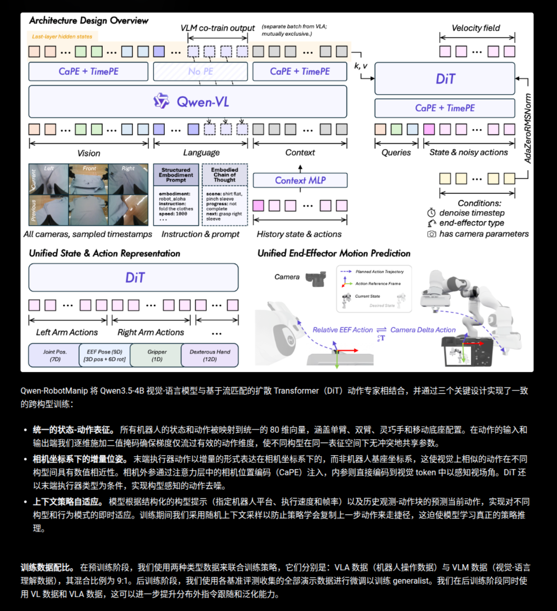

# Qwen-RobotManip：用跨本体对齐解锁机器人操作规模化

> 原标题：Qwen-RobotManip Technical Report: Alignment Unlocks Scale for Robotic Manipulation Foundation Models  
> 作者：Qwen Team；核心贡献者包括 Haoqi Yuan, Anzhe Chen, Zhixuan Liang, Ye Wang, Haoyang Li, Pei Lin, Yiyang Huang, Zixing Lei, Tong Zhang 等  
> 机构：Qwen Team  
> 发表：Technical Report, 2026-06-16  
> 链接：https://qwen.ai/blog?id=qwen-robotmanip  
> 开源：https://github.com/QwenLM/Qwen-RobotManip  
> 本地文件：[Qwen_RobotManip.pdf](/home/user/Notes/Paper/260616_Qwen-RobotManip_Qwen_2026/Qwen_RobotManip.pdf)

---

## 一句话说清楚

Qwen-RobotManip 的核心判断是：机器人操作数据不是“堆得越多越好”，而是必须先把不同机器人、不同坐标系、不同动作空间和不同行为上下文对齐，规模化训练才会从互相干扰变成能力协同。

## 一、研究背景与动机

大语言模型和多模态模型的 scaling recipe 之所以有效，是因为不同来源的数据能被统一到相对一致的文本/视觉-语言表示里。但机器人操作数据天然更难：数据昂贵、任务窄、平台碎片化，且不同机器人记录的状态、动作、坐标系、控制频率都不一致。直接混训这类数据，模型往往不是学到更通用的操作能力，而是在消化互相冲突的表示约定。

现有 VLA 模型在标准 benchmark 上看起来进步很快，但论文认为很多结果只证明了 in-distribution pattern matching：训练和测试共享相似任务、场景、机器人和布局时，甚至 scratch 模型也能拿到很高分。一旦换机器人初始状态、摄像机视角、场景扰动、语言模板或 embodiment，性能会快速掉下去。

Qwen-RobotManip 的目标是把“对齐”和“规模”绑定起来：先用统一状态-动作模板、相机坐标系下的 EEF delta 表示、结构化 embodiment prompt、in-context policy adaptation 等机制，让多源数据的监督信号可比较、可共享；再用开放机器人数据、第一视角人类操作视频和 human-to-robot 合成管线构造约 38,100 小时预训练语料。

## 二、核心贡献

1. **提出跨本体统一对齐框架。** 模型用 80 维 canonical state/action vector 容纳单臂、双臂、夹爪、灵巧手和预留自由度，并通过 per-dimension binary mask 避免空槽位产生伪监督；EEF 动作使用 camera-frame delta pose，让视觉上相似的运动在数值空间也更接近；历史 observation-action chunks 作为隐式 embodiment identifier，帮助策略在线适应当前机器人动力学和执行风格。

2. **构造大规模多源操作语料。** 论文整合开放机器人数据、人类第一视角操作视频和合成机器人轨迹，总计约 38,100 小时。其中 human-to-robot pipeline 将约 1,933 小时 ego human videos 渲染到 15 种双臂机器人形态上，得到约 24,808 小时合成 demonstrations。

3. **强调 OOD 才是 VLA 预训练质量的核心评估。** 论文引入或采用 LIBERO-Plus、RoboTwin-Clean2Rand、RoboCasa365、EBench，并提出 RoboTwin-IF 和 RoboTwin-XE，分别评估真实语言条件控制和 zero-shot cross-embodiment transfer。

4. **给出较强的仿真和真实机器人验证。** Qwen-RobotManip 在多个 OOD benchmark 上超过 π0.5、GR00T 等 baseline，并在 AgileX ALOHA、Franka、UR、ARX 等真实平台上验证；RoboChallenge Table30-v1 generalist track 中报告 45% success rate / 59.83 process score，超过 DM0_generalist 的 37% / 48.43。

## 三、方法原理

### 3.1 整体框架

Qwen-RobotManip 是一个解耦式视觉-语言-动作模型（Vision-Language-Action, VLA）。上游 backbone 采用 Qwen3.5-4B 作为视觉-语言模型，负责多视角图像、语言指令、结构化 embodiment prompt 和历史上下文的联合编码；下游 action expert 是 flow-matching Diffusion Transformer（DiT），负责生成连续动作 chunk。

DiT action expert 有 10 个 transformer blocks，hidden size 768，12 heads。它把 proprioceptive state 通过 MLP 编码后，与 noisy action tokens 一起输入 DiT；cross-attention 交替关注 VLM 的视觉 token 和语言 token。训练时采用 flow matching：从高斯噪声和真实动作之间采样插值点，预测从噪声到动作的 velocity field；推理时用 4 步 Euler integration 生成 action sequence，以满足实时控制。

从架构图看，模型可以拆成“理解条件”和“生成动作”两段：Qwen-VL 读取当前/历史多相机图像、语言指令、结构化 embodiment prompt，以及由 Context MLP 投影后的历史 state/action，输出供 DiT cross-attention 使用的 hidden states；DiT 则接收当前 state、noisy action tokens、去噪时间步、末端执行器类型和相机参数，预测 flow matching 的 velocity field，再逐步生成未来动作块。这里的三个对齐点分别是：用 80 维 canonical state/action vector 统一不同机器人，用 CaPE + TimePE 注入相机几何和时序信息，用 camera-frame EEF delta 让视觉上相似的末端运动在动作空间也更接近。

### 3.2 关键技术细节

**统一状态-动作表示。** 模型使用 80 维 canonical vector：左右两臂各 29 维，包括 7 维关节、9 维 EEF pose、1 维 gripper、12 维 dexterous hand joints，剩余 22 维预留给 mobile base 等扩展。不同机器人只填充自己的有效槽位，缺失维度置零并用 binary mask 从 loss 中排除。这一点看似工程化，但它是 scaling 能否成立的第一层前提：同一维度必须表达同一类物理含义。

**Camera-frame delta EEF。** 论文认为 base frame、world frame 或 robot-specific local frame 会让相同视觉运动在不同数据源中数值不一致。因此 EEF 动作表示为参考相机坐标系下的 relative pose delta。直觉上，机器人在图像中“向杯子移动并抓取”的动作，应该在动作空间中也相近，而不是被不同机器人基座坐标系撕开。该设计需要相机内外参，并通过 Camera Positional Encoding（CaPE）把相机几何注入 DiT cross-attention。

**Embodiment prompt。** Prompt 显式包含 embodiment、instruction、speed、fps、camera view direction 等字段。它不是简单贴一个 robot id，而是把平台身份、任务语义和时间结构一起交给模型。训练中会以 15% 概率 drop embodiment、speed、fps 字段，以增强缺失信息下的鲁棒性。

**In-context policy adaptation。** 每个历史 chunk 包含过去某一段的 observation、state 和 action chunk。历史图像与当前图像一起进入 VLM，历史 state/action 通过轻量 MLP 投影到 VLM hidden space。关键细节是训练时不总是取最近历史，而是随机采样 episode 中的上下文，避免模型学成“复制上一段动作”的捷径。部署时再用最近 rolling window 提供在线适应信号。

**Human-to-robot synthesis。** 给定第一视角人类视频，管线先从 MANO hand keypoints 中构造虚拟夹爪轨迹，做 retargeting 和 smoothing；再用 SAM3 分割手臂、ProPainter inpainting 去掉人手；然后为 15 种机器人形态搜索 base pose，用 MuJoCo IK 跟踪轨迹，并用 Depth Anything v3 做深度合成。论文还对不同 ego 数据源做速度对齐，例如 EgoDex 下采样到 60%、EgoVerse 到 45%、ViTRA 到 25%。

**数据清洗管线。** 论文把清洗也做成了跨模态对齐问题：先在 state-action 层面过滤突变、jerk、极值和时序错位，检查关节状态经正运动学得到的末端位姿是否与记录的 EEF/TCP 一致，并把不同数据集的机器人朝向统一到公共 world frame；再在 instruction-video-state 层面检查语言指令是否匹配视频内容，用 SAM3 分割和 URDF 重投影比较视频里的机器人与记录状态是否一致，最后过滤黑帧、损坏帧、模糊帧和长时间静止片段。直觉上，这一步是在训练前保证“指令、视频、状态、动作”四条监督信号讲的是同一件事。

### 3.3 训练与优化

预训练采用 dual-stream co-training：VLA stream 来自真实机器人、人类 ego videos 和 H2R 合成轨迹；VLM stream 来自视觉-语言数据，包括通用 VL、空间推理、grounding、OCR、instruction following、多语言、ECoT、ego video understanding 和 2D trajectory prediction。默认机器人数据与 VL 数据比例为 9:1，整体 loss 为 flow matching loss 加权 next-token prediction loss，VL loss 权重 λ=0.1。

后训练阶段采用 domain-specific SFT，只优化 action 的 flow matching loss。作者也讨论了 VLA-to-VA degradation：在 benchmark-specific SFT 中，模型可能逐渐忽略语言，只靠视觉模式触发动作。为缓解这个问题，论文额外验证了 post-training 时混入 VL 数据和相近分布 VLA 数据，可以提升 RoboTwin-IF 等语言敏感评估。

部署时使用 remote inference，并通过 Real-Time Chunking（RTC）在机器人执行当前 action chunk 时异步生成下一段动作，以隐藏 WiFi 和服务端推理延迟。

## 四、实验与结果

### 4.1 实验设置

训练语料的主体如下：

| 数据类型 | Embodiment | 来源 | 时间 |
|---|---:|---|---:|
| Robot | single-arm | OXE, RoboMIND, DROID, RH20T 等 | 3,808 h |
| Robot | dual-arm | AgibotWorld-Beta, RoboCOIN, RDT 等 | 6,744 h |
| Robot | mobile & humanoid | InternData-A1, Galaxea Open-World | 868 h |
| Human | human hands | EgoDex, VITRA, EgoVerse | 1,933 h |
| Human-to-Robot | 15 dual-arm platforms | 从 human data 合成 | 24,808 h |

评估分三类：标准 in-distribution benchmark（LIBERO、RoboTwin）、OOD 仿真 benchmark（LIBERO-Plus、RoboTwin-C2R、RoboCasa365、EBench、RoboTwin-IF、RoboTwin-XE），以及真实机器人评估（CobotMagic ALOHA、ARX ALOHA、RoboChallenge Table30-v1）。

### 4.2 主要结果

标准 benchmark 上，Qwen-RobotManip 已经很强，但论文更强调这些数字不足以证明基础模型能力：

| 模型 | LIBERO | RoboTwin-Easy | RoboTwin-Hard |
|---|---:|---:|---:|
| π0 | 94.4 | 65.9 | 58.4 |
| π0.5 | 97.6 | 82.7 | 76.8 |
| StarVLA | 98.0 | 85.7 | 87.3 |
| Qwen-RobotManip-scratch | 98.2 | 88.7 | 88.4 |
| Qwen-RobotManip | 99.1 | 93.4 | 92.5 |
| Qwen-RobotManip-Context | 99.2 | 93.7 | 94.0 |

更关键的是 OOD 结果：

| Benchmark | 关键指标 | π0.5 | Qwen-RobotManip | Qwen-RobotManip-Context |
|---|---:|---:|---:|---:|
| LIBERO-Plus | Total SR | 84.4 | 89.0 | 91.4 |
| RoboTwin-C2R | Hard, joint | 47.9 | 62.6 | 69.4 |
| RoboCasa365 | Total SR | 16.9 | 35.9 | 33.8 |
| EBench | Overall SR / Score | 27.1 / 41 | 45.6 / 60 | 43.6 / 59 |
| RoboTwin-IF | Average SR | 49.6 | 72.2 | 72.0 |
| RoboTwin-XE | zero-shot EEF avg | 7.5 | 23.9 | - |

最有说服力的不是单个最高分，而是分布外难度越大，差距越明显。RoboTwin-C2R Hard 中，Qwen-RobotManip 从 Easy 到 Hard 保留了约 86% 的性能，而 π0.5 约 66%，scratch 模型约 30%。这说明大规模预训练在普通 IID 分数里不一定显眼，但在扰动、 clutter、跨视角、跨机器人时才真正显形。

真实机器人结果也比较扎实：

| 设置 | Baseline | Qwen-RobotManip |
|---|---:|---:|
| CobotMagic ALOHA ID，7 tasks | π0.5 42.9%，StarVLA 20.0% | 88.6% |
| CobotMagic ALOHA OOD，4 tasks | π0.5 37.5%，StarVLA 0.0% | 87.5% |
| ARX few-shot adaptation，5 tasks 平均 | π0.5 40.0%，StarVLA 13.3% | 53.3% |
| ARX cross-embodiment skill transfer | w/o UnifiedEEF 12.5% | 55.0% |
| RoboChallenge Table30-v1 generalist | DM0 37% / 48.43 | 45% / 59.83 |

### 4.3 消融实验

**Action-space alignment 决定 scaling 是否成立。** 论文比较三种设计：无统一空间、仅 canonical vector 但无 UnifiedEEF、完整 camera-frame EEF。只有统一表示的模型表现出较清晰的 log-linear scaling；完整方法在 EEF prediction MSE 和 RoboTwin-C2R downstream success 上最稳定。换句话说，数据规模不是自动变成能力，动作空间必须先对齐。

**结构化 prompt 和 context 是互补的。** 在 RoboTwin-C2R joint OOD 消融中，结构化 prompt 比 naive baseline 更好；加入 context 后，如果仍用 4 denoise steps 会因为动作分布更复杂而抖动，性能不升反降；增加到 10 steps 后平均分从 structure prompt 的 65.9 提到 70.9，20 steps 基本不再增益。

| 变体 | Easy | Hard | Avg |
|---|---:|---:|---:|
| w/o UnifiedEEF | 71.2 | 54.2 | 62.7 |
| + Language Prompt | 71.7 | 55.1 | 63.4 |
| + Structure Prompt | 73.4 | 58.3 | 65.9 |
| Context, 4 denoise steps | 72.1 | 54.4 | 63.3 |
| Context, 10 denoise steps | 80.1 | 61.6 | 70.9 |

**H2R 合成比直接加 ego 更有效。** 在 RoboTwin-C2R-EEF Hard 上，robot-only 为 54.7，+ego 为 55.0，+H2R 为 58.7；在 LIBERO-Plus 上，总分从 87.1 到 88.4 再到 89.0，Camera 维度提升尤其明显（72.8 → 80.0）。这支持作者观点：ego 数据的视觉多样性有用，但经过动作和视觉对齐的 H2R 数据更能转化为机器人策略能力。

**VL co-training 保护语言和视觉 grounding。** 去掉预训练阶段 VL 数据后，LIBERO/LIBERO-Plus 只小幅下降，但 RoboTwin-C2R easy/hard 分别下降 6.7/8.2，RoboTwin-IF 下降 7.0。说明当评估涉及复杂场景、语言条件和 OOD 时，保留 VLM 的视觉-语言能力很重要。

## 五、局限性与展望

作者明确承认，human-to-robot synthesis 仍会引入 retargeting approximation 和 inpainting artifact，合成数据质量上限会影响最终策略。虽然 OOD benchmark 比传统设置更难，但大量评估仍以仿真为主，真实世界覆盖还不够广。

我自己的担心有三点。第一，camera-frame delta EEF 很依赖相机标定和可用视角，实际部署中标定误差、相机遮挡、腕部相机漂移都会直接影响动作表达。第二，固定 action chunk length 加 RTC 对多数 tabletop 任务很合适，但对快速接触、动态物体、亚秒级反应任务可能仍慢。第三，论文的 open-source/open-data 叙事很强，但实际复现还取决于模型权重、训练脚本、数据清洗规则、合成管线和 benchmark 是否完整释放。

后续值得看的方向是：更物理一致的 H2R 合成、更广泛的 non-tabletop/mobile manipulation、更强的 online error recovery，以及把高层 agentic planning 与低层 VLA 控制真正接起来。

## 六、灵魂三问

1. **它解决了什么问题？**

它解决的是异构机器人操作数据无法直接 scaling 的问题。过去很多 VLA 工作把不同 embodiment 的数据混在一起，但状态/动作/坐标/行为上下文不一致会造成监督冲突；Qwen-RobotManip 的贡献是把跨本体表示先对齐，再证明更大规模数据能在 OOD 和真实机器人设置中转化为泛化能力。

2. **为什么这么做？**

因为机器人操作的“同一个动作”不天然有同一个数值表示。相机坐标系下的 EEF delta、80 维 canonical vector、per-dimension mask、structured embodiment prompt 和 execution history，本质上都在做同一件事：让模型看到的监督信号在物理意义上可比。没有这层对齐，更多数据可能只是更多冲突。

3. **什么证据最有说服力？**

最有说服力的是 OOD 与消融的组合证据：RoboTwin-C2R Hard、RoboTwin-IF、RoboTwin-XE 上相对 π0.5 的大幅增益，说明模型不是只记住训练分布；action-space scaling 消融显示完整 UnifiedEEF 才能让数据增加稳定降低 OOD prediction error；真实机器人上 CobotMagic ALOHA OOD 87.5% 和 ARX cross-embodiment transfer 55.0% 则进一步证明这不是纯仿真现象。

## 七、个人总结

1. Qwen-RobotManip 的核心不是某个单点模块，而是“alignment-first scaling”：把 representation、motion、behavior 三层对齐后，再用开放数据和 H2R 合成放大规模。

2. 最大优点是论证闭环很完整：数据管线、模型结构、OOD benchmark、真实机器人和消融都围绕同一个问题展开。最大弱点是系统复杂度高，实际复现和部署会高度依赖标定、数据清洗、合成质量和工程细节。

3. 对 VLA 研究来说，这篇报告的意义更像一个评估范式提醒：IID benchmark 已经不足以判断 foundation model 是否有价值，真正该看的应该是语言条件、跨场景扰动、跨 embodiment 和真实机器人恢复能力。
