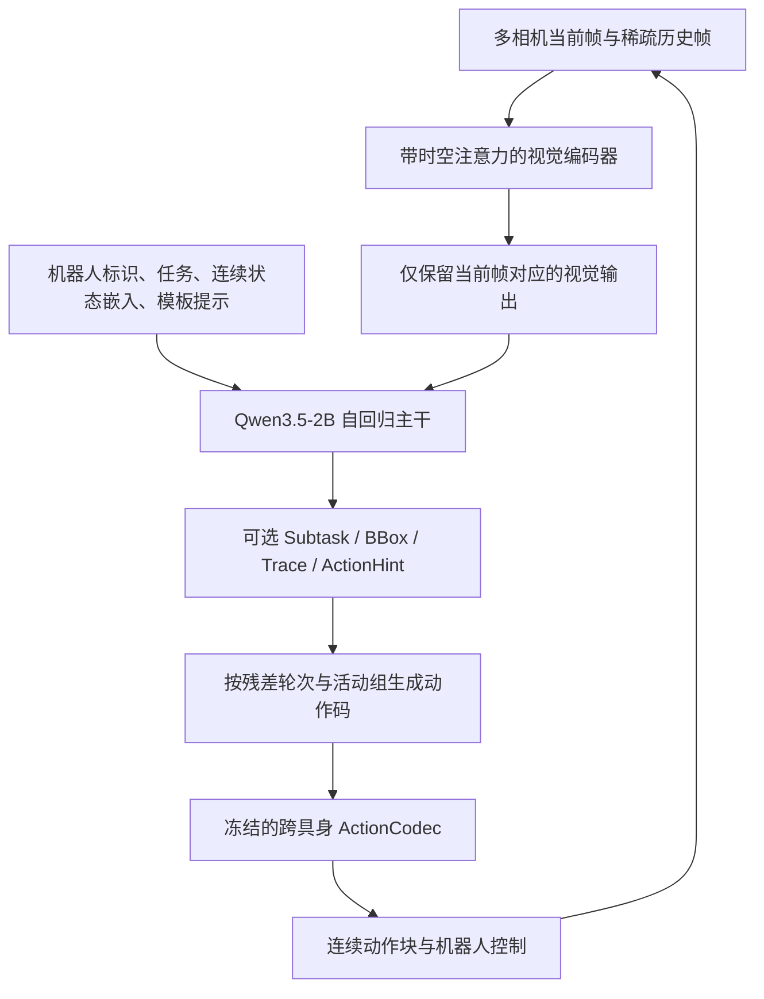
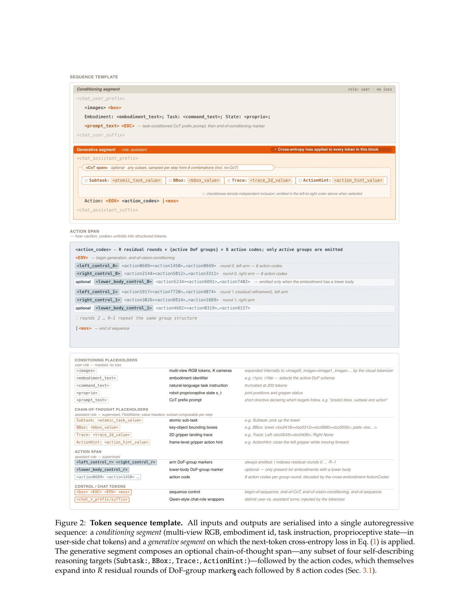

# G0.5：让同一个 VLM 用自回归 token 完成推理与机器人动作生成

> 原标题：G0.5: One Autoregressive Stream for Robot Reasoning and Action（PDF 标题带 Galaxea 前缀）
> 作者：Yicheng Liu、Zibin Dong、Baijun Ye、Tianyuan Yuan 等；PDF 署名 Galaxea Team；项目负责人 Yicheng Liu，PI Hang Zhao
> 机构：Galaxea
> 发表：arXiv:2608.11739v1，2026-08-12；本笔记核验日期 2026-09-10
> 来源：[arXiv](https://arxiv.org/abs/2608.11739v1) · [论文全文](https://arxiv.org/pdf/2608.11739v1) · [官方项目页](https://opengalaxea.github.io/G05/)
> 开源：论文称发布预训练 backbone；本次检查项目页及其前端资源，未找到可核验的代码仓库或模型权重链接，因此不把“已可下载复现”视为确认事实。
> 阅读范围：32 页 PDF，含方法图、正文实验和附录表 6–7。下文数字均为作者报告，未独立复现实验。

---

**一句话说清楚**：先把跨机器人动作块压缩成按身体部位组织的离散码，再让 Qwen3.5-2B 在同一输出序列中预测可选推理文本和动作码；动作由预训练 codec 解码执行。

**阅读判断**：值得关注的是“数据表示—自回归监督—推理时控制—RL 接口”的一致设计。实验支持这套系统很有竞争力，但还不足以证明自回归架构在排除数据、底座和训练配方差异后普遍优于 flow matching。

## 一、研究背景与动机

早期视觉-语言-动作模型（Vision-Language-Action, VLA）把每个时刻、每个动作维度离散化，由视觉语言模型（VLM）逐 token 生成。问题在于，高频率、长动作块、双臂或全身控制都会拉长输出序列，增加解码延迟。

流匹配（Flow Matching, FM）动作专家可一次建模连续动作块，提高生成效率，但将动作生成交给另一组参数。作者认为，这使 VLM 的语言推理能力对动作的影响需要经过额外的条件接口。

这里应区分**作者的结构性假设**与已证实结论：外部动作专家仍可利用语言与推理条件；是否形成有效信息瓶颈，需要控制实验，不能仅凭架构图认定。

G0.5 希望同时解决三个工程问题：跨构型动作如何统一、动作 token 如何压缩、推理监督如何真正进入测试时的动作预测。视觉记忆则用于缓解遮挡及短期部分可观测性。

## 二、核心贡献

1. **共享自回归策略**：以 Qwen3.5-2B 初始化，语言答案、CoT 和动作码由同一个 decoder 生成，VLA 预训练使用统一 next-token 交叉熵。
2. **跨具身结构化 codec**：将动作映射到统一 27 维布局，以残差向量量化（Residual Vector Quantization, RVQ）压缩各运动组，并省略不活动组的输出。采用 FASTer 的分组思路和 ActionCodec 的训练配方，属于组合与扩展，不是首次提出动作量化。
3. **可按 prompt 选择的推理监督**：自动标注子任务、物体框、末端二维轨迹及动作提示，以 8 种模板训练，测试时可启用或关闭 CoT。
4. **跨场景系统验证**：覆盖真实双臂任务、DROID 迁移、三个仿真基准、BEHAVIOR 长任务和指令跟随，并提供 AR/FM、CoT 与小规模 RL 对照。

## 三、方法原理

### 3.1 整体框架



主路径是闭环执行：获取观测、生成推理与动作块、执行后重新观测。论文未报告每轮执行多少步再规划，不能将“闭环”理解为逐控制步都调用 VLM。

默认策略不需要 FM 专家；作者额外接入一个参考 π0.5 设计的 FM head，用于对照和可选部署。**“一个模型、一种损失”主要描述 VLA 的自回归预训练阶段**，不意味着 codec 本身没有独立训练，也不覆盖额外 FM head 或 RL 的所有训练目标。

序列示意：

```text
条件段（不计算 loss）：
  images + embodiment + task + proprioception + CoT template

生成段（计算 next-token loss）：
  [Subtask / BBox / Trace / ActionHint，可选]
  Action: <EOV>
  <left_control_0> 8 个动作码
  <right_control_0> 8 个动作码
  [<lower_body_control_0> 8 个动作码]
  ……其他残差轮次……
  <eos>
```



来源：论文 §3、图 2。图中 EOC/EOV 的文字解释存在不一致，实际实现时应核对 tokenizer 与序列构建代码，而不是逐字照搬图下注释。

### 3.2 关键技术细节

#### 结构化动作 token：先对齐部位，再学习压缩

§4 给出的统一连续动作布局为：

| 槽位 | 维度 | 含义及披露边界 |
|---|---:|---|
| left_control | 9 | 左侧控制槽；9 个通道的具体物理定义未逐项报告 |
| left_gripper | 1 | 左夹爪；数值范围及开闭方向未报告 |
| right_control | 9 | 右侧控制槽；不能据此认定为 9 个关节 |
| right_gripper | 1 | 右夹爪 |
| lower_body | 7 | 下半身控制槽；躯干、底盘的具体通道映射未报告 |
| 合计 | **27** | 跨构型统一连续动作维度，不是固定输出 token 数 |

处理逻辑为：原始动作按语义部位分组、补齐槽位，动作 encoder 编码时间窗口，RVQ 逐轮量化剩余误差，decoder 从离散码重建连续动作。时间对比目标让相邻运动窗口具有更一致的表示，减少近似动作在 token 空间中剧烈跳变。

图 2 每个活动组、每轮残差预测 **1 个组标记 + 8 个动作码**。按该模板推导：

$$N_{\text{action span}}\approx\sum_{r=0}^{R-1}9G_r$$

其中 $G_r$ 是该轮输出的组数，未计全局边界 token 和 CoT；若每轮有相同的 $G$ 个组，则为 $9RG$。这是由模板推导的计数关系，不是论文报告的平均 token 长度。实际残差轮数 $R$、码本规模、chunk 长度均未明确给出；图 3 画了四层 RVQ，也不足以确认全部实验都采用四层。

**需要保留的图文歧义**：统一动作是五个槽位；图 2 的序列主要展示左控制、右控制、下半身三组；图 3 又单列夹爪标记。夹爪究竟并入控制组还是单独编码，本文未给出一致的实现说明。图 2 下方称双臂标记总会生成，也与正文“省略不活动手臂”表述不完全一致。

**padding 与稀疏输出处于不同层次**：§4 说数据合并时未驱动槽位填 noop，§3.1 说序列生成时省略不活动组。统一张量中的占位可以与序列层的省略共存，但 noop 数值、缺失/静止区分、活动判定阈值及相应 mask 未报告。

#### CoT：从独立辅助任务变成动作前缀

| 推理字段 | 监督内容 | 动作预测可利用的信息 |
|---|---|---|
| Subtask | 当前原子子任务 | 当前该执行哪一步 |
| BBox | 相关物体名称及定位 token | 应关注、接触哪个对象 |
| Trace | 左右末端的二维轨迹或落点 | 在图像空间中的运动提示 |
| ActionHint | 帧级运动、夹爪提示 | 更细粒度的执行语义 |

训练时每个机器人样本只抽取一种模板；8 种候选包含无 CoT，子任务文本模板采样权重更高。四种字段可组合，但不能把它说成四个独立 Bernoulli 开关或全部 16 种组合等概率采样。

自动生成标签的流程为：规则分段与关键帧提取 → Gemini 3、Doubao Seed 2.0 Pro 等多模态 API 生成多粒度语言 → 多模态模型与 SAM3 跟踪生成框和分割 → 关节姿态经正运动学得到末端三维位置，再投影到头部相机生成二维 trace。分割 mask 属于标注流程产物，论文未明确将其作为策略输入或直接输出目标。

CoT 不等同于自由形式的完整推理过程，更接近一组结构化、可监督的中间预测。其价值取决于预测准确度，以及动作生成是否真正利用这些预测。

#### 视觉记忆：历史在视觉塔融合，避免传给 LLM 的 token 随历史增长

参照 π0.7/MEM，在 ViT 每四层插入分解的空间与时间注意力。历史帧参与视觉特征计算，最终层丢弃历史 token，只输出当前帧对应特征。状态使用连续 embedding，与视觉帧对齐。

预训练以 **30% 概率丢弃全部历史帧**（§5.3），降低对历史的依赖。历史覆盖数秒，但帧数、时间间隔、分辨率和每视角 token 数未报告。该设计约束了传入语言主干的视觉序列长度，不代表视觉编码历史没有额外成本，也不提供分钟级持久记忆。

### 3.3 训练与优化

| 阶段 | 训练内容 | 已披露细节 | 缺失信息 |
|---|---|---|---|
| Codec 预训练 | 跨具身分组动作的 RVQ 编解码器 | 时间对比约束；后续使用冻结 codec | 训练规模、具体损失权重、码本设置、重建误差 |
| VLA 基础预训练 | 机器人样本 + web/embodied VQA | 单阶段联合训练；AdamW；warmup → constant → cosine；视觉塔不冻结 | 总数据规模、batch、学习率、步数、GPU 预算、精确配比 |
| 任务后训练 | DROID、Bridge、各仿真或真实任务数据 | 各实验单独适配，不能混称零样本 | 部分任务的采样、优化和数据量 |
| 可选 FM / RL | FM head 对照，或 GRPO | RL 中 AR 直接使用 token log-prob；FM 用 SDE 改写 | §5.6 所用 FM head 的完整训练配方；RL 关键超参数 |

VLA 主损失为：

$$\mathcal L_{\rm VLA}=-\sum_{i\in\mathcal G}\log p_\theta(x_i\mid x_{<i})$$

直观理解：只对生成段计算交叉熵，语言答案、CoT 与动作码都作为预测目标；观测和指令只是条件。统一目标不等于不同类型样本贡献完全相等，其有效权重还受采样概率和目标长度影响，具体 loss reduction 规则未报告。

常规评估固定使用 **no-CoT**；§5.6 单独切换 CoT。因此，不能将所有主表增益直接归因于测试时显式推理。

### 3.4 数据使用与维度追踪

#### 数据清单与训练阶段

| 数据源 | 规模 | 样本单位与字段 | 用途阶段 | 处理方式与边界 |
|---|---|---|---|---|
| 混合机器人示教 | **14 种 embodiment**；小时数、episode 数及完整源列表未报告 | 原始 episode；训练按观测窗口与目标动作块构造，含 RGB、状态、指令、动作及可选 CoT | Codec/机器人表征相关训练；VLA 基础预训练 | 统一 27 维动作，按源归一化和通道过滤；codec 训练集与 VLA 混合的对应范围未明确 |
| 通用 web VQA、embodied VQA | 各源规模未报告 | 图像与问答 | VLA 基础预训练 | 与机器人样本采用 action-heavy mixture；精确占比未报告 |
| 自有机器人场景 VQA | 未报告 | 子任务、框、常识问答 | VQA 联合训练及 CoT 标签构建 | 自动标注；子任务相关监督加权，数值未报告 |
| DROID | 实际使用规模未报告 | RGB、语言及机器人动作示教 | **后训练** | 明确不在基础预训练中；评估环境和物体实例从两个阶段排除 |
| BridgeData V2 | 实际使用规模未报告 | 图像、指令、动作；**不输入状态** | 后训练，再到 SimplerEnv 评估 | 80K steps，学习率 3e-5；无额外仿真域训练 |
| RoboTwin 2.0 | 2,500 clean + 25,000 随机化 demos | 双臂仿真轨迹 | 多任务微调 | 4 epochs，batch 1024，学习率 4e-5 |
| LIBERO | 4 套 × 10 任务 × 50 demos = 2,000 demos | Franka 仿真轨迹 | 基准微调 | 100K steps，学习率 1e-5，weight decay 1e-2 |
| BEHAVIOR Challenge | 10,000 demos，超过 1,100 小时；50 任务 | 平均 6.6 分钟、最长约 14 分钟的移动操作 episode | 50 任务联合后训练 | 单帧，1/4 epochs；单 checkpoint，不加显式 stage head |
| R1-Lite/R1-Pro 真实微调集 | 各设置 demo 数未报告 | 三视角 RGB、状态与动作 | 4 个语义任务、6 个任务—机器人设置微调 | 各模型同数据、16 H20、同设置相同训练时长，4–10 小时 |
| PP Bench 自采集集 | 50 小时，嵌套 1H/10H/50H | 拿指定物体放入指定容器 | 后训练与数据规模比较 | 训练场景 5–20 件物体；分别训练 12/8/4 epochs |

通用 VQA 段落引用 LLaVA-NeXT、LLaVA-OneVision；embodied VQA 引用 RoboPoint、MolmoAct、RoboBrain 相关工作。引用不等于公开了实际下载版本、筛选规则与混合 manifest。

#### 一个训练样本如何形成

1. 从某个源的一条轨迹选取当前时刻与稀疏历史，读取多相机 RGB 和同步状态。
2. 获取 episode 指令、当前子任务、帧级动作提示及框/trace 标注；抽取一种监督模板。
3. 截取未来动作块，执行该数据源定义的过滤、归一化和跨具身槽位映射，再通过 codec 生成结构化动作码。论文未明确过滤和各转换的完整执行顺序。
4. 构建条件段与生成段；只监督生成段。VQA 样本则监督答案，不应凭空补一个机器人动作目标。

**归一化重点**：作者按 embodiment/数据源分别设置 z-score 加尾部截断，或 $q_{01}/q_{99}$ 分位数缩放；不使用整个混合数据集的一套统一统计。具体哪些源使用哪种方法、统计量取自哪个 split、是否按 horizon 位置统计、分位数映射目标区间，都未报告。不能自行填成 [-1,1] 或 per-timestep normalization。

**维度快照**（下列 shape 是便于工程阅读的记号，不是论文公开的代码接口）：

| 项目 | 可确认内容 | 不能补猜的内容 |
|---|---|---|
| Observation | 可记作 RGB $[B,K,T,3,H_{img},W_{img}]$；真实双臂微调 K=3，DROID 评估 K=2 | 通用 K/T、分辨率、裁剪增强、历史时间间隔 |
| Language | 图 2：任务指令截断为 **200 tokens**；Qwen 风格 chat wrapper | 完整上下文长度、CoT 最大长度、定位 token 离散精度 |
| State | 关节位置、夹爪状态；连续 embedding | 原始/统一状态维度、状态归一化和缺失 mask；不能由 27 维动作反推状态维度 |
| Action | 统一动作块可记为 $[B,H_a,27]$；槽位 9+1+9+1+7 | $H_a$、控制 Hz、绝对/增量、坐标系、旋转表示、各通道单位 |
| Discrete target | 每组每轮 8 个动作码，加组标记；CoT 可选 | 实际 R、码本数/大小、活动阈值、平均 token 长度 |
| 执行恢复 | 离散码经 codec 解码成连续控制 | 反归一化、插值、限幅、动作块重叠、执行步数及低层控制细节 |

数据工程上，“无需新增每机器人参数”意味着共享模型接口，**不意味着无需为新机器人写映射、标定、归一化及控制适配代码**，也不证明任意新构型可直接零样本执行。

## 四、实验与结果

### 4.1 实验设置

| 评估 | 协议 | 泛化或统计边界 |
|---|---|---|
| DROID | Franka Research 3 + Robotiq 2F-85；第三人称与腕部相机；10 任务 × 10 trials | 后训练后的新环境、新物体实例迁移；一个顺序任务允许 0.5 部分分 |
| SimplerEnv | Bridge/WidowX 四任务；Bridge 后训练；state-free | real-to-sim；部分基线数字从其他论文汇编 |
| RoboTwin | clean/random 两种设置，每任务每设置 100 trials | 附录表 7 列出 50 个任务；是目标基准微调后的结果 |
| LIBERO | 每任务 50 trials，使用基准初始状态 | 40 任务共 2,000 rollouts；不同方法的预训练资源不一致 |
| BEHAVIOR | 50 任务 × 10 实例；G0.5/π0.5 平均两次评估 | 指标是目标谓词完成比例的 Task Success Score，不是整任务二元成功率 |
| 真实双臂 | 6 设置 × 15 episodes；各模型交错评估 | 同微调数据与算力时间；未匹配基础预训练资源 |
| PP Bench | 64 trials；48 个域内对象和 16 类后训练未见对象；测试场景含 16 件物体/容器 | 模型间配对布局、指令和初始状态；16 类只保证后训练未见 |
| CoT 长任务 | Air Fryer/Cook Bacon，各 5 阶段，每配置 5 rollouts | **运行时提供每阶段指令**，不能当作从总目标自主完成阶段规划 |

### 4.2 主要结果

| 基准/指标 | G0.5 | 对照 | 阅读结论 |
|---|---:|---|---|
| 真实微调平均成功率（图 8） | **76.7%** | π0.5 53.3%；GR00T-N1.7 24.4% | 相对 π0.5 高 23.4 个百分点，六设置中五个领先 |
| DROID 平均得分（图 6，作者称 success rate） | **82.5%** | π0.5-DROID 57.5%；MolmoAct2-DROID 52.0% | 强迁移结果，但含部分得分及已做 DROID 后训练 |
| SimplerEnv（表 1） | **87.3%** | π0.5 57.1%；Xiaomi-Robotics-0 79.2% | state-free 后训练策略表现强，基线并非全部同场重跑 |
| RoboTwin（表 2） | **93.3%** | π0.5 79.8%；LingBot-VA 92.2% | clean 93.7%、random 92.8% |
| LIBERO（表 3） | **98.9%** | π0.5 96.9%；Xiaomi-Robotics-0 98.7% | 接近饱和，与最强基线差距很小 |
| BEHAVIOR，1 epoch（表 4） | **0.2904** | π0.5 4 epochs：0.2626 | 更少下游训练轮数即可超过该对照 |
| BEHAVIOR，4 epochs（表 4） | **0.3136** | π0.5 0.2626；RLC 冠军 0.2605 | 相对 π0.5 提升约 19.4%；绝对差 0.0510；不是 31.36% 整任务完成率 |

LIBERO 四套分别是 Spatial 98.4%、Object 100.0%、Goal 98.6%、Long 98.6%。长任务套领先，但 Spatial、Goal 并非逐项最优。

真实任务存在反例：R1-Pro 搬箱堆叠中 π0.5 **93.3%**，G0.5 **80.0%**。BEHAVIOR 的微波炉爆米花任务 π0.5 **0.95**，G0.5 **0.55**；作者将家电/容器交互弱项联系到预训练数据中这类技能不足。这个解释合理，但没有用补充该类数据的控制实验确认。

PP Bench 区分“选对物体并尝试抓取”的 **language following** 与“抓取并放入指定容器”的 **task success**。前者不要求实际抓取成功，也不完整检验目标容器选择。

| PP 后训练规模 | G0.5 跟随率 / 成功率 | π0.5 跟随率 / 成功率 |
|---|---|---|
| 0H | 65.6% / 59.4% | 0.0% / 0.0% |
| 1H | 62.5% / 57.8% | 21.9% / 3.1% |
| 10H | 71.9% / 65.6% | 56.3% / 42.2% |
| 50H | 84.4% / 75.0% | 68.8% / 65.6% |

来源：图 10。1H 相比不后训练略降，因此不能说从零数据开始单调提高。G0.5 基础预训练包含 R1-Lite，其 zero-shot 优势同时受到构型覆盖影响；它不是只改变动作头的实验。全文结论称 G0.5 zero-shot 跟随率超过后训练 π0.5，需要限定数据规模：**65.6% 并未超过 π0.5 的 50H 结果 68.8%**。

### 4.3 消融实验

#### 同一 checkpoint：AR/FM × CoT

| 设置 | Air Fryer 进度（0–5） | Cook Bacon 进度（0–5） |
|---|---:|---:|
| FM，无 CoT | 2.1 | 1.2 |
| FM，有 CoT | 2.7 | 2.0 |
| AR，无 CoT | 2.4 | 1.5 |
| AR，有 CoT | **3.8** | **3.4** |

来源：§5.6、图 11。同一预训练 checkpoint 在推理时切换设置；开启 CoT 时两种解码器都利用推理后的隐藏状态。AR 的增益为 +1.4/+1.9，FM 为 +0.6/+0.8，支持“本系统中 AR 更能利用中间推理”的判断。

但每组仅 5 次、运行时给定阶段指令，而且 AR/FM 是不同闭环 rollout，动作执行后观测和实际 CoT 会分叉，并非完全相同 CoT 文本的严格重放实验。FM head 的训练细节也不足以排除头部优化差异。作者自己把“FM 汇聚隐藏状态导致信息瓶颈”保留为待验证假设。

单步 PP 中，AR 的 CoT 跟随率仅从 65.6% 到 67.2%，FM 从 59.4% 到 60.9%，约为 64 次试验中多对一次。不能据此声称 CoT 普遍显著提升简单抓放任务。

#### 指代上下文

| 输入方式（表 5） | 跟随率 | 成功率 |
|---|---:|---:|
| 仅名称 | 84.4% | 75.0% |
| 加物体与容器框坐标 | 85.9% | 76.6% |
| 再加目标与容器裁剪图 | **98.4%** | **84.4%** |

裁剪图显著缓解了目标指代困难，但增加了外部定位信息，不能算仅靠原始指令的能力。论文正文称坐标“没有改善”，表中实际是小幅上升；更准确的理解是改善很小，未证明统计显著。裁剪生成的完整外部系统成本也未计入这个成功率。

#### RL 及效率补充

§5.7 先用每任务一条示教联合后训练 AR/FM，再选择初始表现接近的四个 LIBERO 任务进行 GRPO。AR 初始约 63.0%，FM 62.5%；图 12 最后一个点分别 **97.4% 与 92.9%**。AR 原生提供离散 token 序列的 log-prob；FM 依照 RLinf 思路引入 SDE，将去噪轨迹作为 Markov 过程构造近似概率。

这说明 AR 接入比率式 RL 更直接，但不是“连续机器人动作密度被精确计算”，也不是“FM 无法做 RL”。任务经过初始成功率筛选，数量仅四个；温度、噪声方案、种子数量等披露不足。

图 1 报告 FM **190 ms**、使用 FlashRT 的 AR+CoT **192 ms**、AR 无 CoT **130 ms**。缺少硬件、batch、动作长度及计时边界说明，应视为部署提示，不能推出通用高频实时性或所有平台的速度排序。

**缺失的关键消融**：未见固定其余条件下，逐项移除 codec 结构分组、时间对比损失、活动组稀疏化、视觉记忆、VQA 数据的完整定量表。尤其 BEHAVIOR 使用单帧后训练/评估，不能仅凭成绩把增益归因于视觉记忆预训练。

## 五、局限性与展望

**作者明确承认的限制**：半透明/低对比度柜体定位困难；记忆仅覆盖数秒；下半身动作虽纳入布局，却没有单独评价；prompt 改词控制行为仍是小规模定性观察。

具体失败证据是 DROID 毛巾入抽屉：无高对比标记时 G0.5 **60%**，π0.5 **90%**；添加橙色标记后 G0.5 到 **100%**。主结果包含这种标记设置，应连同感知条件一起解读。

**我的判断与后续优先级**：

1. **基础预训练不可充分复现**。缺完整数据 manifest、混合权重、动作语义和 codec 配置。对 VLA 工程而言，这些缺口比交叉熵公式更关键；应优先核验数据处理代码和统计文件。
2. **架构收益与数据收益尚未分离**。底座、构型覆盖、标注和训练预算均不同；真实微调公平不代表基础预训练公平。需要同底座、同数据、同预算的 AR/FM 重训，并比较多个合理 FM 条件接口。
3. **共享槽位不自动产生物理语义一致性**。如果各源坐标系、绝对/增量控制、速度与位姿定义未对齐，位置相同的槽位仍可能语义冲突。这是由披露不足带来的工程疑问，不是已确认的实现错误。
4. **长时自主性证据有限**。外部阶段指令与内部子任务生成必须分开评价；应测试只给总目标、自动判定阶段完成、错误恢复和分钟级历史。
5. **统计与报告需更完整**。多数真实评估没有置信区间；LIBERO 头部差距很小；预训练与下游基准的重叠排查未完整披露。真实过程分数虽称附录给出定义，当前 PDF 附录仅见表 6–7，未找到相应细则。

## 六、灵魂三问

1. **它解决了什么问题？**

让 VLM 直接生成机器人动作时，原始逐维离散化会导致动作序列过长，异构动作又难以共享表示。G0.5 用按部位组织的学习式动作压缩恢复可用的 AR 控制接口，同时把中间语义监督放进动作生成序列。

2. **为什么这么做？**

共享动作码让不同机器人的示教成为同类 token 监督；自动标注把动作、子任务、物体定位串在一个训练样本里；统一 decoder 因而能在推理时直接以自己生成的中间结果作为动作前缀。设计也自然提供 token log-prob，利于 RL。优势在接口与监督的一致性，是否全面优于 FM 仍需更严格对照。

3. **什么证据最有说服力？**

对于核心机制，§5.6 的同 checkpoint AR/FM × CoT 对照最直接：两个阶段条件任务中，AR 从 CoT 获得更大进度增益。对于系统实用性，真实双臂六设置的同数据、同微调算力比较更有分量。前者样本少且有外部阶段提示，后者不能排除基础预训练差异。

## 七、个人总结

1. **核心是把动作接口做成 VLM 擅长建模的序列**：27 维语义槽位、分组 RVQ、活动组输出与多粒度语义标注共同决定训练质量，AR 交叉熵只是最终接口。
2. **最大优点是推理、动作、RL 接口统一，最大不足是数据与 codec 细节不透明**。成绩表明系统有效；“AR 天然更会推理”“视觉记忆解释全部长任务收益”仍超出了现有证据。
3. **对当前 VLA 预训练研究的启示**：结合本地 [π0.5 笔记](../260417_PI05_2026/Pi05_PhysicalIntelligence_2025.md) 和 [π0.7 笔记](../260417_PI07_2026/PI07_PhysicalIntelligence_2026.md)，优先研究动作语义对齐、按源归一化、自动标签可靠性及样本模板配比。若做复现，先建立可审计的数据到 token 管线，再在固定数据上比较分组 codec 和 AR/FM；不要仅凭 backbone 名称和主表数字选择路线。
