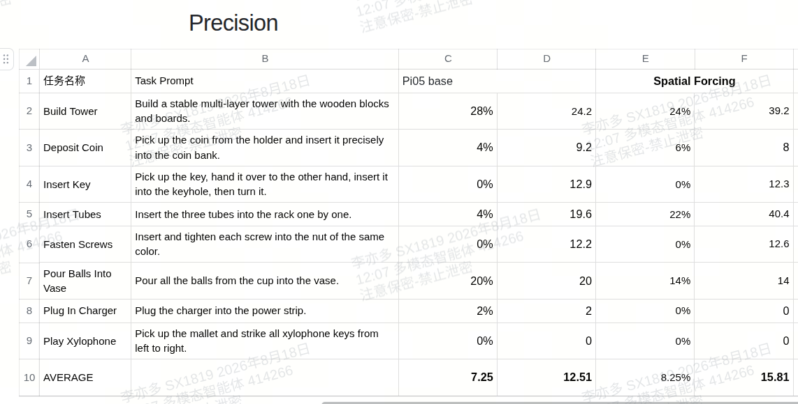
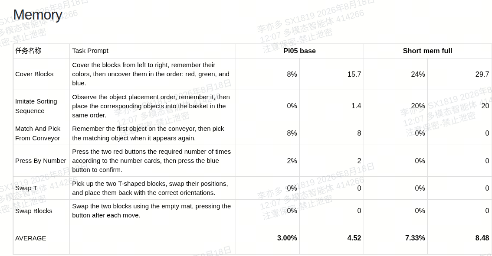

# MagicVLA后训练方法汇总

本文整理三条后训练方向：空间表征监督、短时记忆和视觉扰动一致性。实验涉及π0.5与MagicVLA-base两个基座，分别记录实现与结果，避免混用配置或结论。

## 1. 方法总览

| 方向 | 解决的问题 | 主要改动 | 原记录状态 |
|---|---|---|---|
| Spatial Forcing | 视觉表征缺少显式空间监督 | 用VGGT特征对齐VLA中间视觉token | π0.5复现完成，已有精细操作结果 |
| Short Memory | 单帧难以判断运动和历史任务状态 | 在视觉塔内部融合历史，可另加状态历史 | π0.5 full版本已有结果；MagicVLA实验已提交 |
| 视觉扰动一致性 | 动作预测依赖无关背景等因素 | 对配对观测施加velocity一致性loss | 方案设计，尚无结果 |

状态反映原笔记记录，不代表当前训练平台状态。下文将已观察结果与预期作用分开。

## 2. Spatial Forcing：用空间teacher监督视觉表征

### 2.1 原理

训练时，让VLA中间层的视觉token学习VGGT提供的空间表征。VGGT作为冻结teacher，不要求部署时额外输入深度图或点云。

```text
多视角RGB → π0.5视觉编码器 / VLM → 中间视觉token → Projection MLP
        └→ 冻结VGGT → 空间特征                         ↓
                                                对齐loss
```

投影后的VLA特征与teacher特征按对应位置计算cosine对齐损失，再与动作监督联合优化：

```text
L = L_action + α × L_align
```

对齐目标是teacher的中间表征，而非直接回归深度。对齐层的位置决定监督作用于哪一层表示，应作为实验变量；不能直接把某层的效果推广到所有VLA。

推理时不需要VGGT或辅助对齐头，仍走原动作生成路径。训练成本则包括teacher特征生成、缓存读取和辅助loss。

### 2.2 数据与训练设置

| 项目 | 设置 |
|---|---|
| 基座 | π0.5 Base |
| 数据 | RoboDojo官方数据，约20.66小时 |
| 轨迹 | 3500条，每任务100条 |
| Global batch size | 256 |
| Training steps | 60,000 |
| 空间监督 | VGGT |
| 对照 | 相同训练设置下，不加入Spatial Forcing |

原记录中的工程优化是将VGGT缓存特征由逐sample读取改为batch级读取，减少重复I/O与整理开销。它改变读取效率，不改变监督目标。

该次约20小时数据的VGGT特征缓存约6.5 TB。这是对应缓存格式下的存储记录，不是方法固定需要的空间。

### 2.3 精细操作结果



*图1：原实验表。每种方法包含百分比列和另一项数值列；后者在截图中未标明指标名称，以下仅将百分比列用于成功率比较。*

| 任务 | π0.5 Base | Spatial Forcing | 变化 |
|---|---:|---:|---:|
| Build Tower | 28% | 24% | -4个百分点 |
| Insert Tubes | 4% | 22% | +18个百分点 |
| Deposit Coin | 4% | 6% | +2个百分点 |
| Pour Balls Into Vase | 20% | 14% | -6个百分点 |
| 8项任务平均 | 7.25% | 8.25% | +1个百分点 |

当前结果表明，Insert Tubes有明显提升，但收益并不覆盖所有精细操作任务。Build Tower的另一项数值由24.2升到39.2，成功率却下降，因此不能笼统写成“Build Tower明显提升”。

整体平均成功率提升较小，仍需结合测试次数、重复实验和失败轨迹判断稳定性。空间监督是一个可验证的改善方向，不代表精细操作必然受益。

## 3. Short Memory：在视觉塔内部融合历史

### 3.1 共同思路

当前帧和过去5个采样时刻组成6帧输入，在视觉编码器内部完成时间融合，随后丢弃历史token，只向语言主干输出当前帧对应的视觉token。

```text
6帧图像 → 空间编码 + 时间融合 → 保留当前帧token → 原VLM / Action Expert
```

这样控制了下游视觉prefix长度，但视觉塔前段仍需处理多帧，计算和显存不会与单帧模型相同。这里保持不变的是动作接口和主干结构，不意味着所有原参数都冻结。

### 3.2 π0.5：SigLIP时间分支

每路相机输入为`[B,6,224,224,3]`。原记录使用25 FPS数据、25帧采样间隔，对应`[-5,-4,-3,-2,-1,0]`秒；换数据FPS时应重新换算。

处理流程：

1. 合并batch与时间维，复用SigLIP的patch embedding和空间编码。
2. 恢复时间维，在指定层对相同patch位置做跨帧attention。
3. 通过零初始化gate，将时间分支加到原空间路径。
4. 在视觉塔约前66%的层完成融合后，仅保留当前帧token。

按原实现记录，temporal分支复用原Q/K/V及输出投影，采用严格过去帧mask，不读取自身或未来帧。时间位置按旧到新编码为`5,4,3,2,1,0`，当前帧使用零位置条件。

零初始化gate让新增时间分支在初始化时不改变原路径，之后再逐步学习历史贡献。

### 3.3 Proprio Memory与History Dropout

π0.5 full版本还包含状态历史`[B,6,32]`。当前状态由原路径处理，前5帧经零初始化投影成为额外prefix token。

因此，**视觉历史不增加下游视觉token数，但状态历史会增加prefix token。** 评估full版本时，不能把全部收益归到视觉时间attention。

原配置以0.3概率按样本关闭历史：视觉时间分支置零，历史状态token关闭mask，当前帧保留。该设计用于训练历史缺失条件下的行为，是否提升鲁棒性仍需对照实验。

### 3.4 MagicVLA-base：Qwen视觉时间分支

| 配置项 | 原记录设置 |
|---|---|
| memory_mode | `mem_vision` |
| 历史窗口 | 6帧，间隔1秒 |
| temporal_block_indices | `[3,7,11,15]`，即第4、8、12、16层 |
| past_drop_layer | 16 |
| 输入图像 | 256×256 |
| 动作输出 | `[B,50,32]` |

Reader提供`history_valid`和`history_dt`。episode开头不足的历史用首帧补形状，但标为无效；`history_dt`记录相对当前帧的实际时间差。

时间分支复用视觉Q/K/V，对同一patch跨帧混合。连续时间编码加入temporal Q/K，`dt=0`对应零时间向量。与上述π0.5实现不同，该版本允许读取自身和有效过去帧，再减去原value，形成历史带来的变化量：

```text
temporal_delta = temporal_mix(values) - original_value
output = original_visual_path + per_head_gate × temporal_delta_path
```

上式表示机制，具体变化量还会经过后续空间注意力处理。每个head有独立gate，初始为零。第16个视觉block后丢弃历史token，当前帧继续经过原视觉层与merger，填入原image placeholder。

### 3.5 两个版本的区别

| 内容 | π0.5 Short Memory | MagicVLA-base Vision Memory |
|---|---|---|
| 视觉塔 | SigLIP | Qwen3.5 Vision Encoder |
| 时间条件 | 离散历史位置 | 实际时间差`history_dt` |
| 时间mask | 严格过去帧 | 自身与有效过去帧 |
| Gate | temporal block级 | attention head级 |
| 状态历史 | full版本包含Proprio Memory | 本节方案仅说明视觉历史 |
| 下游视觉token | 保留当前帧 | 保留当前帧 |

两种实现都利用历史，但时间混合、参数与状态输入不同，不能把实验结果直接合并。

### 3.6 MagicVLA实验配方

原记录从单帧MagicVLA-base step 88000权重初始化，优化器和scheduler重新开始。原视觉塔冻结，新增temporal gates训练；语言主干和Action Expert按SFT配置更新。

三个等权数据源为RoboDojo Simulation、RoboTwin2.0 ARX X5和RoboDojo Real ARX X5，均使用6帧、1秒间隔历史。

| 参数 | 早期对比计划 | MagicVLA配置记录 |
|---|---:|---:|
| Global batch size | 256 | 480（8卡×60） |
| Training steps | 60,000 | 100,000 |
| Learning rate | 未在原计划中列出 | 2e-5 |

这些设置与前面的Spatial Forcing实验不同，不能把性能差异直接归因于方法本身。原记录中MagicVLA训练已提交、排队中，本文没有补写未提供的评测结果。

### 3.7 π0.5 full版本的记忆任务结果



*图2：Short mem full的原实验表。按本文配置说明，full版本包含视觉与状态历史；截图另一项数值列未标明名称，不与成功率混用。*

| 任务 | π0.5 Base | Short mem full |
|---|---:|---:|
| Cover Blocks | 8% | 24% |
| Imitate Sorting Sequence | 0% | 20% |
| Match And Pick From Conveyor | 8% | 0% |
| Press By Number | 2% | 0% |
| Swap T | 0% | 0% |
| Swap Blocks | 0% | 0% |
| 6项任务平均 | 3.00% | 7.33% |

收益主要来自Cover Blocks与Imitate Sorting Sequence，部分任务下降。该结果支持继续研究历史条件，但尚不能说明所有记忆任务都改善，也不能区分视觉历史与状态历史的贡献。

后续优先比较current-only、visual-only、proprio-only和full；再加入历史打乱或关键帧移除，判断模型是否真正依赖有效历史。

## 4. 视觉扰动一致性：降低对无关变化的敏感度

### 4.1 配对数据

在仿真中构造clean/random观测对，保持机器人状态、目标物体位姿、语言和正确动作一致，仅改变背景、光照、桌面纹理等因素。

固定随机种子有助于复现，但并不自动保证状态一致。配对后仍需检查位姿、时间索引和动作标签；新增干扰物也不能改变碰撞、可达性或任务所需信息。

### 4.2 一致性目标

对同一动作目标，使用相同noise和flow time构造两次预测：

```text
v_clean  = model(obs_clean,  noisy_action, t)
v_random = model(obs_random, noisy_action, t)

L_consistency = β × masked_mean((v_clean - v_random)²)
L = L_flow + L_consistency
```

`masked_mean`只比较有效动作元素。共享noise和`t`，是为了让差异主要来自观测扰动；原动作监督继续保留，避免仅追求两次输出相同。

该约束针对的是任务无关变化。如果颜色用于选择目标，或光照变化使目标不可见，就不能无条件要求预测不变。

### 4.3 验证方案

该部分目前是方案，预期收益不作为实验结论。

- 对比原训练与加入一致性loss，检查原场景性能是否保持。
- 分别测试新背景、光照、纹理和干扰物，观察哪些变化得到改善。
- 改变β，检查过强一致性是否压制必要的视觉响应。
- 同时记录动作差异与闭环成功率，不能只看consistency loss下降。

## 5. 后续实验如何统一比较

三条路线的作用位置不同：Spatial Forcing约束视觉表示，Short Memory增加历史条件，一致性学习约束扰动下的输出。

比较时分别固定基座、数据、训练预算、动作表示、执行方式和测试次数。记录成功率、失败类型、推理成本和额外存储成本；跨基座或不同预算的结果保留为独立实验。

原图中的未命名数值列、测试次数与重复seed尚未完整说明，后续有记录时再补充，不推断成某种分数或显著性结论。

## 6. 相关笔记

- [Spatial Forcing论文笔记](../Paper/260710_SpatialForcing_HKUSTGZ-Tsinghua_2025/SpatialForcing_HKUSTGZ-Tsinghua_2025.md)
- [MagicVLA短时视觉记忆](../MagicAtom/01_视觉记忆/02_MagicVLA_短时视觉记忆.md)
- [视觉记忆方案对比](../MagicAtom/01_视觉记忆/01_视觉记忆方案对比.md)
- [Flow Matching基础](../Note_Basics.md#basic-flow)
- [模型评测基础](../Note_Basics.md#basic-evaluation)
