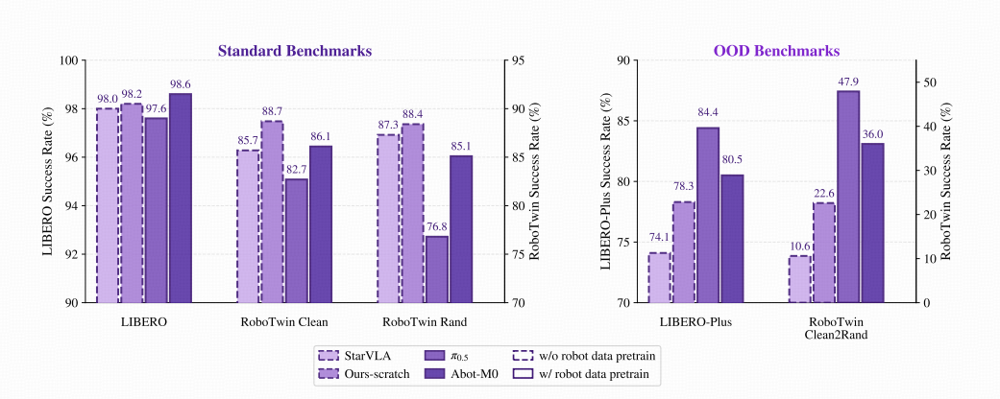
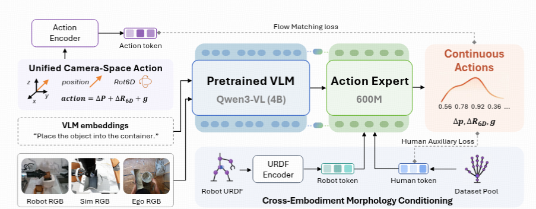

# VLA模型如何利用异构数据扩大能力

**核心问题：** 不同任务、机器人和人类视频的数据，怎样成为可共同训练的监督，并转化为泛化能力？

本文对比Qwen-VLA、Qwen-RobotManip和ACE-Ego-0，重点看接口、动作语义、本体条件和监督质量。内容基于已有单篇笔记与附图整理；实验结论限定在对应评测设置内。

## 1. 三篇工作的关系

| 工作 | 统一的重点 | 核心思路 |
|---|---|---|
| Qwen-VLA | 任务级接口 | 将操作、导航、人类轨迹等任务纳入共享的视觉语言与动作生成框架 |
| Qwen-RobotManip | 操作数据的物理语义 | 对齐动作槽位、坐标、时间和行为上下文，再扩大训练规模 |
| ACE-Ego-0 | 人类与机器人监督 | 对齐动作和本体条件，同时降低人类伪动作噪声的影响 |

三者回答的是不同层次的问题：**数据能否进入同一个模型，进入后是否表达相容的含义，以及模型应当多大程度相信这些标签。**

研究范围更广不等于机制更有效。ACE-Ego-0聚焦操作，但其本体条件和可靠性加权，为人类视频接入提供了具体方法。

## 2. Qwen-VLA：统一任务接口

### 2.1 共同的预测形式

机器人操作、导航和轨迹预测的输出不同，但可以共享一个条件生成形式：

```text
视觉观测 + 语言指令 + 本体/任务条件
→ 未来动作或轨迹
```

Qwen-VLA用Qwen3.5 VLM处理视觉语言条件，再由DiT式Flow Matching decoder生成连续输出。

### 2.2 如何容纳不同动作

- **Embodiment prompt：** 描述机器人类型、单双臂、控制频率、chunk长度和控制约定。
- **统一张量：** 用固定容量承载不同维度的动作，缺失部分padding，并通过mask排除无效监督。
- **按源处理：** 保留不同数据集的动作约定与归一化规则，不要求相同槽位在所有任务中都具有相同物理意义。

这里统一的是模型接口与生成机制。**张量形状一致，不代表动作语义已经对齐。** Prompt提供解释条件，mask标记有效范围，两者作用不同。

### 2.3 分阶段训练

| 阶段 | 主要做法 | 目的 |
|---|---|---|
| T2A | 冻结VLM，用文本与本体条件训练动作decoder | 建立语言条件下的动作先验 |
| CPT | 结合视觉观测、异构动作数据与VL数据继续训练 | 将动作先验与具体场景对应 |
| SFT | 使用下游任务数据适配 | 学习任务与部署分布 |
| RL | 在特定环境中用成功奖励优化 | 改善闭环任务表现 |

VL共同训练用于保留视觉语言能力。论文支持多类任务共享框架的可行性，但不意味着任意数据混合都不会相互干扰。

## 3. Qwen-RobotManip：先对齐，再扩大规模

Qwen-RobotManip聚焦机器人操作。不同机器人即使执行相似任务，记录的joint、EEF、坐标和时间尺度也可能不同，直接混合会增加学习难度。

### 3.1 表示、运动与行为对齐

| 层次 | 方法 | 解决的问题 |
|---|---|---|
| 表示 | 80D canonical state/action及逐维mask | 为不同本体提供有明确含义的槽位 |
| 运动 | Camera-frame EEF delta | 减少不同base/world坐标约定造成的差异 |
| 条件 | Structured embodiment prompt | 显式描述本体与控制设置 |
| 行为 | 历史observation-action chunks | 从实际执行上下文中适应当前机器人 |

Camera-frame EEF让动作与视觉参考系更直接对应，但不会消除工作空间、动力学或工具差异。预测EEF仍需通过目标机器人的控制接口执行。

历史上下文也不只是“多看几张图片”：它同时包含观测和动作，可用于反映当前机器人的执行方式，与只输入视觉历史的memory有所不同。

### 3.2 Human-to-robot数据合成

```text
第一视角人类视频
→ 恢复手部轨迹并构造虚拟夹爪
→ 轨迹平滑与机器人retarget
→ 去除原视频中的人手并合成机器人画面
→ 多本体demonstrations
```

这条路径扩大了可用数据，但也引入手部重建、IK、遮挡处理和渲染误差。数据量之外，还需检查图像、语言、状态和动作是否描述同一件事。

## 4. 怎样评估“扩大了能力”

### 4.1 标准基准高分还不够



*图1：原笔记用于Qwen-RobotManip评测讨论的对比图。左右子图及各自左右纵轴对应不同benchmark，比较时应读取对应刻度；图中包含多个模型，不能仅凭柱高把差异全部归因于预训练。*

图中，scratch模型在部分标准基准上也能取得较高分，但在OOD条件下表现明显下降。这提示：标准测试可能不足以区分对训练分布的拟合与更广泛的泛化能力。

图中的跨模型比较用于提出问题。判断某项对齐或预训练方法的作用，还需结合同模型、同预算的消融实验。

### 4.2 三类泛化评测

| 维度 | 代表评测 | 重点检查 |
|---|---|---|
| 场景与任务变化 | LIBERO-Plus、RoboTwin-Clean2Rand、RoboCasa365、EBench | 背景、视角、初始状态、物体和任务组合变化后能否完成任务 |
| 指令跟随 | RoboTwin-IF | 同一场景中，语言是否能改变目标、动作或左右手分工 |
| 跨本体迁移 | RoboTwin-XE | 未使用目标机器人任务数据适配时，动作表示能否迁移 |

**指令跟随的关键是制造视觉歧义。** 场景里存在多个合理动作，只有语言能决定正确选择，例如按颜色选物体、按空间关系放置，或区分“按订书机”和“移动订书机”。否则模型可能只靠视觉模式完成任务，掩盖VLA退化成VA的问题。

**跨本体评测要说明“零样本”的范围。** 未使用目标机器人的训练数据，不等于部署时不需要其标定、运动学或控制接口。EEF表示降低了对关节布局的直接依赖，但不是无条件迁移。

## 5. ACE-Ego-0：对齐本体，也区分监督可靠性

### 5.1 本体条件如何进入模型



*图2：机器人URDF经encoder形成robot token，人类数据使用human token，两者向Action Expert提供本体条件；机器人与人类数据采用不同监督路径。图中的动作公式是结构示意，不应据此推断代码直接相减rotation-6D分量。*

模型由Qwen3-VL骨干和连续Action Expert组成。RGB与语言形成视觉语言条件，本体信息另行注入动作分支：

- **Robot token：** 从URDF图结构编码，提供机器人形态与运动学信息。
- **Human token：** 使用按数据源学习的替代embedding，不要求人手拥有机器人URDF。

相机系动作解决“运动相对哪里表达”，morphology token解决“由什么身体执行”。两种条件互补，URDF encoder本身不负责求解IK。

### 5.2 时间与标签质量对齐

不同数据源的FPS不同，相同步数的chunk可能对应不同物理时长。ACE-Ego-0按目标时间窗确定各源horizon，使监督覆盖相近的真实时间。

人类视频恢复出的伪动作也不能等同于机器人测量：位置、旋转和gripper的可靠性不同。该方法让机器人数据承担主动作监督，人类伪动作通过可靠性加权的辅助目标提供补充；其权重结合通道先验与时序平滑性。

因此，ACE-Ego-0值得借鉴的不只是URDF encoder，还有一个更一般的原则：**统一表示之后，仍应保留数据质量差异。**

## 6. 对当前项目的联系

| 论文中的问题 | 当前项目可对应的内容 |
|---|---|
| 异构动作怎样进入模型 | 32D/34D各自的槽位、mask与按源归一化 |
| 视觉和动作怎样对应 | Camera-frame EEF、局部轴对齐、相机标定与时间同步 |
| 人手怎样提供监督 | 曲率或指尖距离gripper、virtual-hand、质量检查 |
| 时间跨度怎样一致 | 区分视频FPS、动作上采样、chunk长度与World target时间 |
| 新模块是否有效 | 指令对照、历史干预、World分支消融与闭环评测 |

这些是设计层面的联系，不表示项目已经实现了论文中的全部方法。数据实现见[数据处理笔记](../Note_DataPipeline.md)，模型扩展见[Dynamic/SGM](../MagicAtom/04_Dynamic模型/01_MagicVLA_Dynamic_SGM.md)，评测概念见[基础知识](../Note_Basics.md#basic-evaluation)。

## 7. 个人思考：统一不必发生在原始token层

以下是从三篇工作延伸出的设计设想，不是它们共同验证的结论。

图像、语言、力觉和触觉的采样频率、噪声与信息结构不同，可以先使用各自的encoder，再将任务相关特征融合：

```text
不同传感器
→ 模态专用编码器
→ 时间、空间与任务条件对齐
→ 可交互的latent表示
→ World / Action模型
→ 动作
```

关键不只是把特征投影到相同维度，还要让模型知道信息对应的时间、位置、本体和可靠性。是否采用统一token、跨模态attention或分支结构，应由任务需求与计算成本决定。

## 8. 相关单篇笔记

- [Qwen-VLA：任务级统一](../Paper/260625_Qwen-VLA_Qwen_2026/Qwen-VLA_Qwen_2026.md)
- [Qwen-RobotManip：对齐与规模化](../Paper/260616_Qwen-RobotManip_Qwen_2026/Qwen-RobotManip_Qwen_2026.md)
- [ACE-Ego-0：人类与机器人联合预训练](../Paper/260630_ACE-Ego-0_ACE-CUHK_2026/ACE-Ego-0_ACE-CUHK_2026.md)
